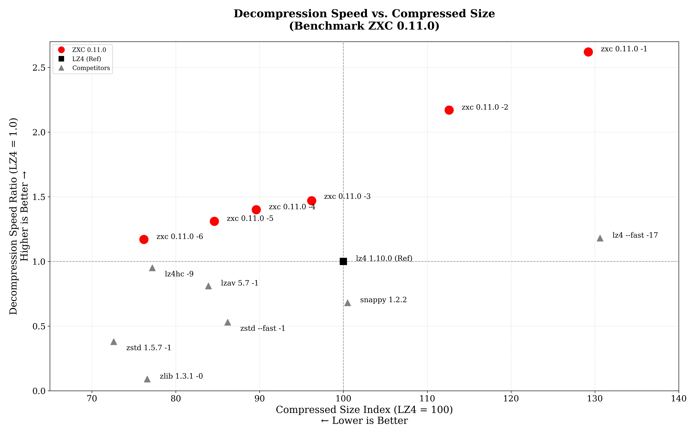
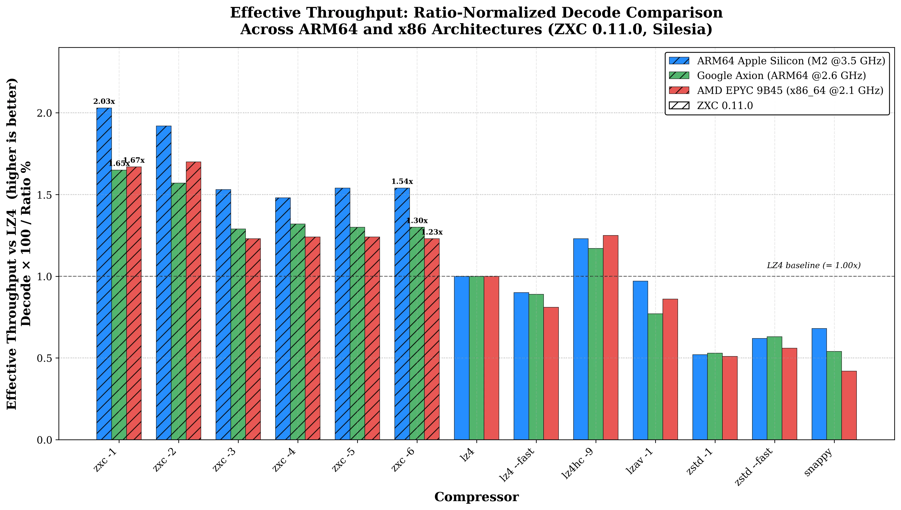

# ZXC: High-Performance Asymmetric Lossless Compression

[](https://github.com/hellobertrand/zxc/actions/workflows/build.yml)
[](https://github.com/hellobertrand/zxc/actions/workflows/quality.yml)
[](https://github.com/hellobertrand/zxc/actions/workflows/fuzzing.yml)
[](https://github.com/hellobertrand/zxc/actions/workflows/benchmark.yml)

<!-- [](https://snyk.io/test/github/hellobertrand/zxc) -->
[](https://github.com/hellobertrand/zxc/actions/workflows/security.yml)
[](https://codecov.io/github/hellobertrand/zxc)

[](https://repology.org/project/zxc/versions)
[](https://repology.org/project/zxc/versions)
[](https://repology.org/project/zxc/versions)
[](https://repology.org/project/zxc/versions)
[](https://repology.org/project/zxc/versions)

[](https://crates.io/crates/zxc-compress)
[](https://pypi.org/project/zxc-compress)
[](https://www.npmjs.com/package/zxc-compress)

[](LICENSE)

**ZXC** is a high-performance, lossless, asymmetric compression library optimized for Content Delivery and Embedded Systems (Game Assets, Firmware, App Bundles).
It is designed to be **"Write Once, Read Many"** *(WORM)*. Unlike codecs like LZ4, ZXC trades compression speed (build-time) for **maximum decompression throughput** (run-time).

**ZXC runs on all major architectures** (x86_64, ARM64, ARMv7, ARMv6, RISC-V, POWER (ppc64el), s390x, i386) with hand-tuned SIMD paths (AVX2/AVX-512 on x86_64, NEON on ARMv8+). It shows especially strong gains on modern ARM cores (Apple Silicon, AWS Graviton, Google Axion) thanks to a bitstream layout tuned for their deep pipelines.

## TL;DR

- **What:** A C library for lossless compression, optimized for **maximum decompression speed**.
- **Key Result:** Up to **>40% faster** decompression than LZ4 on Apple Silicon, **>20% faster** on Google Axion (ARM64), **>10% faster** on x86_64 (AMD EPYC), **all with better compression ratios**. Cross-platform by design, with particularly strong results on ARMv8+.
- **Use Cases:** Game assets, firmware, app bundles, anything *compressed once, decompressed millions of times*.
- **Seekable:** Built-in seek table for **O(1) random-access** decompression, load any block without scanning the entire file.
- **Install:** `conan install --requires="zxc/[*]"` · `vcpkg install zxc` · `brew install zxc` · `pip install zxc-compress` · `cargo add zxc-compress` · `npm i zxc-compress`
- **Quality:** Fuzzed (5B+ iterations to date), sanitized, formally tested, thread-safe API. BSD-3-Clause.

> **Independently Verified:** ZXC has been officially merged into both major open-source compression benchmark suites:
>
> - **[lzbench](https://github.com/inikep/lzbench)** (master branch, by @inikep)
> - **[TurboBench](https://github.com/powturbo/TurboBench)** (master branch, by @powturbo)
>
> You can reproduce these results independently using either industry-standard benchmark, alongside 70+ other codecs.


## ZXC Design Philosophy

Traditional codecs often force a trade-off between **symmetric speed** (LZ4) and **archival density** (Zstd).

**ZXC focuses on Asymmetric Efficiency.**

Designed for the "Write-Once, Read-Many" reality of software distribution, ZXC utilizes a computationally intensive encoder to generate a bitstream specifically structured to **maximize decompression throughput**.
By performing heavy analysis upfront, the encoder produces a layout optimized for the instruction pipelining and branch prediction capabilities of modern CPUs, particularly ARMv8, effectively offloading complexity from the decoder to the encoder.

*   **Build Time:** You generally compress only once (on CI/CD).
*   **Run Time:** You decompress millions of times (on every user's device). **ZXC respects this asymmetry.**

[👉 **Read the Technical Whitepaper**](docs/WHITEPAPER.md)


## Benchmarks

To ensure consistent performance, benchmarks are automatically executed on every commit via GitHub Actions.
We monitor metrics on both **x86_64** (Linux) and **ARM64** (Apple Silicon M2) runners to track compression speed, decompression speed, and ratios.

*(See the [latest benchmark logs](https://github.com/hellobertrand/zxc/actions/workflows/benchmark.yml))*


### 1. Mobile & Client: Apple Silicon (M2)
*Scenario: Game Assets loading, App startup.*

| Target | ZXC vs Competitor | Decompression Speed | Ratio | Verdict |
| :--- | :--- | :--- | :--- | :--- |
| **1. Max Speed** | **ZXC -1** vs *LZ4 --fast* | **12,530 MB/s** vs 5,623 MB/s **2.23x Faster** | **61.5** vs 62.2 **Smaller** (-0.7%) | **ZXC** leads in raw throughput. |
| **2. Standard** | **ZXC -3** vs *LZ4 Default* | **7,049 MB/s** vs 4,783 MB/s **1.47x Faster** | **45.8** vs 47.6 **Smaller** (-1.8%) | **ZXC** outperforms LZ4 in read speed and ratio. |
| **3. High Density** | **ZXC -5** vs *Zstd --fast 1* | **6,267 MB/s** vs 2,538 MB/s **2.47x Faster** | **40.3** vs 41.0 **Equivalent** (-0.7%) | **ZXC** outperforms Zstd in decoding speed. |
| **4. Max Density** | **ZXC -6** vs *lz4hc -9* | **5,620 MB/s** vs 4,528 MB/s **1.24x Faster** | **36.3** vs 36.8 **Smaller** (-0.5%) | **ZXC** beats lz4hc on both decode speed and ratio. |

### 2. Cloud Server: Google Axion (ARM Neoverse V2)
*Scenario: High-throughput Microservices, ARM Cloud Instances.*

| Target | ZXC vs Competitor | Decompression Speed | Ratio | Verdict |
| :--- | :--- | :--- | :--- | :--- |
| **1. Max Speed** | **ZXC -1** vs *LZ4 --fast* | **9,067 MB/s** vs 4,951 MB/s **1.83x Faster** | **61.5** vs 62.2 **Smaller** (-0.7%) | **ZXC** leads in raw throughput. |
| **2. Standard** | **ZXC -3** vs *LZ4 Default* | **5,297 MB/s** vs 4,259 MB/s **1.24x Faster** | **45.8** vs 47.6 **Smaller** (-1.8%) | **ZXC** outperforms LZ4 in read speed and ratio. |
| **3. High Density** | **ZXC -5** vs *Zstd --fast 1* | **4,685 MB/s** vs 2,295 MB/s **2.04x Faster** | **40.3** vs 41.0 **Equivalent** (-0.7%) | **ZXC** outperforms Zstd in decoding speed. |
| **4. Max Density** | **ZXC -6** vs *lz4hc -9* | **4,205 MB/s** vs 3,849 MB/s **1.09x Faster** | **36.3** vs 36.8 **Smaller** (-0.5%) | **ZXC** beats lz4hc on both decode speed and ratio. |

### 3. Build Server: x86_64 (AMD EPYC 9B45)
*Scenario: CI/CD Pipelines compatibility.*

| Target | ZXC vs Competitor | Decompression Speed | Ratio | Verdict |
| :--- | :--- | :--- | :--- | :--- |
| **1. Max Speed** | **ZXC -1** vs *LZ4 --fast* | **10,844 MB/s** vs 5,301 MB/s **2.05x Faster** | **61.5** vs 62.2 **Smaller** (-0.7%) | **ZXC** achieves higher throughput. |
| **2. Standard** | **ZXC -3** vs *LZ4 Default* | **5,955 MB/s** vs 5,013 MB/s **1.19x Faster** | **45.8** vs 47.6 **Smaller** (-1.8%) | **ZXC** offers improved speed and ratio. |
| **3. High Density** | **ZXC -5** vs *Zstd --fast 1* | **5,259 MB/s** vs 2,407 MB/s **2.18x Faster** | **40.3** vs 41.0 **Smaller** (-0.7%) | **ZXC** provides faster decoding. |
| **4. Max Density** | **ZXC -6** vs *lz4hc -9* | 4,695 MB/s vs **4,841 MB/s** **0.97x** | **36.3** vs 36.8 **Smaller** (-0.5%) | **Equivalent** decode (~3% slower), **ZXC** wins on ratio. |


*(Benchmark Graph ARM64 : Decompression Throughput & Storage Ratio (Normalized to LZ4))*


*(Effective Throughput : Ratio-Normalized Decode across ARM64 and x86 — `decode × 100 / ratio`, LZ4 baseline = 1.00x)*


> **What is Effective Throughput?**
>
> Raw decode speed misses half the picture: in real workloads (asset streaming, container pulls, microservice payloads), the decoder is fed by a compressed-byte source - disk, network, inter-core - whose bandwidth is the bottleneck. The right question is *how much original data is delivered per MB of compressed input*.
>
> Formula: `Effective (MB/s) = Decode × 100 / Ratio (%)`: combines decode speed and ratio in one number. **Every ZXC palier sits above LZ4** on every architecture, peaking at **2.0x on Apple Silicon** and ranging **1.15x–1.70x** on x86 and ARM cloud platforms.


### Benchmark ARM64 (Apple Silicon M2)

Benchmarks were conducted using lzbench 2.2.1 (from @inikep), compiled with Clang 21.0.0 using *MOREFLAGS="-march=native"* on macOS Tahoe 26.4 (Build 25E246). The reference hardware is an Apple M2 processor (ARM64). All performance metrics reflect single-threaded execution on the standard Silesia Corpus and the benchmark made use of [silesia.tar](https://github.com/DataCompression/corpus-collection/tree/main/Silesia-Corpus), which contains tarred files from the Silesia compression corpus.

| Compressor name         | Compression| Decompress.| Compr. size | Ratio | Filename |
| ---------------         | -----------| -----------| ----------- | ----- | -------- |
| memcpy                  | 52866 MB/s | 52887 MB/s |   211947520 |100.00 | 1 files|
| **zxc 0.11.0 -1**           |   876 MB/s | **12530 MB/s** |   130356444 | **61.50** | 1 files|
| **zxc 0.11.0 -2**           |   586 MB/s | **10360 MB/s** |   113634139 | **53.61** | 1 files|
| **zxc 0.11.0 -3**           |   253 MB/s |  **7049 MB/s** |    97051816 | **45.79** | 1 files|
| **zxc 0.11.0 -4**           |   174 MB/s |  **6697 MB/s** |    90393215 | **42.65** | 1 files|
| **zxc 0.11.0 -5**           |   102 MB/s |  **6267 MB/s** |    85341643 | **40.27** | 1 files|
| **zxc 0.11.0 -6**           |  11.8 MB/s |  **5620 MB/s** |    76888252 | **36.28** | 1 files|
| lz4 1.10.0              |   813 MB/s |  4783 MB/s |   100880800 | 47.60 | 1 files|
| lz4 1.10.0 --fast -17   |  1350 MB/s |  5623 MB/s |   131732802 | 62.15 | 1 files|
| lz4hc 1.10.0 -9         |  48.2 MB/s |  4528 MB/s |    77884448 | 36.75 | 1 files|
| lzav 5.7 -1             |   665 MB/s |  3877 MB/s |    84644732 | 39.94 | 1 files|
| snappy 1.2.2            |   880 MB/s |  3264 MB/s |   101415443 | 47.85 | 1 files|
| zstd 1.5.7 --fast --1   |   724 MB/s |  2538 MB/s |    86916294 | 41.01 | 1 files|
| zstd 1.5.7 -1           |   645 MB/s |  1806 MB/s |    73193704 | 34.53 | 1 files|
| zlib 1.3.1 -1           |   150 MB/s |   410 MB/s |    77259029 | 36.45 | 1 files|


### Benchmark ARM64 (Google Axion Neoverse-V2)

Benchmarks were conducted using lzbench 2.2.1 (from @inikep), compiled with GCC 14.3.0 using *MOREFLAGS="-march=native"* on Linux 64-bits Debian GNU/Linux 12 (bookworm). The reference hardware is a Google Neoverse-V2 processor (ARM64). All performance metrics reflect single-threaded execution on the standard Silesia Corpus and the benchmark made use of [silesia.tar](https://github.com/DataCompression/corpus-collection/tree/main/Silesia-Corpus), which contains tarred files from the Silesia compression corpus.

| Compressor name         | Compression| Decompress.| Compr. size | Ratio | Filename |
| ---------------         | -----------| -----------| ----------- | ----- | -------- |
| memcpy                  | 24179 MB/s | 24134 MB/s |   211947520 |100.00 | 1 files|
| **zxc 0.11.0 -1**           |   868 MB/s |  **9067 MB/s** |   130356444 | **61.50** | 1 files|
| **zxc 0.11.0 -2**           |   586 MB/s |  **7524 MB/s** |   113634139 | **53.61** | 1 files|
| **zxc 0.11.0 -3**           |   238 MB/s |  **5297 MB/s** |    97051816 | **45.79** | 1 files|
| **zxc 0.11.0 -4**           |   165 MB/s |  **5025 MB/s** |    90393215 | **42.65** | 1 files|
| **zxc 0.11.0 -5**           |  96.9 MB/s |  **4685 MB/s** |    85341643 | **40.27** | 1 files|
| **zxc 0.11.0 -6**           |  11.0 MB/s |  **4205 MB/s** |    76888252 | **36.28** | 1 files|
| lz4 1.10.0              |   732 MB/s |  4259 MB/s |   100880800 | 47.60 | 1 files|
| lz4 1.10.0 --fast -17   |  1280 MB/s |  4951 MB/s |   131732802 | 62.15 | 1 files|
| lz4hc 1.10.0 -9         |  43.4 MB/s |  3849 MB/s |    77884448 | 36.75 | 1 files|
| lzav 5.7 -1             |   562 MB/s |  2757 MB/s |    84644732 | 39.94 | 1 files|
| snappy 1.2.2            |   757 MB/s |  2313 MB/s |   101415443 | 47.85 | 1 files|
| zstd 1.5.7 --fast --1   |   607 MB/s |  2295 MB/s |    86916294 | 41.01 | 1 files|
| zstd 1.5.7 -1           |   525 MB/s |  1645 MB/s |    73193704 | 34.53 | 1 files|
| zlib 1.3.1 -1           |   115 MB/s |   390 MB/s |    77259029 | 36.45 | 1 files|


### Benchmark x86_64 (AMD EPYC 9B45)

Benchmarks were conducted using lzbench 2.2.1 (from @inikep), compiled with GCC 14.3.0 using *MOREFLAGS="-march=native"* on Linux 64-bits Ubuntu 24.04. The reference hardware is an AMD EPYC 9B45 processor (x86_64). All performance metrics reflect single-threaded execution on the standard Silesia Corpus and the benchmark made use of [silesia.tar](https://github.com/DataCompression/corpus-collection/tree/main/Silesia-Corpus), which contains tarred files from the Silesia compression corpus.

| Compressor name         | Compression| Decompress.| Compr. size | Ratio | Filename |
| ---------------         | -----------| -----------| ----------- | ----- | -------- |
| memcpy                  | 23351 MB/s | 23292 MB/s |   211947520 |100.00 | 1 files|
| **zxc 0.11.0 -1**           |   859 MB/s | **10844 MB/s** |   130356444 | **61.50** | 1 files|
| **zxc 0.11.0 -2**           |   584 MB/s |  **9597 MB/s** |   113634139 | **53.61** | 1 files|
| **zxc 0.11.0 -3**           |   238 MB/s |  **5955 MB/s** |    97051816 | **45.79** | 1 files|
| **zxc 0.11.0 -4**           |   163 MB/s |  **5589 MB/s** |    90393215 | **42.65** | 1 files|
| **zxc 0.11.0 -5**           |  97.0 MB/s |  **5259 MB/s** |    85341643 | **40.27** | 1 files|
| **zxc 0.11.0 -6**           |  11.7 MB/s |  **4695 MB/s** |    76888252 | **36.28** | 1 files|
| lz4 1.10.0              |   767 MB/s |  5013 MB/s |   100880800 | 47.60 | 1 files|
| lz4 1.10.0 --fast -17   |  1280 MB/s |  5301 MB/s |   131732802 | 62.15 | 1 files|
| lz4hc 1.10.0 -9         |  45.0 MB/s |  4841 MB/s |    77884448 | 36.75 | 1 files|
| lzav 5.7 -1             |   600 MB/s |  3628 MB/s |    84644732 | 39.94 | 1 files|
| snappy 1.2.2            |   768 MB/s |  2118 MB/s |   101512076 | 47.89 | 1 files|
| zstd 1.5.7 --fast --1   |   656 MB/s |  2407 MB/s |    86916294 | 41.01 | 1 files|
| zstd 1.5.7 -1           |   597 MB/s |  1868 MB/s |    73193704 | 34.53 | 1 files|
| zlib 1.3.1 -1           |   133 MB/s |   387 MB/s |    77259029 | 36.45 | 1 files|


### Benchmark x86_64 (AMD EPYC 7763)

Benchmarks were conducted using lzbench 2.2.1 (from @inikep), compiled with GCC 14.2.0 using *MOREFLAGS="-march=native"* on Linux 64-bits Ubuntu 24.04. The reference hardware is an AMD EPYC 7763 64-Core processor (x86_64). All performance metrics reflect single-threaded execution on the standard Silesia Corpus and the benchmark made use of [silesia.tar](https://github.com/DataCompression/corpus-collection/tree/main/Silesia-Corpus), which contains tarred files from the Silesia compression corpus.

| Compressor name         | Compression| Decompress.| Compr. size | Ratio | Filename |
| ---------------         | -----------| -----------| ----------- | ----- | -------- |
| memcpy                  | 23023 MB/s | 23087 MB/s |   211947520 |100.00 | 1 files|
| **zxc 0.11.0 -1**           |   640 MB/s |  **7077 MB/s** |   130356444 | **61.50** | 1 files|
| **zxc 0.11.0 -2**           |   431 MB/s |  **5907 MB/s** |   113634139 | **53.61** | 1 files|
| **zxc 0.11.0 -3**           |   185 MB/s |  **3922 MB/s** |    97051816 | **45.79** | 1 files|
| **zxc 0.11.0 -4**           |   128 MB/s |  **3775 MB/s** |    90393215 | **42.65** | 1 files|
| **zxc 0.11.0 -5**           |  76.5 MB/s |  **3624 MB/s** |    85341643 | **40.27** | 1 files|
| **zxc 0.11.0 -6**           |  8.85 MB/s |  **3196 MB/s** |    76888252 | **36.28** | 1 files|
| lz4 1.10.0              |   580 MB/s |  3546 MB/s |   100880800 | 47.60 | 1 files|
| lz4 1.10.0 --fast -17   |  1015 MB/s |  4092 MB/s |   131732802 | 62.15 | 1 files|
| lz4hc 1.10.0 -9         |  33.8 MB/s |  3401 MB/s |    77884448 | 36.75 | 1 files|
| lzav 5.7 -1             |   407 MB/s |  2609 MB/s |    84644732 | 39.94 | 1 files|
| snappy 1.2.2            |   612 MB/s |  1591 MB/s |   101512076 | 47.89 | 1 files|
| zstd 1.5.7 --fast --1   |   443 MB/s |  1626 MB/s |    86916294 | 41.01 | 1 files|
| zstd 1.5.7 -1           |   400 MB/s |  1221 MB/s |    73193704 | 34.53 | 1 files|
| zlib 1.3.1 -1           |  98.1 MB/s |   328 MB/s |    77259029 | 36.45 | 1 files|

---

## Installation

### Option 1: Download Release (GitHub)

1.  Go to the [Releases page](https://github.com/hellobertrand/zxc/releases).
2.  Download the archive matching your architecture:

    **macOS:**
    *   `zxc-macos-arm64.tar.gz` (NEON optimizations included).

    **Linux:**
    *   `zxc-linux-aarch64.tar.gz` (NEON optimizations included).
    *   `zxc-linux-x86_64.tar.gz` (Runtime dispatch for AVX2/AVX512).

    **Windows:**
    *   `zxc-windows-x64.zip` (Runtime dispatch for AVX2/AVX512).
    *   `zxc-windows-arm64.zip` (NEON optimizations included).

3.  Extract and install:
    ```bash
    tar -xzf zxc-linux-x86_64.tar.gz -C /usr/local
    ```

    Each archive contains:
    ```
    bin/zxc                          # CLI binary
    include/                         # C headers (zxc.h, zxc_buffer.h, ...)
    lib/libzxc.a                     # Static library
    lib/pkgconfig/libzxc.pc          # pkg-config support
    lib/cmake/zxc/zxcConfig.cmake    # CMake find_package(zxc) support
    ```

4.  Use in your project:

    **CMake:**
    ```cmake
    find_package(zxc REQUIRED)
    target_link_libraries(myapp PRIVATE zxc::zxc_lib)
    ```

    **pkg-config:**
    ```bash
    cc myapp.c $(pkg-config --cflags --libs libzxc) -o myapp
    ```

### Option 2: vcpkg

**Classic mode:**
```bash
vcpkg install zxc
```

**Manifest mode** (add to `vcpkg.json`):
```json
{
  "dependencies": ["zxc"]
}
```

Then in your CMake project:
```cmake
find_package(zxc CONFIG REQUIRED)
target_link_libraries(myapp PRIVATE zxc::zxc_lib)
```

### Option 3: Conan

You also can download and install zxc using the [Conan](https://conan.io/) package manager:

```bash
    conan install -r conancenter --requires="zxc/[*]" --build=missing
```

Or add to your `conanfile.txt`:
```ini
[requires]
zxc/[*]
```

The zxc package in Conan Center is kept up to date by
[ConanCenterIndex](https://github.com/conan-io/conan-center-index) contributors.
If the version is out of date, please create an issue or pull request on the Conan Center Index repository.

### Option 4: Homebrew

```bash
brew install zxc
```

The formula is maintained in [homebrew-core](https://formulae.brew.sh/formula/zxc).

### Option 5: Building from Source

**Requirements:** CMake (3.14+), C17 Compiler (Clang/GCC/MSVC).

```bash
git clone https://github.com/hellobertrand/zxc.git
cd zxc
cmake -B build -DCMAKE_BUILD_TYPE=Release
cmake --build build --parallel

# Run tests
ctest --test-dir build -C Release --output-on-failure

# CLI usage
./build/zxc --help

# Install library, headers, and CMake/pkg-config files
sudo cmake --install build
```

#### CMake Options

| Option | Default | Description |
|--------|---------|-------------|
| `BUILD_SHARED_LIBS` | OFF | Build shared libraries instead of static (`libzxc.so`, `libzxc.dylib`, `zxc.dll`) |
| `ZXC_NATIVE_ARCH` | ON | Enable `-march=native` for maximum performance |
| `ZXC_ENABLE_LTO` | ON | Enable Link-Time Optimization (LTO) |
| `ZXC_PGO_MODE` | OFF | Profile-Guided Optimization mode (`OFF`, `GENERATE`, `USE`) |
| `ZXC_BUILD_CLI` | ON | Build command-line interface |
| `ZXC_BUILD_TESTS` | ON | Build unit tests |
| `ZXC_ENABLE_COVERAGE` | OFF | Enable code coverage generation (disables LTO/PGO) |
| `ZXC_DISABLE_SIMD` | OFF | Disable hand-written SIMD paths (AVX2/AVX512/NEON) |

```bash
# Build shared library
cmake -B build -DBUILD_SHARED_LIBS=ON

# Portable build (without -march=native)
cmake -B build -DZXC_NATIVE_ARCH=OFF

# Library only (no CLI, no tests)
cmake -B build -DZXC_BUILD_CLI=OFF -DZXC_BUILD_TESTS=OFF

# Code coverage build
cmake -B build -DZXC_ENABLE_COVERAGE=ON

# Disable explicit SIMD code paths (compiler auto-vectorisation is unaffected)
cmake -B build -DZXC_DISABLE_SIMD=ON
```

#### Profile-Guided Optimization (PGO)

PGO uses runtime profiling data to optimize branch layout, inlining decisions, and code placement.

**Step 1 - Build with instrumentation:**
```bash
cmake -B build -DCMAKE_BUILD_TYPE=Release -DZXC_PGO_MODE=GENERATE
cmake --build build --parallel
```

**Step 2 - Run a representative workload to collect profile data:**
```bash
# Run the test suite (exercises all block types and compression levels)
./build/zxc_test

# Or compress/decompress representative data
./build/zxc -b your_data_file
```

**Step 3 - (Clang only) Merge raw profiles:**
```bash
# Clang generates .profraw files that must be merged before use
llvm-profdata merge -output=build/pgo/default.profdata build/pgo/*.profraw
```
> GCC uses a directory-based format and does not require this step.

**Step 4 - Rebuild with profile data:**
```bash
cmake -B build -DCMAKE_BUILD_TYPE=Release -DZXC_PGO_MODE=USE
cmake --build build --parallel
```

### Packaging Status

[](https://repology.org/project/zxc/versions)

---

## Compression Levels

*   **Level 1, 2 (Fast):** Optimized for real-time assets (Gaming, UI).
*   **Level 3, 4 (Balanced):** A strong middle-ground offering efficient compression speed and a ratio superior to LZ4.
*   **Level 5 (Compact):** The best choice for Embedded, Firmware, or Archival. Better compression than LZ4 and significantly faster decoding than Zstd.

## Block Size Tuning

The default block size is **512 KB**, tuned for bulk/archival workloads where ratio and decompression throughput matter most. For **memory-constrained or streaming use cases**, **256 KB blocks** halve the per-context memory footprint at a small cost in ratio and decompression speed.

**Why larger blocks help:** Each block starts with a cold hash table, so the LZ match-finder has no history and produces more literals until the table warms up. Doubling the block size halves the number of cold-start penalties, improving both ratio and decompression speed.

| Block Size | cctx memory | dctx memory | Ratio (level -3) | Decompression gain vs 256 KB |
|:----------:|:-----------:|:-----------:|:----------------:|:----------------------------:|
| 256 KB | ~1.03 MB | ~256 KB | 46.36% | — |
| 512 KB *(default)* | ~1.78 MB | ~512 KB | 45.81% *(−0.55 pp)* | +1% to +8% depending on CPU |

```bash
# CLI — fall back to 256 KB blocks (e.g. embedded / streaming)
zxc -B 256K -5 input_file output_file

# API
zxc_compress_opts_t opts = {
    .level      = ZXC_LEVEL_COMPACT,
    .block_size = 256 * 1024,
};
```

**Guideline:** Stick with 512 KB (default) for bulk compression pipelines, CI/CD asset packaging, and high-throughput servers. Use 256 KB (`-B 256K`) for streaming, embedded, or memory-constrained environments.

---

## Usage

### 1. CLI

The CLI is perfect for benchmarking or manually compressing assets.

```bash
# Basic Compression (Level 3 is default)
zxc -z input_file output_file

# High Compression (Level 5)
zxc -z -5 input_file output_file

# Seekable Archive (enables O(1) random-access decompression)
zxc -z -S input_file output_file

# -z for compression can be omitted
zxc input_file output_file

# as well as output file; it will be automatically assigned to input_file.zxc
zxc input_file

# Decompression
zxc -d compressed_file output_file

# Benchmark Mode (Testing speed on your machine)
zxc -b input_file
```

#### Using with `tar`

ZXC works as a drop-in external compressor for `tar` (reads stdin, writes stdout, returns 0 on success):

```bash
# GNU tar (Linux)
tar -I 'zxc -5' -cf archive.tar.zxc data/
tar -I 'zxc -d' -xf archive.tar.zxc

# bsdtar (macOS)
tar --use-compress-program='zxc -5' -cf archive.tar.zxc data/
tar --use-compress-program='zxc -d' -xf archive.tar.zxc

# Pipes (universal)
tar cf - data/ | zxc > archive.tar.zxc
zxc -d < archive.tar.zxc | tar xf -
```

### 2. API

ZXC provides a **thread-safe API** with two usage patterns. Parameters are passed through dedicated options structs, making call sites self-documenting and forward-compatible.

#### Buffer API (In-Memory)
```c
#include "zxc.h"

// Compression
uint64_t bound = zxc_compress_bound(src_size);
zxc_compress_opts_t c_opts = {
    .level            = ZXC_LEVEL_DEFAULT,
    .checksum_enabled = 1,
    /* .block_size = 0 -> 512 KB default */
};
int64_t compressed_size = zxc_compress(src, src_size, dst, bound, &c_opts);

// Decompression
zxc_decompress_opts_t d_opts = { .checksum_enabled = 1 };
int64_t decompressed_size = zxc_decompress(src, src_size, dst, dst_capacity, &d_opts);
```

#### Stream API (Files, Multi-Threaded)
```c
#include "zxc.h"

// Compression (auto-detect threads, level 3, checksum on)
zxc_compress_opts_t c_opts = {
    .n_threads        = 0,               // 0 = auto
    .level            = ZXC_LEVEL_DEFAULT,
    .checksum_enabled = 1,
    /* .block_size = 0 -> 512 KB default */
};
int64_t bytes_written = zxc_stream_compress(f_in, f_out, &c_opts);

// Decompression
zxc_decompress_opts_t d_opts = { .n_threads = 0, .checksum_enabled = 1 };
int64_t bytes_out = zxc_stream_decompress(f_in, f_out, &d_opts);
```

#### Reusable Context API (Low-Latency / Embedded)

For tight loops (e.g. filesystem plug-ins) where per-call `malloc`/`free`
overhead matters, use opaque reusable contexts.
Options are **sticky** - settings from `zxc_create_cctx()` are reused when
passing `NULL`:
```c
#include "zxc.h"

zxc_compress_opts_t opts = { .level = 3, .checksum_enabled = 0 };
zxc_cctx* cctx = zxc_create_cctx(&opts);   // allocate once, settings remembered
zxc_dctx* dctx = zxc_create_dctx();        // allocate once

// reuse across many blocks - NULL reuses sticky settings:
int64_t csz = zxc_compress_cctx(cctx, src, src_sz, dst, dst_cap, NULL);
int64_t dsz = zxc_decompress_dctx(dctx, dst, csz, out, src_sz, NULL);

zxc_free_cctx(cctx);
zxc_free_dctx(dctx);
```

**Features:**
- Caller-allocated buffers with explicit bounds
- Thread-safe (stateless)
- Configurable block sizes (4 KB – 2 MB, powers of 2)
- Multi-threaded streaming (auto-detects CPU cores)
- Optional checksum validation
- Reusable contexts for high-frequency call sites
- Seekable archives: optional seek table for O(1) random-access decompression (`.seekable = 1`)

**[See complete examples and advanced usage ->](docs/EXAMPLES.md)**

## Language Bindings

[](https://crates.io/crates/zxc-compress)
[](https://pypi.org/project/zxc-compress)
[](https://www.npmjs.com/package/zxc-compress)

Official wrappers maintained in this repository:

| Language | Package Manager | Install Command | Documentation | Author |
|----------|-----------------|-----------------|---------------|--------|
| **Rust** | [`crates.io`](https://crates.io/crates/zxc-compress) | `cargo add zxc-compress` | [README](wrappers/rust/zxc/README.md) | [@hellobertrand](https://github.com/hellobertrand) |
| **Python**| [`PyPI`](https://pypi.org/project/zxc-compress) | `pip install zxc-compress` | [README](wrappers/python/README.md) | [@nuberchardzer1](https://github.com/nuberchardzer1) |
| **Node.js**| [`npm`](https://www.npmjs.com/package/zxc-compress) | `npm install zxc-compress` | [README](wrappers/nodejs/README.md) | [@hellobertrand](https://github.com/hellobertrand) |
| **Go** | `go get` | `go get github.com/hellobertrand/zxc/wrappers/go` | [README](wrappers/go/README.md) | [@hellobertrand](https://github.com/hellobertrand) |
| **WASM** | Build from source | `emcmake cmake -B build-wasm && cmake --build build-wasm` | [README](wrappers/wasm/README.md) | [@hellobertrand](https://github.com/hellobertrand) |

Community-maintained bindings:

| Language | Package Manager | Install Command | Repository | Author |
| -------- | --------------- | --------------- | ---------- | ------ |
| **Go** | pkg.go.dev | `go get github.com/meysam81/go-zxc` | <https://github.com/meysam81/go-zxc> | [@meysam81](https://github.com/meysam81) |
| **Nim** | nimble | `nimble install zxc` | <https://github.com/openpeeps/zxc-nim> | [@georgelemon](https://github.com/georgelemon) |
| **Free Pascal** | Build from source | Clone the repository | <https://github.com/Xelitan/Free-Pascal-port-of-ZXC-compressor-decompressor> | [@Xelitan](https://github.com/Xelitan) |

## Safety & Quality
* **Unit Tests**: Comprehensive test suite with CTest integration.
* **Continuous Fuzzing**: Integrated with ClusterFuzzLite suites — **5+ billion iterations** accumulated to date across compress, decompress, streaming and seekable API surfaces.
* **Static Analysis**: Checked with Cppcheck & Clang Static Analyzer.
* **CodeQL Analysis**: GitHub Advanced Security scanning for vulnerabilities.
* **Code Coverage**: Automated tracking with Codecov integration.
* **Dynamic Analysis**: Validated with Valgrind and ASan/UBSan in CI pipelines.
* **Safe API**: Explicit buffer capacity is required for all operations.


## License & Credits

**ZXC** Copyright © 2025-2026, Bertrand Lebonnois and contributors.
Licensed under the **BSD 3-Clause License**. See LICENSE for details.

**Third-Party Components:**
- **rapidhash** by Nicolas De Carli (MIT) - Used for high-speed, platform-independent checksums.
