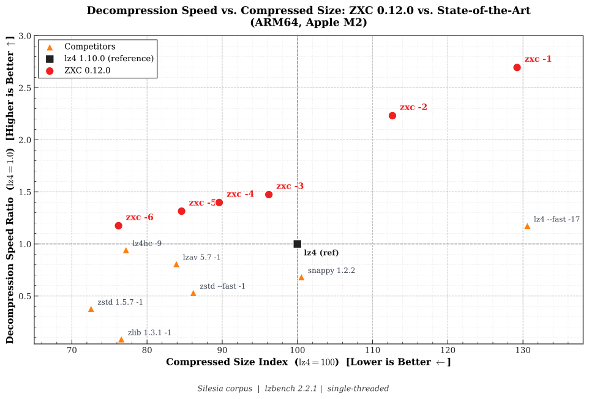
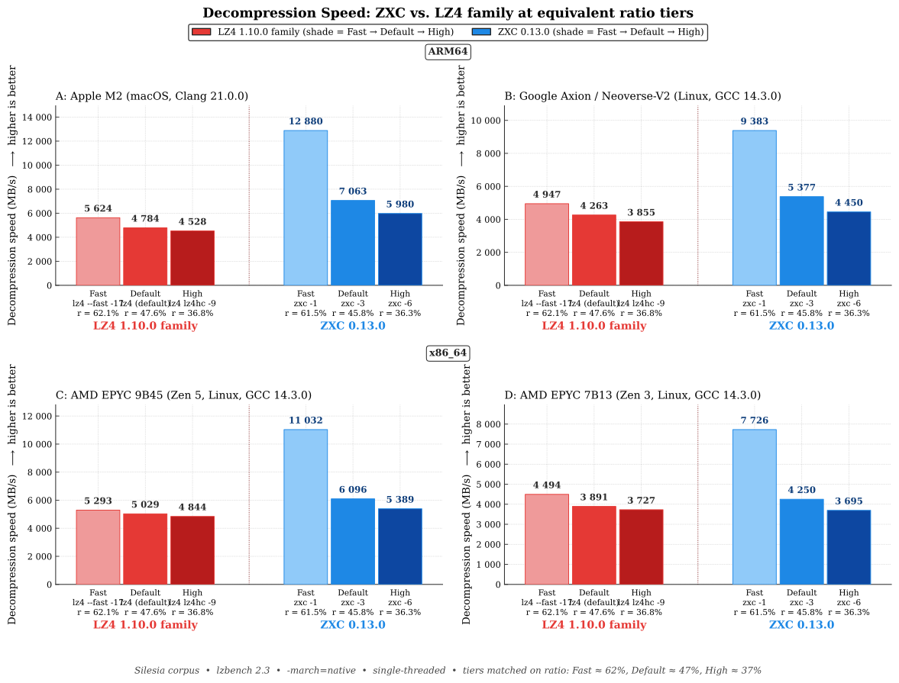

# ZXC - Asymmetric Lossless Compression Built for Ultra-Fast Decode

[](https://github.com/hellobertrand/zxc/actions/workflows/build.yml)
[](https://github.com/hellobertrand/zxc/actions/workflows/quality.yml)
[](https://github.com/hellobertrand/zxc/actions/workflows/security.yml)
[](https://github.com/hellobertrand/zxc/actions/workflows/fuzzing.yml)
<!-- [](https://github.com/hellobertrand/zxc/actions/workflows/benchmark.yml) -->

<!-- [](https://snyk.io/test/github/hellobertrand/zxc) -->
[](https://sonarcloud.io/summary/overall?id=hellobertrand_zxc)
[](https://codecov.io/github/hellobertrand/zxc)
[](https://scorecard.dev/viewer/?uri=github.com/hellobertrand/zxc)
[](LICENSE)

ZXC is a lossless compression **C library** (with official Rust, Python, Node.js, and Go bindings). It trades compression speed for maximum decode throughput — the appropriate trade-off whenever data is **compressed once and read many times**: content delivery, embedded systems, FOTA (Firmware Over-The-Air) updates, game assets, and app bundles. It runs on all major architectures (`x86_64`, `ARM64`, `ARMv7`, `ARMv6`, `RISC-V`, `POWER`, `s390x`, `i386`) with hand-tuned SIMD paths, and shows particularly strong gains on modern ARM cores (Apple Silicon, AWS Graviton, Google Axion) thanks to a bitstream layout tuned for their deep pipelines.

## TL;DR

- **Faster decode than LZ4, at a smaller size.** 10–47% faster decode at the default level (best on ARM64), rising to up to 2.3× in the speed-optimized tier, always at an equal-or-better compression ratio. See the [benchmarks](#benchmarks).
- **Independently verified.** Merged into [lzbench](https://github.com/inikep/lzbench) (@inikep) and [TurboBench](https://github.com/powturbo/TurboBench) (@powturbo); every benchmark below is reproducible against 70+ codecs.
- **Cross-platform.** x86_64, ARM64, ARMv7, ARMv6, RISC-V, POWER (ppc64el), s390x, i386, with hand-tuned SIMD (SSE2/AVX2/AVX-512 on x86, NEON on ARMv8+).
- **Built for "Write Once, Read Many."** Compress once at build time, decompress millions of times at run time.
- **Production-grade.** 5B+ fuzzing iterations, ASan/UBSan/Valgrind-clean, SLSA-signed releases, thread-safe API, BSD-3-Clause.
- **Seekable.** Built-in seek table for O(1) random-access decompression.
- **Broadly packaged.** Conan, vcpkg, Homebrew, Winget and Rust/Python/Node packages.

## Quick start

```bash
# Install (pick your package manager)
brew install zxc
conan install --requires="zxc/[*]"     # or: vcpkg install zxc

# Compress once, decompress fast
zxc -5 assets.tar assets.tar.zxc
zxc -d assets.tar.zxc assets.tar
```

> **Independently verified:** ZXC is merged into both major open-source compression benchmark suites — [lzbench](https://github.com/inikep/lzbench) (master, by @inikep) and [TurboBench](https://github.com/powturbo/TurboBench) (master, by @powturbo). Every number in this README is reproducible with either tool, alongside 70+ other codecs.

## Design Philosophy: Asymmetric Efficiency

Traditional codecs force a trade-off between **symmetric speed** (LZ4) and **archival density** (Zstd). **ZXC takes a third path: asymmetric efficiency.**

The encoder does the heavy lifting upfront — match selection, optimal parsing, statistics tuning — to emit a bitstream structured for the instruction pipelining and branch prediction of modern CPUs (particularly ARMv8). Complexity is **offloaded from the decoder to the encoder**, which is exactly the trade-off WORM workloads want.

*   **Build time:** you compress only once (on CI/CD).
*   **Run time:** you decompress millions of times (on every user's device). **ZXC respects this asymmetry.**

[👉 **Read the Technical Whitepaper**](docs/WHITEPAPER.md)


## Benchmarks

To ensure consistent performance, benchmarks are automatically executed on every commit via GitHub Actions.
We monitor metrics on both **x86_64** (Linux) and **ARM64** (Apple Silicon M2) runners to track compression speed, decompression speed, and ratios.

*(See the [latest benchmark logs](https://github.com/hellobertrand/zxc/actions/workflows/benchmark.yml))*

*Decompression Speed vs Compressed Size — ARM64 Apple M2*




### 1. Mobile & Client: Apple Silicon (M2)
*Scenario: Game Assets loading, App startup.*

| Target | ZXC vs Competitor | Decompression Speed | Ratio | Verdict |
| :--- | :--- | :--- | :--- | :--- |
| **1. Max Speed** | **ZXC -1** vs *LZ4 --fast* | **12,880 MB/s** vs 5,624 MB/s **2.29x Faster** | **61.5** vs 62.2 **Smaller** (-0.7%) | **ZXC** leads in raw throughput. |
| **2. Standard** | **ZXC -3** vs *LZ4 Default* | **7,063 MB/s** vs 4,784 MB/s **1.48x Faster** | **45.8** vs 47.6 **Smaller** (-1.8%) | **ZXC** outperforms LZ4 in read speed and ratio. |
| **3. Max Density** | **ZXC -6** vs *LZ4HC -9* | **5,980 MB/s** vs 4,528 MB/s **1.32x Faster** | **36.3** vs 36.8 **Smaller** (-0.5%) | **ZXC** beats LZ4HC on both decode speed and ratio. |

### 2. Cloud Server: Google Axion (ARM Neoverse V2)
*Scenario: High-throughput Microservices, ARM Cloud Instances.*

| Target | ZXC vs Competitor | Decompression Speed | Ratio | Verdict |
| :--- | :--- | :--- | :--- | :--- |
| **1. Max Speed** | **ZXC -1** vs *LZ4 --fast* | **9,383 MB/s** vs 4,947 MB/s **1.90x Faster** | **61.5** vs 62.2 **Smaller** (-0.7%) | **ZXC** leads in raw throughput. |
| **2. Standard** | **ZXC -3** vs *LZ4 Default* | **5,377 MB/s** vs 4,263 MB/s **1.26x Faster** | **45.8** vs 47.6 **Smaller** (-1.8%) | **ZXC** outperforms LZ4 in read speed and ratio. |
| **3. Max Density** | **ZXC -6** vs *LZ4HC -9* | **4,450 MB/s** vs 3,855 MB/s **1.15x Faster** | **36.3** vs 36.8 **Smaller** (-0.5%) | **ZXC** beats LZ4HC on both decode speed and ratio. |

### 3. Build Server: x86_64 (AMD EPYC 9B45 / Zen 5)
*Scenario: CI/CD Pipelines compatibility.*

| Target | ZXC vs Competitor | Decompression Speed | Ratio | Verdict |
| :--- | :--- | :--- | :--- | :--- |
| **1. Max Speed** | **ZXC -1** vs *LZ4 --fast* | **10,907 MB/s** vs 5,302 MB/s **2.06x Faster** | **61.5** vs 62.2 **Smaller** (-0.7%) | **ZXC** achieves higher throughput. |
| **2. Standard** | **ZXC -3** vs *LZ4 Default* | **6,040 MB/s** vs 5,028 MB/s **1.20x Faster** | **45.8** vs 47.6 **Smaller** (-1.8%) | **ZXC** offers improved speed and ratio. |
| **3. Max Density** | **ZXC -6** vs *LZ4HC -9* | 4,764 MB/s vs **4,843 MB/s** (decode within 2%) | **36.3** vs 36.8 **Smaller** (-0.5%) | **ZXC** wins on ratio; decode trails `LZ4HC -9` by ~2%. |

### 4. Production Server: x86_64 (AMD EPYC 7B13 / Zen 3)
*Scenario: Mainstream cloud workloads (AWS c6a, Azure HBv3, GCP n2d).*

| Target | ZXC vs Competitor | Decompression Speed | Ratio | Verdict |
| :--- | :--- | :--- | :--- | :--- |
| **1. Max Speed** | **ZXC -1** vs *LZ4 --fast* | **7,796 MB/s** vs 4,491 MB/s **1.74x Faster** | **61.5** vs 62.2 **Smaller** (-0.7%) | **ZXC** holds a strong lead on the legacy x86 pipeline. |
| **2. Standard** | **ZXC -3** vs *LZ4 Default* | **4,308 MB/s** vs 3,891 MB/s **1.11x Faster** | **45.8** vs 47.6 **Smaller** (-1.8%) | **ZXC** delivers faster decode and smaller output. |
| **3. Max Density** | **ZXC -6** vs *LZ4HC -9* | 3,508 MB/s vs **3,732 MB/s** (decode within 6%) | **36.3** vs 36.8 **Smaller** (-0.5%) | **ZXC** wins on ratio; decode trails `LZ4HC -9` by ~6% on Zen 3. |

*Decompression Speed: ZXC vs LZ4 family at equivalent ratio tiers, across 4 CPUs (Fast ≈ 62%, Default ≈ 47%, High ≈ 37%)*




*Effective Throughput : Ratio-Normalized Decode across ARM64 and x86 (decode x 100 / ratio%, LZ4 baseline = 1.00x)*


> **What is Effective Throughput?**
>
> Raw decode speed misses half the picture: in real workloads (asset streaming, container pulls, microservice payloads), the decoder is fed by a compressed-byte source - disk, network, inter-core - whose bandwidth is the bottleneck. The right question is *how much original data is delivered per MB of compressed input*.
>
> Formula: `Effective (MB/s) = Decode × 100 / Ratio (%)`: combines decode speed and ratio in one number. **Every ZXC level from -1 to -6 sits above LZ4** on every architecture, peaking at **2.0x on Apple Silicon** and ranging **1.15x–1.72x** on x86 and ARM cloud platforms. The density-optimized ULTRA level -7 trades decode throughput for ratio.

### Benchmark ARM64 (Apple Silicon M2)

Benchmarks were conducted using lzbench 2.3 (from @inikep), compiled with Clang 21.0.0 using *MOREFLAGS="-march=native"* on macOS Tahoe 26 (`macos-26-xlarge`). The reference hardware is an Apple M2 processor (ARM64). All performance metrics reflect single-threaded execution on the standard Silesia Corpus and the benchmark made use of [silesia.tar](https://github.com/DataCompression/corpus-collection/tree/main/Silesia-Corpus), which contains tarred files from the Silesia compression corpus.

| Compressor name         | Compression| Decompress.| Compr. size | Ratio | Filename |
| ---------------         | -----------| -----------| ----------- | ----- | -------- |
| memcpy                  | 52855 MB/s | 52878 MB/s |   211947520 |100.00 | 1 files|
| **zxc 0.13.0 -1**           |   888 MB/s | **12880 MB/s** |   130356147 | **61.50** | 1 files|
| **zxc 0.13.0 -2**           |   594 MB/s | **10683 MB/s** |   113633866 | **53.61** | 1 files|
| **zxc 0.13.0 -3**           |   251 MB/s |  **7063 MB/s** |    97051444 | **45.79** | 1 files|
| **zxc 0.13.0 -4**           |   173 MB/s |  **6696 MB/s** |    90392857 | **42.65** | 1 files|
| **zxc 0.13.0 -5**           |   103 MB/s |  **6295 MB/s** |    85341256 | **40.27** | 1 files|
| **zxc 0.13.0 -6**           |  12.4 MB/s |  **5980 MB/s** |    76877873 | **36.27** | 1 files|
| **zxc 0.13.0 -7**           |  8.74 MB/s |  **3790 MB/s** |    69950212 | **33.00** | 1 files|
| lz4 1.10.0              |   814 MB/s |  4784 MB/s |   100880800 | 47.60 | 1 files|
| lz4 1.10.0 --fast -17   |  1354 MB/s |  5624 MB/s |   131732802 | 62.15 | 1 files|
| lz4hc 1.10.0 -9         |  48.0 MB/s |  4528 MB/s |    77884448 | 36.75 | 1 files|
| lzav 5.9 -1             |   674 MB/s |  3901 MB/s |    84644732 | 39.94 | 1 files|
| snappy 1.2.2            |   883 MB/s |  3265 MB/s |   101415443 | 47.85 | 1 files|
| zstd 1.5.7 --fast --1   |   725 MB/s |  2539 MB/s |    86916294 | 41.01 | 1 files|
| zstd 1.5.7 -1           |   646 MB/s |  1809 MB/s |    73193704 | 34.53 | 1 files|
| zstd 1.5.7 -3           |   394 MB/s |  1704 MB/s |    66133500 | 31.20 | 1 files|
| zlib 1.3.2 -1           |   150 MB/s |   412 MB/s |    77259029 | 36.45 | 1 files|


### Benchmark ARM64 (Google Axion Neoverse-V2)

Benchmarks were conducted using lzbench 2.3 (from @inikep), compiled with GCC 14.3.0 using *MOREFLAGS="-march=native"* on 64-bit Linux. The reference hardware is a Google Axion (Neoverse-V2) processor on a **Google Cloud C4A** instance (ARM64, 1 thread per core). All performance metrics reflect single-threaded execution on the standard Silesia Corpus and the benchmark made use of [silesia.tar](https://github.com/DataCompression/corpus-collection/tree/main/Silesia-Corpus), which contains tarred files from the Silesia compression corpus.

| Compressor name         | Compression| Decompress.| Compr. size | Ratio | Filename |
| ---------------         | -----------| -----------| ----------- | ----- | -------- |
| memcpy                  | 24338 MB/s | 24266 MB/s |   211947520 |100.00 | 1 files|
| **zxc 0.13.0 -1**           |   868 MB/s |  **9383 MB/s** |   130356147 | **61.50** | 1 files|
| **zxc 0.13.0 -2**           |   588 MB/s |  **7816 MB/s** |   113633866 | **53.61** | 1 files|
| **zxc 0.13.0 -3**           |   241 MB/s |  **5377 MB/s** |    97051444 | **45.79** | 1 files|
| **zxc 0.13.0 -4**           |   167 MB/s |  **5115 MB/s** |    90392857 | **42.65** | 1 files|
| **zxc 0.13.0 -5**           |  98.5 MB/s |  **4794 MB/s** |    85341256 | **40.27** | 1 files|
| **zxc 0.13.0 -6**           |  11.7 MB/s |  **4450 MB/s** |    76877873 | **36.27** | 1 files|
| **zxc 0.13.0 -7**           |  7.72 MB/s |  **2843 MB/s** |    69950212 | **33.00** | 1 files|
| lz4 1.10.0              |   729 MB/s |  4263 MB/s |   100880800 | 47.60 | 1 files|
| lz4 1.10.0 --fast -17   |  1276 MB/s |  4947 MB/s |   131732802 | 62.15 | 1 files|
| lz4hc 1.10.0 -9         |  24.1 MB/s |  3855 MB/s |    77884448 | 36.75 | 1 files|
| lzav 5.9 -1             |   633 MB/s |  2799 MB/s |    84644732 | 39.94 | 1 files|
| snappy 1.2.2            |   755 MB/s |  2296 MB/s |   101415443 | 47.85 | 1 files|
| zstd 1.5.7 --fast --1   |   605 MB/s |  2278 MB/s |    86916294 | 41.01 | 1 files|
| zstd 1.5.7 -1           |   522 MB/s |  1644 MB/s |    73193704 | 34.53 | 1 files|
| zstd 1.5.7 -3           |   330 MB/s |  1526 MB/s |    66133500 | 31.20 | 1 files|
| zlib 1.3.2 -1           |   115 MB/s |   389 MB/s |    77259029 | 36.45 | 1 files|


### Benchmark x86_64 (AMD EPYC 9B45)

Benchmarks were conducted using lzbench 2.2.1 (from @inikep), compiled with GCC 14.3.0 using *MOREFLAGS="-march=native"* on 64-bit Linux. The reference hardware is an AMD EPYC 9B45 processor on a **Google Cloud C4D** instance (x86_64, SMT disabled — 1 thread per core). All performance metrics reflect single-threaded execution on the standard Silesia Corpus and the benchmark made use of [silesia.tar](https://github.com/DataCompression/corpus-collection/tree/main/Silesia-Corpus), which contains tarred files from the Silesia compression corpus.

| Compressor name         | Compression| Decompress.| Compr. size | Ratio | Filename |
| ---------------         | -----------| -----------| ----------- | ----- | -------- |
| memcpy                  | 25130 MB/s | 25640 MB/s |   211947520 |100.00 | 1 files|
| **zxc 0.12.0 -1**           |   868 MB/s | **10907 MB/s** |   130356147 | **61.50** | 1 files|
| **zxc 0.12.0 -2**           |   589 MB/s |  **9725 MB/s** |   113633866 | **53.61** | 1 files|
| **zxc 0.12.0 -3**           |   243 MB/s |  **6040 MB/s** |    97051444 | **45.79** | 1 files|
| **zxc 0.12.0 -4**           |   167 MB/s |  **5724 MB/s** |    90392857 | **42.65** | 1 files|
| **zxc 0.12.0 -5**           |  99.8 MB/s |  **5405 MB/s** |    85341256 | **40.27** | 1 files|
| **zxc 0.12.0 -6**           |  12.7 MB/s |  **4764 MB/s** |    76882010 | **36.27** | 1 files|
| lz4 1.10.0              |   771 MB/s |  5028 MB/s |   100880800 | 47.60 | 1 files|
| lz4 1.10.0 --fast -17   |  1290 MB/s |  5302 MB/s |   131732802 | 62.15 | 1 files|
| lz4hc 1.10.0 -9         |  45.3 MB/s |  4843 MB/s |    77884448 | 36.75 | 1 files|
| lzav 5.7 -1             |   606 MB/s |  3574 MB/s |    84644732 | 39.94 | 1 files|
| snappy 1.2.2            |   772 MB/s |  2085 MB/s |   101512076 | 47.89 | 1 files|
| zstd 1.5.7 --fast --1   |   328 MB/s |  2425 MB/s |    86916294 | 41.01 | 1 files|
| zstd 1.5.7 -1           |   600 MB/s |  1879 MB/s |    73193704 | 34.53 | 1 files|
| zlib 1.3.1 -1           |   136 MB/s |   392 MB/s |    77259029 | 36.45 | 1 files|


### Benchmark x86_64 (AMD EPYC 7B13)

Benchmarks were conducted using lzbench 2.2.1 (from @inikep), compiled with GCC 14.3.0 using *MOREFLAGS="-march=native"* on 64-bit Linux. The reference hardware is an AMD EPYC 7B13 64-Core processor on a **Google Cloud C2D** instance (x86_64, SMT disabled — 1 thread per core). All performance metrics reflect single-threaded execution on the standard Silesia Corpus and the benchmark made use of [silesia.tar](https://github.com/DataCompression/corpus-collection/tree/main/Silesia-Corpus), which contains tarred files from the Silesia compression corpus.

| Compressor name         | Compression| Decompress.| Compr. size | Ratio | Filename |
| ---------------         | -----------| -----------| ----------- | ----- | -------- |
| memcpy                  | 24142 MB/s | 24155 MB/s |   211947520 |100.00 | 1 files|
| **zxc 0.12.0 -1**           |   724 MB/s |  **7796 MB/s** |   130356147 | **61.50** | 1 files|
| **zxc 0.12.0 -2**           |   486 MB/s |  **6477 MB/s** |   113633866 | **53.61** | 1 files|
| **zxc 0.12.0 -3**           |   205 MB/s |  **4308 MB/s** |    97051444 | **45.79** | 1 files|
| **zxc 0.12.0 -4**           |   143 MB/s |  **4133 MB/s** |    90392857 | **42.65** | 1 files|
| **zxc 0.12.0 -5**           |  85.8 MB/s |  **3992 MB/s** |    85341256 | **40.27** | 1 files|
| **zxc 0.12.0 -6**           |  10.6 MB/s |  **3508 MB/s** |    76882010 | **36.27** | 1 files|
| lz4 1.10.0              |   640 MB/s |  3891 MB/s |   100880800 | 47.60 | 1 files|
| lz4 1.10.0 --fast -17   |  1111 MB/s |  4491 MB/s |   131732802 | 62.15 | 1 files|
| lz4hc 1.10.0 -9         |  37.1 MB/s |  3732 MB/s |    77884448 | 36.75 | 1 files|
| lzav 5.7 -1             |   443 MB/s |  2886 MB/s |    84644732 | 39.94 | 1 files|
| snappy 1.2.2            |   665 MB/s |  1739 MB/s |   101512076 | 47.89 | 1 files|
| zstd 1.5.7 --fast --1   |   488 MB/s |  1789 MB/s |    86916294 | 41.01 | 1 files|
| zstd 1.5.7 -1           |   443 MB/s |  1342 MB/s |    73193704 | 34.53 | 1 files|
| zlib 1.3.1 -1           |   106 MB/s |   359 MB/s |    77259029 | 36.45 | 1 files|

---

## Installation

ZXC is packaged across major ecosystems and kept current by their maintainers:

[](https://repology.org/project/zxc/versions)
[](https://repology.org/project/zxc/versions)
[](https://repology.org/project/zxc/versions)
[](https://repology.org/project/zxc/versions)
[](https://repology.org/project/zxc/versions)

[](https://crates.io/crates/zxc-compress)
[](https://pypi.org/project/zxc-compress)
[](https://www.npmjs.com/package/zxc-compress)

### Option 1: Download Release (GitHub)

1.  Go to the [Releases page](https://github.com/hellobertrand/zxc/releases).
2.  Download the archive matching your architecture (replace `<version>` with the release, e.g. `0.13.0`):

    **macOS:**
    *   `zxc-<version>-macos-arm64.tar.gz` (NEON optimizations included).

    **Linux:**
    *   `zxc-<version>-linux-arm64.tar.gz` (NEON optimizations included).
    *   `zxc-<version>-linux-x86_64.tar.gz` (Runtime dispatch for AVX2/AVX512).

    **Windows:**
    *   `zxc-<version>-windows-x86_64.zip` (Runtime dispatch for AVX2/AVX512).
    *   `zxc-<version>-windows-arm64.zip` (NEON optimizations included).

3.  Verify, then extract. Every archive is signed via SLSA build provenance; the SHA-256 of each asset is also shown directly on the GitHub release page:
    ```bash
    # Authenticity + integrity in one shot (SLSA — recommended)
    gh attestation verify zxc-<version>-linux-x86_64.tar.gz --repo hellobertrand/zxc

    # Extract
    tar -xzf zxc-<version>-linux-x86_64.tar.gz
    sudo cp -r zxc-<version>-linux-x86_64/* /usr/local/
    ```

    Each archive contains a versioned top-level directory with:
    ```
    bin/zxc                          # CLI binary
    include/                         # C headers (zxc.h, zxc_buffer.h, ...)
    lib/libzxc.a                     # Static library
    lib/pkgconfig/libzxc.pc          # pkg-config support
    lib/cmake/zxc/zxcConfig.cmake    # CMake find_package(zxc) support
    ```

4.  Use in your project:

    **CMake:**
    ```cmake
    find_package(zxc REQUIRED)
    target_link_libraries(myapp PRIVATE zxc::zxc_lib)
    ```

    **pkg-config:**
    ```bash
    cc myapp.c $(pkg-config --cflags --libs libzxc) -o myapp
    ```

### Option 2: vcpkg

**Classic mode:**
```bash
vcpkg install zxc
```

**Manifest mode** (add to `vcpkg.json`):
```json
{
  "dependencies": ["zxc"]
}
```

Then in your CMake project:
```cmake
find_package(zxc CONFIG REQUIRED)
target_link_libraries(myapp PRIVATE zxc::zxc_lib)
```

### Option 3: Conan

You also can download and install zxc using the [Conan](https://conan.io/) package manager:

```bash
    conan install -r conancenter --requires="zxc/[*]" --build=missing
```

Or add to your `conanfile.txt`:
```ini
[requires]
zxc/[*]
```

The zxc package in Conan Center is kept up to date by
[ConanCenterIndex](https://github.com/conan-io/conan-center-index) contributors.
If the version is out of date, please create an issue or pull request on the Conan Center Index repository.

### Option 4: Homebrew

```bash
brew install zxc
```

The formula is maintained in [homebrew-core](https://formulae.brew.sh/formula/zxc).

### Option 5: Meson Subproject

zxc ships a native `meson.build`, so any Meson project can pull it in as a
subproject or via [WrapDB](https://mesonbuild.com/Wrapdb-projects.html).

**1. Create `subprojects/zxc.wrap`:**
```ini
[wrap-git]
url = https://github.com/hellobertrand/zxc.git
revision = head
depth = 1

[provide]
libzxc = libzxc_dep
```

**2. Use the dependency in your `meson.build`:**
```meson
zxc_dep = dependency('libzxc', fallback : ['zxc', 'libzxc_dep'])
executable('myapp', 'main.c', dependencies : zxc_dep)
```

**3. Build:**
```bash
meson setup build
meson compile -C build
```

When consumed as a subproject, only the library is built (CLI and tests are
skipped automatically).

### Option 6: 

**Requirements:** Windows 10 1709 (or later)

Use winget to install the zxc CLI: 

```ps1
winget install hellobertrand.zxc
```

### Option 7: Building from Source (CMake)

**Requirements:** CMake (3.14+), C17 Compiler (Clang/GCC/MSVC).

```bash
git clone https://github.com/hellobertrand/zxc.git
cd zxc
cmake -B build -DCMAKE_BUILD_TYPE=Release
cmake --build build --parallel

# Run tests
ctest --test-dir build -C Release --output-on-failure

# CLI usage
./build/zxc --help

# Install library, headers, and CMake/pkg-config files
sudo cmake --install build
```

#### CMake Options

| Option | Default | Description |
|--------|---------|-------------|
| `BUILD_SHARED_LIBS` | OFF | Build shared libraries instead of static (`libzxc.so`, `libzxc.dylib`, `zxc.dll`) |
| `ZXC_NATIVE_ARCH` | ON | Enable `-march=native` for maximum performance |
| `ZXC_ENABLE_LTO` | ON | Enable Link-Time Optimization (LTO) |
| `ZXC_PGO_MODE` | OFF | Profile-Guided Optimization mode (`OFF`, `GENERATE`, `USE`) |
| `ZXC_BUILD_CLI` | ON | Build command-line interface |
| `ZXC_BUILD_TESTS` | ON | Build unit tests |
| `ZXC_ENABLE_COVERAGE` | OFF | Enable code coverage generation (disables LTO/PGO) |
| `ZXC_DISABLE_SIMD` | OFF | Disable hand-written SIMD paths (AVX2/AVX512/NEON) |

```bash
# Build shared library
cmake -B build -DBUILD_SHARED_LIBS=ON

# Portable build (without -march=native)
cmake -B build -DZXC_NATIVE_ARCH=OFF

# Library only (no CLI, no tests)
cmake -B build -DZXC_BUILD_CLI=OFF -DZXC_BUILD_TESTS=OFF

# Code coverage build
cmake -B build -DZXC_ENABLE_COVERAGE=ON

# Disable explicit SIMD code paths (compiler auto-vectorisation is unaffected)
cmake -B build -DZXC_DISABLE_SIMD=ON
```

#### Profile-Guided Optimization (PGO)

PGO uses runtime profiling data to optimize branch layout, inlining decisions, and code placement.

**Step 1 - Build with instrumentation:**
```bash
cmake -B build -DCMAKE_BUILD_TYPE=Release -DZXC_PGO_MODE=GENERATE
cmake --build build --parallel
```

**Step 2 - Run a representative workload to collect profile data:**
```bash
# Run the test suite (exercises all block types and compression levels)
./build/zxc_test

# Or compress/decompress representative data
./build/zxc -b your_data_file
```

**Step 3 - (Clang only) Merge raw profiles:**
```bash
# Clang generates .profraw files that must be merged before use
llvm-profdata merge -output=build/pgo/default.profdata build/pgo/*.profraw
```
> GCC uses a directory-based format and does not require this step.

**Step 4 - Rebuild with profile data:**
```bash
cmake -B build -DCMAKE_BUILD_TYPE=Release -DZXC_PGO_MODE=USE
cmake --build build --parallel
```

### Packaging Status

[](https://repology.org/project/zxc/versions)

---

## Compression Levels

*   **Level 1, 2 (Fast):** Optimized for real-time assets (Gaming, UI).
*   **Level 3, 4 (Balanced):** A strong middle-ground offering efficient compression speed and a ratio superior to LZ4.
*   **Level 5 (Compact):** A good choice for Embedded and Firmware. Better compression than LZ4 and significantly faster decoding than Zstd.
*   **Level 6 (Max):** Beats LZ4-HC on both axes — better ratio *and* faster decode — while staying in the multi-GB/s decode class. Best for Archival and write-once / read-many workloads where compression time is amortized over many reads.
*   **Level 7 (Ultra):** Maximum density. Deep parse plus Huffman-coded literals *and* tokens (11-bit codes) push the ratio past `zstd -1` while decoding several times faster than it. Choose it when storage or bandwidth dominates but decode must remain fast; compression is the slowest tier.

## Block Size Tuning

The default block size is **512 KB**, tuned for bulk/archival workloads where ratio and decompression throughput matter most. For **memory-constrained or streaming use cases**, **256 KB blocks** halve the per-context memory footprint at a small cost in ratio and decompression speed.

**Why larger blocks help:** Each block starts with a cold hash table, so the LZ match-finder has no history and produces more literals until the table warms up. Doubling the block size halves the number of cold-start penalties, improving both ratio and decompression speed.

| Block Size | cctx memory | dctx memory | Ratio (level -3) | Decompression gain vs 256 KB |
|:----------:|:-----------:|:-----------:|:----------------:|:----------------------------:|
| 256 KB | ~1.03 MB | ~256 KB | 46.36% | — |
| 512 KB *(default)* | ~1.78 MB | ~512 KB | 45.81% *(−0.55 pp)* | +1% to +8% depending on CPU |

```bash
# CLI — fall back to 256 KB blocks (e.g. embedded / streaming)
zxc -B 256K -5 input_file output_file

# API
zxc_compress_opts_t opts = {
    .level      = ZXC_LEVEL_COMPACT,
    .block_size = 256 * 1024,
};
```

**Guideline:** Stick with 512 KB (default) for bulk compression pipelines, CI/CD asset packaging, and high-throughput servers. Use 256 KB (`-B 256K`) for streaming, embedded, or memory-constrained environments.

---

## In-Place Decompression

When the whole archive already lives in RAM (a firmware image, a game asset, a FOTA payload), ZXC can decompress **inside a single buffer** — no separate output allocation. You place the compressed archive flush-right in a buffer, and ZXC decodes left-to-right into the same memory. Because a ZXC block never expands, the write cursor provably never overtakes the read cursor given a one-block safety margin, so peak memory drops from *compressed + decompressed* to roughly *decompressed* alone.

```c
// One allocation instead of two.
size_t need = zxc_decompress_inplace_bound(archive, archive_size);   // reads header+footer
uint8_t* buf = malloc(need);
memcpy(buf + (need - archive_size), archive, archive_size);          // archive flush-right
int64_t n = zxc_decompress_inplace(buf, need, archive_size, NULL);   // decode into buf[0..]
// buf[0 .. n) now holds the decompressed data
```

The required margin is one block plus the accumulated per-block framing overhead and the wild-copy tail (`block_size + nblocks x (8-12 B) + ~2 KB`) — about **1 %** overhead on a large archive; always size the buffer via `zxc_decompress_inplace_bound` rather than the formula. An undersized buffer is rejected with `ZXC_ERROR_DST_TOO_SMALL`, never silent corruption. This is a library/API capability (like LZ4's and Zstd's in-place modes): it targets embedded/firmware integrators, not the file→file CLI, whose streaming decode is already memory-bounded.

---

## Dictionary Compression

For workloads compressed in **small blocks** (4 KB–128 KB), a pre-trained dictionary dramatically improves compression ratio. Because the dictionary prefills the LZ77 sliding window at the *start of each block*, the benefit is per-block: a block only has its own preceding bytes as history, so the smaller the block, the more it leans on the dictionary for representative patterns. This applies whether the input is a single small payload or a large payload split into many small blocks — any time the block size is small enough that early bytes would otherwise lack history to match against.

**Typical use cases:** JSON API responses, small game assets, structured logs, key-value store records, RPC messages, and any large but homogeneous corpus compressed in small blocks for random access (e.g. seekable archives).

### Training a dictionary

```bash
# Train a dictionary from a corpus of similar files.
# Without -o the dictionary is written as ./dictionary_<dict_id>.zxd.
zxc --train samples/*.json

# Choose the output file explicitly with -o:
zxc --train -o corpus.zxd samples/*.json

# Or point -o at a directory: the dictionary is saved as dictionary_<dict_id>.zxd
# inside it (the dict_id embeds in the name), e.g. dicts/dictionary_bc46eec1.zxd
zxc --train -o dicts/ samples/*.json
```

```c
// C API
const void* samples[] = { buf1, buf2, buf3 };
size_t sizes[] = { len1, len2, len3 };
uint8_t dict[32768];
int64_t dict_sz = zxc_train_dict(samples, sizes, 3, dict, sizeof(dict));
```

### Compressing with a dictionary

```bash
# CLI — the same dictionary is required to decompress (pass it with -D)
zxc -z -D corpus.zxd input.json
zxc -d -D corpus.zxd input.json.zxc
```

```c
// C API — compression
zxc_compress_opts_t copts = {
    .level = ZXC_LEVEL_DEFAULT,
    .dict = dict_content,
    .dict_size = dict_sz,
};
int64_t compressed_size = zxc_compress(src, src_size, dst, dst_cap, &copts);

// C API — decompression (same dictionary required)
zxc_decompress_opts_t dopts = {
    .dict = dict_content,
    .dict_size = dict_sz,
};
int64_t original_size = zxc_decompress(compressed, comp_size, out, out_cap, &dopts);
```

The dictionary is stored as an external `.zxd` file and referenced by a 32-bit ID (`dict_id`) in the ZXC file header. The **same dictionary is required to decompress** and must be supplied explicitly with `-D` — there is no auto-lookup. Decompressing an archive that needs a dictionary without supplying one returns `ZXC_ERROR_DICT_REQUIRED`; supplying the wrong one returns `ZXC_ERROR_DICT_MISMATCH`. Training to a directory names the file `dictionary_<dict_id>.zxd`. See [FORMAT.md](docs/FORMAT.md) §12 for the full specification.

---

## Usage

### 1. CLI

The CLI is perfect for benchmarking or manually compressing assets.

```bash
# Basic Compression (Level 3 is default)
zxc -z input_file output_file

# High Compression (Level 5)
zxc -z -5 input_file output_file

# Seekable Archive (enables O(1) random-access decompression)
zxc -z -S input_file output_file

# -z for compression can be omitted
zxc input_file output_file

# as well as output file; it will be automatically assigned to input_file.zxc
zxc input_file

# Decompression
zxc -d compressed_file output_file

# When installed, "unzxc" is an alias for "zxc -d"
unzxc compressed_file output_file

# Benchmark Mode (Testing speed on your machine)
zxc -b input_file
```

#### Using with `tar`

ZXC works as a drop-in external compressor for `tar` (reads stdin, writes stdout, returns 0 on success):

```bash
# GNU tar (Linux)
tar -I 'zxc -5' -cf archive.tar.zxc data/
tar -I 'zxc -d' -xf archive.tar.zxc

# bsdtar (macOS)
tar --use-compress-program='zxc -5' -cf archive.tar.zxc data/
tar --use-compress-program='zxc -d' -xf archive.tar.zxc

# Pipes (universal)
tar cf - data/ | zxc > archive.tar.zxc
zxc -d < archive.tar.zxc | tar xf -
```

### 2. API

ZXC provides a **thread-safe API** with two usage patterns. Parameters are passed through dedicated options structs, making call sites self-documenting and forward-compatible.

#### Buffer API (In-Memory)
```c
#include "zxc.h"

// Compression
uint64_t bound = zxc_compress_bound(src_size);
zxc_compress_opts_t c_opts = {
    .level            = ZXC_LEVEL_DEFAULT,
    .checksum_enabled = 1,
    /* .block_size = 0 -> 512 KB default */
};
int64_t compressed_size = zxc_compress(src, src_size, dst, bound, &c_opts);

// Decompression
zxc_decompress_opts_t d_opts = { .checksum_enabled = 1 };
int64_t decompressed_size = zxc_decompress(src, src_size, dst, dst_capacity, &d_opts);
```

#### Stream API (Files, Multi-Threaded)
```c
#include "zxc.h"

// Compression (auto-detect threads, level 3, checksum on)
zxc_compress_opts_t c_opts = {
    .n_threads        = 0,               // 0 = auto
    .level            = ZXC_LEVEL_DEFAULT,
    .checksum_enabled = 1,
    /* .block_size = 0 -> 512 KB default */
};
int64_t bytes_written = zxc_stream_compress(f_in, f_out, &c_opts);

// Decompression
zxc_decompress_opts_t d_opts = { .n_threads = 0, .checksum_enabled = 1 };
int64_t bytes_out = zxc_stream_decompress(f_in, f_out, &d_opts);
```

#### Reusable Context API (Low-Latency / Embedded)

For tight loops (e.g. filesystem plug-ins) where per-call `malloc`/`free`
overhead matters, use opaque reusable contexts.
Options are **sticky** - settings from `zxc_create_cctx()` are reused when
passing `NULL`:
```c
#include "zxc.h"

zxc_compress_opts_t opts = { .level = 3, .checksum_enabled = 0 };
zxc_cctx* cctx = zxc_create_cctx(&opts);   // allocate once, settings remembered
zxc_dctx* dctx = zxc_create_dctx();        // allocate once

// reuse across many blocks - NULL reuses sticky settings:
int64_t csz = zxc_compress_cctx(cctx, src, src_sz, dst, dst_cap, NULL);
int64_t dsz = zxc_decompress_dctx(dctx, dst, csz, out, src_sz, NULL);

zxc_free_cctx(cctx);
zxc_free_dctx(dctx);
```

**Features:**
- Caller-allocated buffers with explicit bounds
- Thread-safe (stateless)
- Configurable block sizes (4 KB – 2 MB, powers of 2)
- Multi-threaded streaming (auto-detects CPU cores)
- Optional checksum validation
- Reusable contexts for high-frequency call sites
- Seekable archives: optional seek table for O(1) random-access decompression (`.seekable = 1`)

**[👉 See complete examples and advanced usage](docs/EXAMPLES.md)**

## Language Bindings

[](https://crates.io/crates/zxc-compress)
[](https://pypi.org/project/zxc-compress)
[](https://www.npmjs.com/package/zxc-compress)

Official wrappers maintained in this repository:

| Language | Package Manager | Install Command | Documentation | Author |
|----------|-----------------|-----------------|---------------|--------|
| **Rust** | [`crates.io`](https://crates.io/crates/zxc-compress) | `cargo add zxc-compress` | [README](wrappers/rust/zxc/README.md) | [@hellobertrand](https://github.com/hellobertrand) |
| **Python**| [`PyPI`](https://pypi.org/project/zxc-compress) | `pip install zxc-compress` | [README](wrappers/python/README.md) | [@nuberchardzer1](https://github.com/nuberchardzer1) |
| **Node.js**| [`npm`](https://www.npmjs.com/package/zxc-compress) | `npm install zxc-compress` | [README](wrappers/nodejs/README.md) | [@hellobertrand](https://github.com/hellobertrand) |
| **Go** | `go get` | `go get github.com/hellobertrand/zxc/wrappers/go` | [README](wrappers/go/README.md) | [@hellobertrand](https://github.com/hellobertrand) |
| **WASM** | Build from source | `emcmake cmake -B build-wasm && cmake --build build-wasm` | [README](wrappers/wasm/README.md) | [@hellobertrand](https://github.com/hellobertrand) |

Community-maintained bindings:

| Language | Package Manager | Install Command | Repository | Author |
| -------- | --------------- | --------------- | ---------- | ------ |
| **Go** | pkg.go.dev | `go get github.com/meysam81/go-zxc` | <https://github.com/meysam81/go-zxc> | [@meysam81](https://github.com/meysam81) |
| **Nim** | nimble | `nimble install zxc` | <https://github.com/openpeeps/zxc-nim> | [@georgelemon](https://github.com/georgelemon) |
| **Free Pascal** | Build from source | Clone the repository | <https://github.com/Xelitan/Free-Pascal-port-of-ZXC-compressor-decompressor> | [@Xelitan](https://github.com/Xelitan) |

## Format & Conformance

The ZXC on-disk wire format is fully specified in [`docs/FORMAT.md`](docs/FORMAT.md) (format version 7), so any third party can build an independent, interoperable decoder.

> **Upgrading?** The current format is **v7** — Huffman entropy sections in the new PivCo layout (faster SIMD-merge decode), Huffman-coded tokens and 11-bit codes at level 7. Like the v5→v6 change, this is a deliberate clean break: v7 tools reject v6 archives (see [`docs/MIGRATION.md`](docs/MIGRATION.md) to convert).

Two complementary, byte-frozen suites guard that format:

* **Decoder conformance** — [`conformance/`](conformance/README.md) ships public reference vectors: `valid/*.zxc` streams paired with their expected decompressed output, plus `invalid/*.zxc` streams that a correct decoder **must** reject. Point your own decoder at them to prove interoperability — no dependency on this implementation. Run locally via the `conformance` CTest.
* **Wire-format stability** — [`tests/format/`](tests/format/README.md) pins the exact bytes the encoder emits for every block type and integrity field. A dedicated CI job ([`golden.yml`](.github/workflows/golden.yml)) fails on any single-byte drift, so a format change can only ever be deliberate.

The distinction: conformance freezes decoder *behaviour* (`decode(x) == expected`), while the golden suite freezes the encoder's *bytes*. Together they make the format both interoperable and stable.

## Safety & Quality
* **Unit Tests**: Comprehensive test suite with CTest integration.
* **Continuous Fuzzing**: Integrated with ClusterFuzzLite suites — **5+ billion iterations** accumulated to date across compress, decompress, streaming and seekable API surfaces.
* **Static Analysis**: Checked with Cppcheck & Clang Static Analyzer.
* **CodeQL Analysis**: GitHub Advanced Security scanning for vulnerabilities.
* **Snyk**: Continuous security and code analysis for dependencies and source.
* **Code Coverage**: Automated tracking with Codecov integration.
* **Dynamic Analysis**: Validated with Valgrind and ASan/UBSan in CI pipelines.
* **Safe API**: Explicit buffer capacity is required for all operations.


## License & Credits

**ZXC** Copyright © 2025-2026, Bertrand Lebonnois and contributors.
Licensed under the **BSD 3-Clause License**. See LICENSE for details.

**Third-Party Components:**
- **rapidhash** by Nicolas De Carli (MIT) - Used for high-speed, platform-independent checksums.
