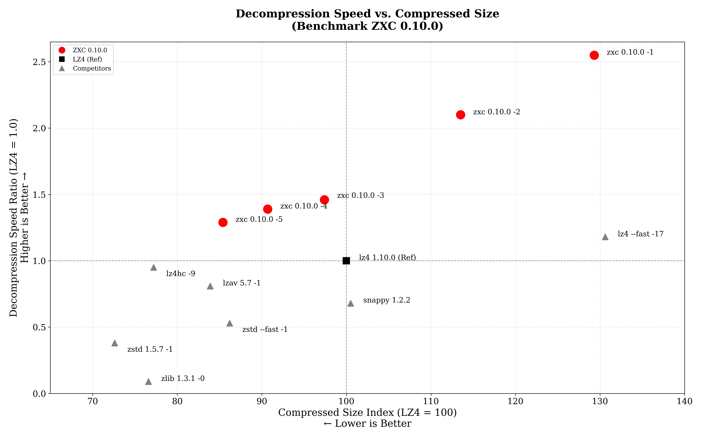

# ZXC: High-Performance Asymmetric Lossless Compression

[](https://github.com/hellobertrand/zxc/actions/workflows/build.yml)
[](https://github.com/hellobertrand/zxc/actions/workflows/security.yml)
[](https://github.com/hellobertrand/zxc/actions/workflows/fuzzing.yml)
[](https://github.com/hellobertrand/zxc/actions/workflows/benchmark.yml)

[](https://snyk.io/test/github/hellobertrand/zxc)
[](https://codecov.io/github/hellobertrand/zxc)

[](https://repology.org/project/zxc/versions)
[](https://repology.org/project/zxc/versions)
[](https://repology.org/project/zxc/versions)
[](https://repology.org/project/zxc/versions)
[](https://repology.org/project/zxc/versions)

[](https://crates.io/crates/zxc-compress)
[](https://pypi.org/project/zxc-compress)
[](https://www.npmjs.com/package/zxc-compress)

[](LICENSE)

**ZXC** is a high-performance, lossless, asymmetric compression library optimized for Content Delivery and Embedded Systems (Game Assets, Firmware, App Bundles).
It is designed to be **"Write Once, Read Many"** *(WORM)*. Unlike codecs like LZ4, ZXC trades compression speed (build-time) for **maximum decompression throughput** (run-time).

## TL;DR

- **What:** A C library for lossless compression, optimized for **maximum decompression speed**.
- **Key Result:** Up to **>40% faster** decompression than LZ4 on Apple Silicon, **>20% faster** on Google Axion (ARM64), **>10% faster** on x86_64, **all with better compression ratios**.
- **Use Cases:** Game assets, firmware, app bundles, anything *compressed once, decompressed millions of times*.
- **Seekable:** Built-in seek table for **O(1) random-access** decompression, load any block without scanning the entire file.
- **Install:** `conan install --requires="zxc/[*]"` · `vcpkg install zxc` · `brew install zxc` · `pip install zxc-compress` · `cargo add zxc-compress` · `npm i zxc-compress`
- **Quality:** Fuzzed, sanitized, formally tested, thread-safe API. BSD-3-Clause.

> **Verified:** ZXC has been officially merged into the **[lzbench master branch](https://github.com/inikep/lzbench)**. You can now verify these results independently using the industry-standard benchmark suite.


## ZXC Design Philosophy

Traditional codecs often force a trade-off between **symmetric speed** (LZ4) and **archival density** (Zstd).

**ZXC focuses on Asymmetric Efficiency.**

Designed for the "Write-Once, Read-Many" reality of software distribution, ZXC utilizes a computationally intensive encoder to generate a bitstream specifically structured to **maximize decompression throughput**.
By performing heavy analysis upfront, the encoder produces a layout optimized for the instruction pipelining and branch prediction capabilities of modern CPUs, particularly ARMv8, effectively offloading complexity from the decoder to the encoder.

*   **Build Time:** You generally compress only once (on CI/CD).
*   **Run Time:** You decompress millions of times (on every user's device). **ZXC respects this asymmetry.**

[👉 **Read the Technical Whitepaper**](docs/WHITEPAPER.md)


## Benchmarks

To ensure consistent performance, benchmarks are automatically executed on every commit via GitHub Actions.
We monitor metrics on both **x86_64** (Linux) and **ARM64** (Apple Silicon M2) runners to track compression speed, decompression speed, and ratios.

*(See the [latest benchmark logs](https://github.com/hellobertrand/zxc/actions/workflows/benchmark.yml))*


### 1. Mobile & Client: Apple Silicon (M2)
*Scenario: Game Assets loading, App startup.*

| Target | ZXC vs Competitor | Decompression Speed | Ratio | Verdict |
| :--- | :--- | :--- | :--- | :--- |
| **1. Max Speed** | **ZXC -1** vs *LZ4 --fast* | **11,942 MB/s** vs 5,623 MB/s **2.12x Faster** | **61.9** vs 62.2 **Smaller** (-0.5%) | **ZXC** leads in raw throughput. |
| **2. Standard** | **ZXC -3** vs *LZ4 Default* | **6,959 MB/s** vs 4,782 MB/s **1.46x Faster** | **46.4** vs 47.6 **Smaller** (-2.6%) | **ZXC** outperforms LZ4 in read speed and ratio. |
| **3. High Density** | **ZXC -5** vs *Zstd --fast 1* | **6,144 MB/s** vs 2,540 MB/s **2.42x Faster** | **40.7** vs 41.0 **Equivalent** (-0.8%) | **ZXC** outperforms Zstd in decoding speed. |

### 2. Cloud Server: Google Axion (ARM Neoverse V2)
*Scenario: High-throughput Microservices, ARM Cloud Instances.*

| Target | ZXC vs Competitor | Decompression Speed | Ratio | Verdict |
| :--- | :--- | :--- | :--- | :--- |
| **1. Max Speed** | **ZXC -1** vs *LZ4 --fast* | **8,724 MB/s** vs 4,917 MB/s **1.77x Faster** | **61.9** vs 62.2 **Smaller** (-0.5%) | **ZXC** leads in raw throughput. |
| **2. Standard** | **ZXC -3** vs *LZ4 Default* | **5,249 MB/s** vs 4,249 MB/s **1.24x Faster** | **46.4** vs 47.6 **Smaller** (-2.6%) | **ZXC** outperforms LZ4 in read speed and ratio. |
| **3. High Density** | **ZXC -5** vs *Zstd --fast 1* | **4,633 MB/s** vs 2,287 MB/s **2.03x Faster** | **40.7** vs 41.0 **Equivalent** (-0.8%) | **ZXC** outperforms Zstd in decoding speed. |

### 3. Build Server: x86_64 (AMD EPYC 9B45)
*Scenario: CI/CD Pipelines compatibility.*

| Target | ZXC vs Competitor | Decompression Speed | Ratio | Verdict |
| :--- | :--- | :--- | :--- | :--- |
| **1. Max Speed** | **ZXC -1** vs *LZ4 --fast* | **9,971 MB/s** vs 5,127 MB/s **1.94x Faster** | **61.9** vs 62.2 **Smaller** (-0.5%) | **ZXC** achieves higher throughput. |
| **2. Standard** | **ZXC -3** vs *LZ4 Default* | **5,707 MB/s** vs 4,902 MB/s **1.16x Faster** | **46.4** vs 47.6 **Smaller** (-2.6%) | ZXC offers improved speed and ratio. |
| **3. High Density** | **ZXC -5** vs *Zstd --fast 1* | **5,093 MB/s** vs 2,378 MB/s **2.14x Faster** | **40.7** vs 41.0 **Equivalent** (-0.8%) | **ZXC** provides faster decoding. |


*(Benchmark Graph ARM64 : Decompression Throughput & Storage Ratio (Normalized to LZ4))*



### Benchmark ARM64 (Apple Silicon M2)

Benchmarks were conducted using lzbench 2.2.1 (from @inikep), compiled with Clang 21.0.0 using *MOREFLAGS="-march=native"* on macOS Tahoe 26.4 (Build 25E246). The reference hardware is an Apple M2 processor (ARM64). All performance metrics reflect single-threaded execution on the standard Silesia Corpus and the benchmark made use of [silesia.tar](https://github.com/DataCompression/corpus-collection/tree/main/Silesia-Corpus), which contains tarred files from the Silesia compression corpus.

| Compressor name         | Compression| Decompress.| Compr. size | Ratio | Filename |
| ---------------         | -----------| -----------| ----------- | ----- | -------- |
| memcpy                  | 52891 MB/s | 52870 MB/s |   211947520 |100.00 | 1 files|
| **zxc 0.10.0 -1**           |   938 MB/s | **11942 MB/s** |   131081262 | **61.85** | 1 files|
| **zxc 0.10.0 -2**           |   600 MB/s |  **9820 MB/s** |   114645515 | **54.09** | 1 files|
| **zxc 0.10.0 -3**           |   240 MB/s |  **6959 MB/s** |    98255455 | **46.36** | 1 files|
| **zxc 0.10.0 -4**           |   169 MB/s |  **6588 MB/s** |    91527983 | **43.18** | 1 files|
| **zxc 0.10.0 -5**           |  96.7 MB/s |  **6144 MB/s** |    86199001 | **40.67** | 1 files|
| lz4 1.10.0              |   812 MB/s |  4782 MB/s |   100880800 | 47.60 | 1 files|
| lz4 1.10.0 --fast -17   |  1352 MB/s |  5623 MB/s |   131732802 | 62.15 | 1 files|
| lz4hc 1.10.0 -9         |  48.1 MB/s |  4529 MB/s |    77884448 | 36.75 | 1 files|
| lzav 5.7 -1             |   663 MB/s |  3864 MB/s |    84644732 | 39.94 | 1 files|
| snappy 1.2.2            |   879 MB/s |  3262 MB/s |   101415443 | 47.85 | 1 files|
| zstd 1.5.7 --fast --1   |   724 MB/s |  2540 MB/s |    86916294 | 41.01 | 1 files|
| zstd 1.5.7 -1           |   645 MB/s |  1809 MB/s |    73193704 | 34.53 | 1 files|
| zlib 1.3.1 -1           |   150 MB/s |   410 MB/s |    77259029 | 36.45 | 1 files|


### Benchmark ARM64 (Google Axion Neoverse-V2)

Benchmarks were conducted using lzbench 2.2.1 (from @inikep), compiled with GCC 14.3.0 using *MOREFLAGS="-march=native"* on Linux 64-bits Debian GNU/Linux 12 (bookworm). The reference hardware is a Google Neoverse-V2 processor (ARM64). All performance metrics reflect single-threaded execution on the standard Silesia Corpus and the benchmark made use of [silesia.tar](https://github.com/DataCompression/corpus-collection/tree/main/Silesia-Corpus), which contains tarred files from the Silesia compression corpus.

| Compressor name         | Compression| Decompress.| Compr. size | Ratio | Filename |
| ---------------         | -----------| -----------| ----------- | ----- | -------- |
| memcpy                  | 23113 MB/s | 22777 MB/s |   211947520 |100.00 | 1 files|
| **zxc 0.10.0 -1**           |   867 MB/s |  **8724 MB/s** |   131081262 | **61.85** | 1 files|
| **zxc 0.10.0 -2**           |   556 MB/s |  **7294 MB/s** |   114645515 | **54.09** | 1 files|
| **zxc 0.10.0 -3**           |   231 MB/s |  **5249 MB/s** |    98255455 | **46.36** | 1 files|
| **zxc 0.10.0 -4**           |   161 MB/s |  **4984 MB/s** |    91527983 | **43.18** | 1 files|
| **zxc 0.10.0 -5**           |  91.8 MB/s |  **4633 MB/s** |    86199001 | **40.67** | 1 files|
| lz4 1.10.0              |   733 MB/s |  4249 MB/s |   100880800 | 47.60 | 1 files|
| lz4 1.10.0 --fast -17   |  1277 MB/s |  4917 MB/s |   131732802 | 62.15 | 1 files|
| lz4hc 1.10.0 -9         |  43.5 MB/s |  3837 MB/s |    77884448 | 36.75 | 1 files|
| lzav 5.7 -1             |   544 MB/s |  2742 MB/s |    84644732 | 39.94 | 1 files|
| snappy 1.2.2            |   757 MB/s |  2293 MB/s |   101415443 | 47.85 | 1 files|
| zstd 1.5.7 --fast --1   |   606 MB/s |  2287 MB/s |    86916294 | 41.01 | 1 files|
| zstd 1.5.7 -1           |   524 MB/s |  1644 MB/s |    73193704 | 34.53 | 1 files|
| zlib 1.3.1 -1           |   114 MB/s |   390 MB/s |    77259029 | 36.45 | 1 files|


### Benchmark x86_64 (AMD EPYC 9B45)

Benchmarks were conducted using lzbench 2.2.1 (from @inikep), compiled with GCC 14.3.0 using *MOREFLAGS="-march=native"* on Linux 64-bits Ubuntu 24.04. The reference hardware is an AMD EPYC 9B45 processor (x86_64). All performance metrics reflect single-threaded execution on the standard Silesia Corpus and the benchmark made use of [silesia.tar](https://github.com/DataCompression/corpus-collection/tree/main/Silesia-Corpus), which contains tarred files from the Silesia compression corpus.

| Compressor name         | Compression| Decompress.| Compr. size | Ratio | Filename |
| ---------------         | -----------| -----------| ----------- | ----- | -------- |
| memcpy                  | 25522 MB/s | 25555 MB/s |   211947520 |100.00 | 1 files|
| **zxc 0.10.0 -1**           |   827 MB/s |  **9971 MB/s** |   131081262 | **61.85** | 1 files|
| **zxc 0.10.0 -2**           |   508 MB/s |  **8885 MB/s** |   114645515 | **54.09** | 1 files|
| **zxc 0.10.0 -3**           |   210 MB/s |  **5707 MB/s** |    98255455 | **46.36** | 1 files|
| **zxc 0.10.0 -4**           |   149 MB/s |  **5416 MB/s** |    91527983 | **43.18** | 1 files|
| **zxc 0.10.0 -5**           |  87.1 MB/s |  **5093 MB/s** |    86199001 | **40.67** | 1 files|
| lz4 1.10.0              |   770 MB/s |  4902 MB/s |   100880800 | 47.60 | 1 files|
| lz4 1.10.0 --fast -17   |  1260 MB/s |  5127 MB/s |   131732802 | 62.15 | 1 files|
| lz4hc 1.10.0 -9         |  43.6 MB/s |  4751 MB/s |    77884448 | 36.75 | 1 files|
| lzav 5.7 -1             |   604 MB/s |  3582 MB/s |    84644732 | 39.94 | 1 files|
| snappy 1.2.2            |   734 MB/s |  2088 MB/s |   101512076 | 47.89 | 1 files|
| zstd 1.5.7 --fast --1   |   642 MB/s |  2378 MB/s |    86916294 | 41.01 | 1 files|
| zstd 1.5.7 -1           |   588 MB/s |  1851 MB/s |    73193704 | 34.53 | 1 files|
| zlib 1.3.1 -1           |   131 MB/s |   385 MB/s |    77259029 | 36.45 | 1 files|


### Benchmark x86_64 (AMD EPYC 7763)

Benchmarks were conducted using lzbench 2.2.1 (from @inikep), compiled with GCC 14.2.0 using *MOREFLAGS="-march=native"* on Linux 64-bits Ubuntu 24.04. The reference hardware is an AMD EPYC 7763 64-Core processor (x86_64). All performance metrics reflect single-threaded execution on the standard Silesia Corpus and the benchmark made use of [silesia.tar](https://github.com/DataCompression/corpus-collection/tree/main/Silesia-Corpus), which contains tarred files from the Silesia compression corpus.

| Compressor name         | Compression| Decompress.| Compr. size | Ratio | Filename |
| ---------------         | -----------| -----------| ----------- | ----- | -------- |
| memcpy                  | 23987 MB/s | 23852 MB/s |   211947520 |100.00 | 1 files|
| **zxc 0.10.0 -1**           |   636 MB/s |  **6901 MB/s** |   131081262 | **61.85** | 1 files|
| **zxc 0.10.0 -2**           |   404 MB/s |  **5806 MB/s** |   114645515 | **54.09** | 1 files|
| **zxc 0.10.0 -3**           |   173 MB/s |  **3968 MB/s** |    98255455 | **46.36** | 1 files|
| **zxc 0.10.0 -4**           |   123 MB/s |  **3802 MB/s** |    91527983 | **43.18** | 1 files|
| **zxc 0.10.0 -5**           |  72.4 MB/s |  **3632 MB/s** |    86199001 | **40.67** | 1 files|
| lz4 1.10.0              |   582 MB/s |  3554 MB/s |   100880800 | 47.60 | 1 files|
| lz4 1.10.0 --fast -17   |  1016 MB/s |  4102 MB/s |   131732802 | 62.15 | 1 files|
| lz4hc 1.10.0 -9         |  34.0 MB/s |  3406 MB/s |    77884448 | 36.75 | 1 files|
| lzav 5.7 -1             |   440 MB/s |  2638 MB/s |    84644732 | 39.94 | 1 files|
| snappy 1.2.2            |   613 MB/s |  1593 MB/s |   101512076 | 47.89 | 1 files|
| zstd 1.5.7 --fast --1   |   445 MB/s |  1626 MB/s |    86916294 | 41.01 | 1 files|
| zstd 1.5.7 -1           |   405 MB/s |  1224 MB/s |    73193704 | 34.53 | 1 files|
| zlib 1.3.1 -1           |  98.3 MB/s |   328 MB/s |    77259029 | 36.45 | 1 files|


---

## Installation

### Option 1: Download Release (GitHub)

1.  Go to the [Releases page](https://github.com/hellobertrand/zxc/releases).
2.  Download the archive matching your architecture:

    **macOS:**
    *   `zxc-macos-arm64.tar.gz` (NEON optimizations included).

    **Linux:**
    *   `zxc-linux-aarch64.tar.gz` (NEON optimizations included).
    *   `zxc-linux-x86_64.tar.gz` (Runtime dispatch for AVX2/AVX512).

    **Windows:**
    *   `zxc-windows-x64.zip` (Runtime dispatch for AVX2/AVX512).

3.  Extract and install:
    ```bash
    tar -xzf zxc-linux-x86_64.tar.gz -C /usr/local
    ```

    Each archive contains:
    ```
    bin/zxc                          # CLI binary
    include/                         # C headers (zxc.h, zxc_buffer.h, ...)
    lib/libzxc.a                     # Static library
    lib/pkgconfig/libzxc.pc          # pkg-config support
    lib/cmake/zxc/zxcConfig.cmake    # CMake find_package(zxc) support
    ```

4.  Use in your project:

    **CMake:**
    ```cmake
    find_package(zxc REQUIRED)
    target_link_libraries(myapp PRIVATE zxc::zxc_lib)
    ```

    **pkg-config:**
    ```bash
    cc myapp.c $(pkg-config --cflags --libs libzxc) -o myapp
    ```

### Option 2: vcpkg

**Classic mode:**
```bash
vcpkg install zxc
```

**Manifest mode** (add to `vcpkg.json`):
```json
{
  "dependencies": ["zxc"]
}
```

Then in your CMake project:
```cmake
find_package(zxc CONFIG REQUIRED)
target_link_libraries(myapp PRIVATE zxc::zxc_lib)
```

### Option 3: Conan

You also can download and install zxc using the [Conan](https://conan.io/) package manager:

```bash
    conan install -r conancenter --requires="zxc/[*]" --build=missing
```

Or add to your `conanfile.txt`:
```ini
[requires]
zxc/[*]
```

The zxc package in Conan Center is kept up to date by
[ConanCenterIndex](https://github.com/conan-io/conan-center-index) contributors.
If the version is out of date, please create an issue or pull request on the Conan Center Index repository.

### Option 4: Homebrew

```bash
brew install zxc
```

The formula is maintained in [homebrew-core](https://formulae.brew.sh/formula/zxc).

### Option 5: Building from Source

**Requirements:** CMake (3.14+), C17 Compiler (Clang/GCC/MSVC).

```bash
git clone https://github.com/hellobertrand/zxc.git
cd zxc
cmake -B build -DCMAKE_BUILD_TYPE=Release
cmake --build build --parallel

# Run tests
ctest --test-dir build -C Release --output-on-failure

# CLI usage
./build/zxc --help

# Install library, headers, and CMake/pkg-config files
sudo cmake --install build
```

#### CMake Options

| Option | Default | Description |
|--------|---------|-------------|
| `BUILD_SHARED_LIBS` | OFF | Build shared libraries instead of static (`libzxc.so`, `libzxc.dylib`, `zxc.dll`) |
| `ZXC_NATIVE_ARCH` | ON | Enable `-march=native` for maximum performance |
| `ZXC_ENABLE_LTO` | ON | Enable Link-Time Optimization (LTO) |
| `ZXC_PGO_MODE` | OFF | Profile-Guided Optimization mode (`OFF`, `GENERATE`, `USE`) |
| `ZXC_BUILD_CLI` | ON | Build command-line interface |
| `ZXC_BUILD_TESTS` | ON | Build unit tests |
| `ZXC_ENABLE_COVERAGE` | OFF | Enable code coverage generation (disables LTO/PGO) |
| `ZXC_DISABLE_SIMD` | OFF | Disable hand-written SIMD paths (AVX2/AVX512/NEON) |

```bash
# Build shared library
cmake -B build -DBUILD_SHARED_LIBS=ON

# Portable build (without -march=native)
cmake -B build -DZXC_NATIVE_ARCH=OFF

# Library only (no CLI, no tests)
cmake -B build -DZXC_BUILD_CLI=OFF -DZXC_BUILD_TESTS=OFF

# Code coverage build
cmake -B build -DZXC_ENABLE_COVERAGE=ON

# Disable explicit SIMD code paths (compiler auto-vectorisation is unaffected)
cmake -B build -DZXC_DISABLE_SIMD=ON
```

#### Profile-Guided Optimization (PGO)

PGO uses runtime profiling data to optimize branch layout, inlining decisions, and code placement.

**Step 1 - Build with instrumentation:**
```bash
cmake -B build -DCMAKE_BUILD_TYPE=Release -DZXC_PGO_MODE=GENERATE
cmake --build build --parallel
```

**Step 2 - Run a representative workload to collect profile data:**
```bash
# Run the test suite (exercises all block types and compression levels)
./build/zxc_test

# Or compress/decompress representative data
./build/zxc -b your_data_file
```

**Step 3 - (Clang only) Merge raw profiles:**
```bash
# Clang generates .profraw files that must be merged before use
llvm-profdata merge -output=build/pgo/default.profdata build/pgo/*.profraw
```
> GCC uses a directory-based format and does not require this step.

**Step 4 - Rebuild with profile data:**
```bash
cmake -B build -DCMAKE_BUILD_TYPE=Release -DZXC_PGO_MODE=USE
cmake --build build --parallel
```

### Packaging Status

[](https://repology.org/project/zxc/versions)

---

## Compression Levels

*   **Level 1, 2 (Fast):** Optimized for real-time assets (Gaming, UI).
*   **Level 3, 4 (Balanced):** A strong middle-ground offering efficient compression speed and a ratio superior to LZ4.
*   **Level 5 (Compact):** The best choice for Embedded, Firmware, or Archival. Better compression than LZ4 and significantly faster decoding than Zstd.

## Block Size Tuning

The default block size is **256 KB**, a conservative choice that balances compression quality, memory usage, and random-access granularity. For **bulk/archival workloads** where maximum throughput matters, **512 KB blocks** are recommended.

**Why larger blocks help:** Each block starts with a cold hash table, so the LZ match-finder has no history and produces more literals until the table warms up. Doubling the block size halves the number of cold-start penalties, improving both ratio and decompression speed.

| Block Size | Memory (per context) | Ratio (level -3) | Decompression gain vs 256 KB |
|:----------:|:--------------------:|:-----------------:|:----------------------------:|
| 256 KB *(default)* | ~1.7 MB | 46.36% | — |
| 512 KB | ~3.3 MB | 45.81% *(−0.55 pp)* | +1% to +8% depending on CPU |

```bash
# CLI
zxc -B 512K -5 input_file output_file

# API
zxc_compress_opts_t opts = {
    .level      = ZXC_LEVEL_COMPACT,
    .block_size = 512 * 1024,
};
```

**Guideline:** Use 256 KB (default) for streaming, embedded, or memory-constrained environments. Use 512 KB for bulk compression pipelines, CI/CD asset packaging, and high-throughput servers.

---

## Usage

### 1. CLI

The CLI is perfect for benchmarking or manually compressing assets.

```bash
# Basic Compression (Level 3 is default)
zxc -z input_file output_file

# High Compression (Level 5)
zxc -z -5 input_file output_file

# Seekable Archive (enables O(1) random-access decompression)
zxc -z -S input_file output_file

# -z for compression can be omitted
zxc input_file output_file

# as well as output file; it will be automatically assigned to input_file.zxc
zxc input_file

# Decompression
zxc -d compressed_file output_file

# Benchmark Mode (Testing speed on your machine)
zxc -b input_file
```

#### Using with `tar`

ZXC works as a drop-in external compressor for `tar` (reads stdin, writes stdout, returns 0 on success):

```bash
# GNU tar (Linux)
tar -I 'zxc -5' -cf archive.tar.zxc data/
tar -I 'zxc -d' -xf archive.tar.zxc

# bsdtar (macOS)
tar --use-compress-program='zxc -5' -cf archive.tar.zxc data/
tar --use-compress-program='zxc -d' -xf archive.tar.zxc

# Pipes (universal)
tar cf - data/ | zxc > archive.tar.zxc
zxc -d < archive.tar.zxc | tar xf -
```

### 2. API

ZXC provides a **thread-safe API** with two usage patterns. Parameters are passed through dedicated options structs, making call sites self-documenting and forward-compatible.

#### Buffer API (In-Memory)
```c
#include "zxc.h"

// Compression
uint64_t bound = zxc_compress_bound(src_size);
zxc_compress_opts_t c_opts = {
    .level            = ZXC_LEVEL_DEFAULT,
    .checksum_enabled = 1,
    /* .block_size = 0 -> 256 KB default */
};
int64_t compressed_size = zxc_compress(src, src_size, dst, bound, &c_opts);

// Decompression
zxc_decompress_opts_t d_opts = { .checksum_enabled = 1 };
int64_t decompressed_size = zxc_decompress(src, src_size, dst, dst_capacity, &d_opts);
```

#### Stream API (Files, Multi-Threaded)
```c
#include "zxc.h"

// Compression (auto-detect threads, level 3, checksum on)
zxc_compress_opts_t c_opts = {
    .n_threads        = 0,               // 0 = auto
    .level            = ZXC_LEVEL_DEFAULT,
    .checksum_enabled = 1,
    /* .block_size = 0 -> 256 KB default */
};
int64_t bytes_written = zxc_stream_compress(f_in, f_out, &c_opts);

// Decompression
zxc_decompress_opts_t d_opts = { .n_threads = 0, .checksum_enabled = 1 };
int64_t bytes_out = zxc_stream_decompress(f_in, f_out, &d_opts);
```

#### Reusable Context API (Low-Latency / Embedded)

For tight loops (e.g. filesystem plug-ins) where per-call `malloc`/`free`
overhead matters, use opaque reusable contexts.
Options are **sticky** - settings from `zxc_create_cctx()` are reused when
passing `NULL`:
```c
#include "zxc.h"

zxc_compress_opts_t opts = { .level = 3, .checksum_enabled = 0 };
zxc_cctx* cctx = zxc_create_cctx(&opts);   // allocate once, settings remembered
zxc_dctx* dctx = zxc_create_dctx();        // allocate once

// reuse across many blocks - NULL reuses sticky settings:
int64_t csz = zxc_compress_cctx(cctx, src, src_sz, dst, dst_cap, NULL);
int64_t dsz = zxc_decompress_dctx(dctx, dst, csz, out, src_sz, NULL);

zxc_free_cctx(cctx);
zxc_free_dctx(dctx);
```

**Features:**
- Caller-allocated buffers with explicit bounds
- Thread-safe (stateless)
- Configurable block sizes (4 KB – 2 MB, powers of 2)
- Multi-threaded streaming (auto-detects CPU cores)
- Optional checksum validation
- Reusable contexts for high-frequency call sites
- Seekable archives: optional seek table for O(1) random-access decompression (`.seekable = 1`)

**[See complete examples and advanced usage ->](docs/EXAMPLES.md)**

## Language Bindings

[](https://crates.io/crates/zxc-compress)
[](https://pypi.org/project/zxc-compress)
[](https://www.npmjs.com/package/zxc-compress)

Official wrappers maintained in this repository:

| Language | Package Manager | Install Command | Documentation | Author |
|----------|-----------------|-----------------|---------------|--------|
| **Rust** | [`crates.io`](https://crates.io/crates/zxc-compress) | `cargo add zxc-compress` | [README](wrappers/rust/zxc/README.md) | [@hellobertrand](https://github.com/hellobertrand) |
| **Python**| [`PyPI`](https://pypi.org/project/zxc-compress) | `pip install zxc-compress` | [README](wrappers/python/README.md) | [@nuberchardzer1](https://github.com/nuberchardzer1) |
| **Node.js**| [`npm`](https://www.npmjs.com/package/zxc-compress) | `npm install zxc-compress` | [README](wrappers/nodejs/README.md) | [@hellobertrand](https://github.com/hellobertrand) |
| **Go** | `go get` | `go get github.com/hellobertrand/zxc/wrappers/go` | [README](wrappers/go/README.md) | [@hellobertrand](https://github.com/hellobertrand) |
| **WASM** | Build from source | `emcmake cmake -B build-wasm && cmake --build build-wasm` | [README](wrappers/wasm/README.md) | [@hellobertrand](https://github.com/hellobertrand) |

Community-maintained bindings:

| Language | Package Manager | Install Command | Repository | Author |
| -------- | --------------- | --------------- | ---------- | ------ |
| **Go** | pkg.go.dev | `go get github.com/meysam81/go-zxc` | <https://github.com/meysam81/go-zxc> | [@meysam81](https://github.com/meysam81) |

## Safety & Quality
* **Unit Tests**: Comprehensive test suite with CTest integration.
* **Continuous Fuzzing**: Integrated with ClusterFuzzLite suites.
* **Static Analysis**: Checked with Cppcheck & Clang Static Analyzer.
* **CodeQL Analysis**: GitHub Advanced Security scanning for vulnerabilities.
* **Code Coverage**: Automated tracking with Codecov integration.
* **Dynamic Analysis**: Validated with Valgrind and ASan/UBSan in CI pipelines.
* **Safe API**: Explicit buffer capacity is required for all operations.


## License & Credits

**ZXC** Copyright © 2025-2026, Bertrand Lebonnois and contributors.
Licensed under the **BSD 3-Clause License**. See LICENSE for details.

**Third-Party Components:**
- **rapidhash** by Nicolas De Carli (MIT) - Used for high-speed, platform-independent checksums.
