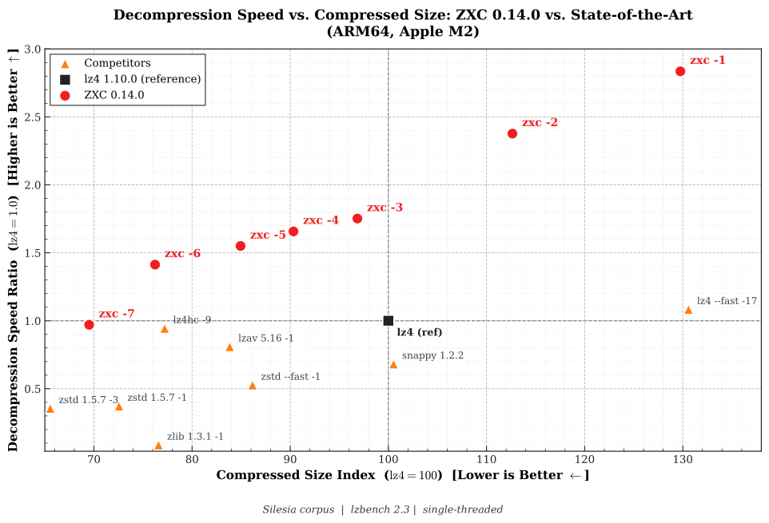
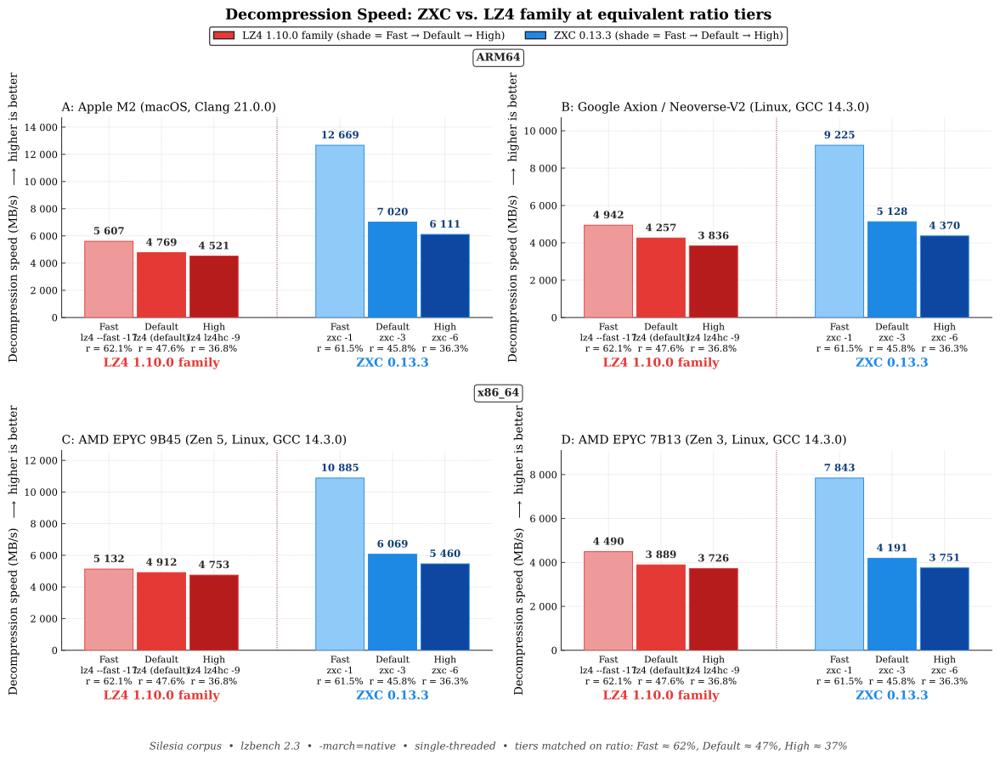
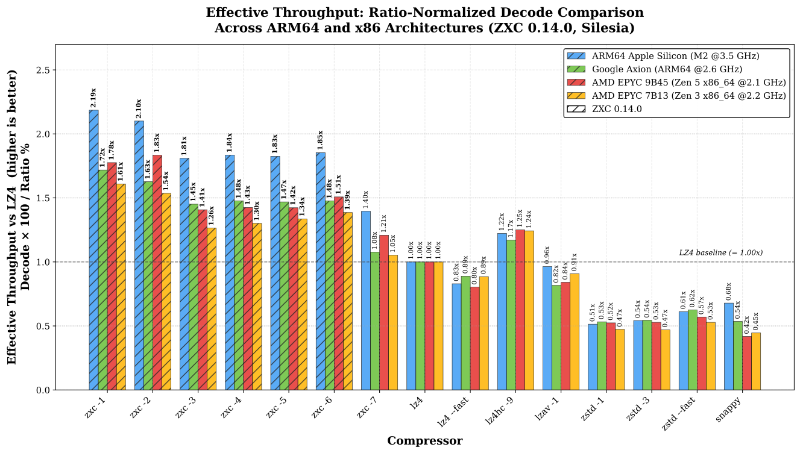

# ZXC - Seekable Lossless Compression Built for Ultra-Fast Decode

[](https://github.com/hellobertrand/zxc/actions/workflows/build.yml)
[](https://github.com/hellobertrand/zxc/actions/workflows/quality.yml)
[](https://github.com/hellobertrand/zxc/actions/workflows/security.yml)

<!-- [](https://sonarcloud.io/summary/overall?id=hellobertrand_zxc) -->
[](https://oss-fuzz-build-logs.storage.googleapis.com/index.html#zxc)
[](https://snyk.io/test/github/hellobertrand/zxc/badge.svg)
[](https://codecov.io/github/hellobertrand/zxc)
[](https://scorecard.dev/viewer/?uri=github.com/hellobertrand/zxc)
[](LICENSE)

ZXC is a lossless compression **C library** (with official Rust, Python, Node.js, Go and WASM bindings). It trades compression speed for maximum decode throughput — the appropriate trade-off whenever data is **compressed once and read many times**: content delivery, embedded systems, FOTA (Firmware Over-The-Air) updates, game assets, and app bundles. It runs on all major architectures (`x86_64`, `ARM64`, `ARMv7`, `ARMv6`, `RISC-V`, `POWER`, `s390x`, `i386`) with hand-tuned SIMD paths, and shows particularly strong gains on modern ARM cores (Apple Silicon, AWS Graviton, Google Axion) thanks to a bitstream layout tuned for their deep pipelines.

## TL;DR

- **Faster decode than LZ4, at a smaller size.** 22–75% faster decode at the default level (best on ARM64), rising to up to 2.6× in the speed-optimized tier, always at an equal-or-better compression ratio. See the [benchmarks](#benchmarks).
- **Independently verified.** Merged into [lzbench](https://github.com/inikep/lzbench) (@inikep) and [TurboBench](https://github.com/powturbo/TurboBench) (@powturbo); every benchmark below is reproducible against 70+ codecs.
- **Cross-platform.** x86_64, ARM64, ARMv7, ARMv6, RISC-V, POWER (ppc64el), s390x, i386, with hand-tuned SIMD (SSE2/AVX2/AVX-512 on x86, NEON on ARMv8+).
- **Built for "Write Once, Read Many."** Compress once at build time, decompress millions of times at run time.
- **Production-grade.** Continuously fuzzed by Google [OSS-Fuzz](https://github.com/google/oss-fuzz), ASan/UBSan/Valgrind-clean, SLSA-signed releases, thread-safe API, BSD-3-Clause.
- **Seekable.** Built-in seek table for O(1) random-access decompression.
- **Dictionary mode for small data.** A corpus-trained dictionary (`zxc --train`) prefills the LZ77 window at every block start, recovering ratio on payloads too small to build their own history. See [dictionary compression](#dictionary-compression).
- **Broadly packaged.** Conan, vcpkg, Homebrew, Winget and Rust/Python/Node packages.

## Quick start

```bash
# Install (pick your package manager)
brew install zxc
conan install --requires="zxc/[*]"     # or: vcpkg install zxc

# Compress once, decompress fast
zxc -5 assets.tar assets.tar.zxc
zxc -d assets.tar.zxc assets.tar
```

> **Independently verified:** ZXC is merged into both major open-source compression benchmark suites — [lzbench](https://github.com/inikep/lzbench) (master, by @inikep) and [TurboBench](https://github.com/powturbo/TurboBench) (master, by @powturbo). Every number in this README is reproducible with either tool, alongside 70+ other codecs.

## Design Philosophy: Asymmetric Efficiency

Traditional codecs force a trade-off between **symmetric speed** (LZ4) and **archival density** (Zstd). **ZXC takes a third path: asymmetric efficiency.**

The encoder does the heavy lifting upfront — match selection, optimal parsing, statistics tuning — to emit a bitstream structured for the instruction pipelining and branch prediction of modern CPUs (particularly ARMv8). Complexity is **offloaded from the decoder to the encoder**, which is exactly the trade-off WORM workloads want.

*   **Build time:** you compress only once (on CI/CD).
*   **Run time:** you decompress millions of times (on every user's device). **ZXC respects this asymmetry.**

[👉 **Read the Technical Whitepaper**](docs/WHITEPAPER.md)


## Benchmarks

Silesia corpus (202 MB), single-threaded, [lzbench](https://github.com/inikep/lzbench) 2.3.1 (from
[@inikep](https://github.com/inikep)) built with `MOREFLAGS="-march=native"`, on four reference
machines: Apple M2 (Clang 21, macOS 26), Google Axion / Neoverse-V2 (GCC 14, GCP C4A), AMD EPYC 9B45
/ Zen 5 (GCP C4D) and AMD EPYC 7B13 / Zen 3 (GCP C2D) — both x86 with SMT disabled. Re-run on every
commit ([latest logs](https://github.com/hellobertrand/zxc/actions/workflows/benchmark.yml)).

**Decompression speed, against the closest competitor at each ratio tier:**

| Machine | `-1` vs `lz4 --fast` | `-3` vs `lz4` | `-6` vs `lz4hc -9` | `-7` vs `zstd -1` |
| :--- | ---: | ---: | ---: | ---: |
| Apple M2 | **2.62x** | **1.75x** | **1.50x** | **2.60x** |
| Axion (Neoverse-V2) | **1.92x** | **1.41x** | **1.25x** | **1.94x** |
| EPYC 9B45 (Zen 5) | **2.20x** | **1.36x** | **1.19x** | **2.21x** |
| EPYC 7B13 (Zen 3) | **1.81x** | **1.22x** | **1.10x** | **2.13x** |

The speed is not bought with ratio: ZXC is also *smaller* in all four pairings — 61.76 vs 62.15,
46.09 vs 47.60, 36.28 vs 36.75 and 33.09 vs 34.53 %. Per-level tables for every machine, cycles per
byte and memory figures live in the
**[whitepaper](docs/WHITEPAPER.md#7-performance-analysis-benchmarks)**.

*Decompression Speed vs Compressed Size — ARM64 Apple M2*



*Decompression Speed: ZXC vs LZ4 family at equivalent ratio tiers, across 4 CPUs (Fast ≈ 62%, Default ≈ 47%, High ≈ 37%)*



*Effective Throughput : Ratio-Normalized Decode across ARM64 and x86 (decode x 100 / ratio%, LZ4 baseline = 1.00x)*



> **What is Effective Throughput?**
>
> Raw decode speed misses half the picture: in real workloads (asset streaming, container pulls, microservice payloads), the decoder is fed by a compressed-byte source - disk, network, inter-core - whose bandwidth is the bottleneck. The right question is *how much original data is delivered per MB of compressed input*.
>
> Formula: `Effective (MB/s) = Decode × 100 / Ratio (%)`: combines decode speed and ratio in one number. **Every ZXC level from -1 to -7 sits above LZ4** on every architecture, peaking at **2.19x on Apple Silicon** and ranging **1.26x–1.83x** on x86 and ARM cloud platforms for levels -1 to -6. The density-optimized ULTRA level -7 now clears LZ4 as well (**1.05x–1.40x**), at a 33.09% ratio.

---

## Installation

ZXC is packaged across major ecosystems and kept current by their maintainers:

[](https://repology.org/project/zxc/versions)
[](https://repology.org/project/zxc/versions)
[](https://repology.org/project/zxc/versions)
[](https://repology.org/project/zxc/versions)
[](https://repology.org/project/zxc/versions)

[](https://crates.io/crates/zxc-compress)
[](https://pypi.org/project/zxc-compress)
[](https://www.npmjs.com/package/zxc-compress)

| Ecosystem | Install |
| :--- | :--- |
| [vcpkg](https://vcpkg.io/) | `vcpkg install zxc`, or `"dependencies": ["zxc"]` in `vcpkg.json` |
| [Conan](https://conan.io/) | `conan install -r conancenter --requires="zxc/[*]" --build=missing`, or `zxc/[*]` under `[requires]` in `conanfile.txt` |
| [Homebrew](https://formulae.brew.sh/formula/zxc) | `brew install zxc` |
| winget (Windows 10 1709+) | `winget install hellobertrand.zxc` |
| Rust / Python / Node.js | `cargo add zxc-compress` &middot; `pip install zxc-compress` &middot; `npm install zxc-compress` |

The vcpkg and Conan Center recipes are maintained by their respective communities; if a version
lags behind, open an issue on that registry's index repository.

### From a release archive

Pick the archive for your platform on the [Releases page](https://github.com/hellobertrand/zxc/releases)
— `zxc-<version>-{linux,macos}-{x86_64,arm64}.tar.gz` or `zxc-<version>-windows-{x86_64,arm64}.zip`.
x86_64 builds dispatch AVX2/AVX-512 at runtime; ARM64 builds carry NEON. `zxc-<version>.tar.gz` is
the canonical source, reproducible with
`git archive --format=tar --prefix=zxc-<version>/ v<version> | gzip -n -9`; `zxc-<version>.tar.zxc`
is that same tar compressed with `zxc -7`, readable only by a `zxc` whose format version matches, so
keep the `.tar.gz` for archival.

Verify before extracting — the manifest is signed, so check it first:

```bash
minisign -Vm checksums.sha256 -P 'RWQV0cpiyJYPkxF5iIysJzKNtzcGphqeyyFkiFErLMo5UZkWisGBxkNB'
sha256sum -c checksums.sha256 --ignore-missing      # macOS: grep <file> checksums.sha256 | shasum -a 256 -c
gh attestation verify zxc-<version>-linux-x86_64.tar.gz --repo hellobertrand/zxc

tar -xzf zxc-<version>-linux-x86_64.tar.gz
sudo cp -r zxc-<version>-linux-x86_64/* /usr/local/
```

Each archive holds `bin/zxc`, `include/`, `lib/libzxc.a`, `lib/pkgconfig/libzxc.pc` and
`lib/cmake/zxc/zxcConfig.cmake`. Release tags are PGP-signed: `curl -sS https://github.com/hellobertrand.gpg | gpg --import`
then `git verify-tag v<version>`. Full verification path: [SECURITY.md](.github/SECURITY.md).

### In your project

```cmake
find_package(zxc REQUIRED)          # find_package(zxc CONFIG REQUIRED) via vcpkg or Conan
target_link_libraries(myapp PRIVATE zxc::zxc_lib)
```

```bash
cc myapp.c $(pkg-config --cflags --libs libzxc) -o myapp
```

Vendoring zxc instead — CMake `FetchContent` or `add_subdirectory()`, a Meson subproject or WrapDB —
and building from source, with the full option table and the PGO workflow:
**[docs/INSTALL.md](docs/INSTALL.md)**.

### Packaging Status

[](https://repology.org/project/zxc/versions)

---

## Compression Levels

*   **Level 1, 2 (Fast):** Optimized for real-time assets (Gaming, UI).
*   **Level 3, 4 (Balanced):** A strong middle-ground offering efficient compression speed and a ratio superior to LZ4.
*   **Level 5 (Compact):** A good choice for Embedded and Firmware. Better compression than LZ4 and significantly faster decoding than Zstd.
*   **Level 6 (Density):** Beats LZ4HC on both axes — better ratio *and* faster decode on every measured platform — while staying in the multi-GB/s decode class. Best for Archival and write-once / read-many workloads where compression time is amortized over many reads.
*   **Level 7 (Ultra):** Maximum density. Deep parse plus Huffman-coded literals *and* tokens (11-bit codes) push the ratio past `zstd -1` while decoding several times faster than it. Choose it when storage or bandwidth dominates but decode must remain fast; compression is the slowest tier.

## Block Size Tuning

The default block size is **512 KB**, tuned for bulk/archival workloads where ratio and decompression throughput matter most. For **memory-constrained or streaming use cases**, **256 KB blocks** halve the per-context memory footprint at a small cost in ratio and decompression speed.

**Why larger blocks help:** Each block starts with a cold hash table, so the LZ match-finder has no history and produces more literals until the table warms up. Doubling the block size halves the number of cold-start penalties, improving both ratio and decompression speed.

| Block Size | cctx memory | dctx memory | Ratio (level -3) | Decompression gain vs 256 KB |
|:----------:|:-----------:|:-----------:|:----------------:|:----------------------------:|
| 256 KB | ~1.03 MB | ~256 KB | 46.68% | — |
| 512 KB *(default)* | ~1.78 MB | ~512 KB | 46.09% *(−0.59 pp)* | +1% to +8% depending on CPU |

```bash
# CLI — fall back to 256 KB blocks (e.g. embedded / streaming)
zxc -B 256K -5 input_file output_file

# API
zxc_compress_opts_t opts = {
    .level      = ZXC_LEVEL_COMPACT,
    .block_size = 256 * 1024,
};
```

**Guideline:** Stick with 512 KB (default) for bulk compression pipelines, CI/CD asset packaging, and high-throughput servers. Use 256 KB (`-B 256K`) for streaming, embedded, or memory-constrained environments.

---

## In-Place Decompression

When the whole archive already lives in RAM (a firmware image, a game asset, a FOTA payload), ZXC can decompress **inside a single buffer** — no separate output allocation. You place the compressed archive flush-right in a buffer, and ZXC decodes left-to-right into the same memory. Because a ZXC block never expands, the write cursor provably never overtakes the read cursor given a one-block safety margin, so peak memory drops from *compressed + decompressed* to roughly *decompressed* alone.

```c
// One allocation instead of two.
size_t need = zxc_decompress_inplace_bound(archive, archive_size);   // reads header+footer
uint8_t* buf = malloc(need);
memcpy(buf + (need - archive_size), archive, archive_size);          // archive flush-right
int64_t n = zxc_decompress_inplace(buf, need, archive_size, NULL);   // decode into buf[0..]
// buf[0 .. n) now holds the decompressed data
```

The required margin is one block, the accumulated per-block framing overhead, the trailing framing the encoder writes after the last block (EOF block, seek table, footer), and the wild-copy tail (`block_size + nblocks x (12-16 B) + ~2 KB`) — about **1 %** overhead on a large archive; always size the buffer via `zxc_decompress_inplace_bound` rather than the formula. An undersized buffer is rejected with `ZXC_ERROR_DST_TOO_SMALL`, never silent corruption. This is a library/API capability: it targets embedded/firmware integrators.

---

## Dictionary Compression

For workloads compressed in **small blocks** (4 KB–128 KB), a pre-trained dictionary dramatically
improves compression ratio. It prefills the LZ77 sliding window at the *start of each block*, so the
benefit is per-block: the smaller the block, the less history of its own it has and the more it
leans on the dictionary. That holds for a single small payload as much as for a large one split into
many small blocks — anywhere early bytes would otherwise have nothing to match against.

A `.zxd` also carries a **shared literal Huffman table**, trained on the post-LZ literal
distribution of the corpus: blocks it encodes well drop their own 128-byte table header, a fixed
cost small blocks cannot amortize. It codes literals at levels 6-7 only, and the CLI handles it end
to end — `--train` always writes one, `-D` always loads it.

**Typical use cases:** JSON API responses, small game assets, structured logs, key-value store
records, RPC messages, and any large but homogeneous corpus compressed in small blocks for random
access (e.g. seekable archives).

```bash
# Train from a corpus of similar files. Without -o: ./dictionary_<dict_id>.zxd
zxc --train samples/*.json
zxc --train -o corpus.zxd samples/*.json     # -o also accepts a directory

# The same dictionary is required to decompress: pass it with -D, there is no auto-lookup
zxc -z -D corpus.zxd input.json
zxc -d -D corpus.zxd input.json.zxc
```

The dictionary is an external `.zxd` file — content plus shared literal table — referenced by a
32-bit `dict_id` in the archive header that covers both parts. Decompressing an archive that needs
one without supplying it returns `ZXC_ERROR_DICT_REQUIRED`; supplying the wrong one returns
`ZXC_ERROR_DICT_MISMATCH`. Training and attaching a dictionary from C:
[EXAMPLES.md](docs/EXAMPLES.md#using-a-pre-trained-dictionary) and
[API.md §11b](docs/API.md#11b-dictionary-api). Wire format:
[FORMAT.md §12](docs/FORMAT.md#12-pre-trained-dictionary-support).

---

## Usage

### 1. CLI

The CLI is perfect for benchmarking or manually compressing assets.

```bash
# Compress. -z is implied, and the output name defaults to <input>.zxc
zxc assets.tar                        # level 3 (default) -> assets.tar.zxc
zxc -z -5 assets.tar assets.tar.zxc   # level 5
zxc -z -S assets.tar assets.tar.zxc   # seekable: O(1) random-access decompression

# Decompress. "unzxc" is installed as an alias for "zxc -d"
zxc -d assets.tar.zxc assets.tar
unzxc assets.tar.zxc assets.tar

# Benchmark mode (testing speed on your machine)
zxc -b assets.tar
```

Every option is in `zxc --help` and the [man page](docs/man/zxc.1.md).

#### Using with `tar`

ZXC works as a drop-in external compressor for `tar` (reads stdin, writes stdout, returns 0 on success):

```bash
# GNU tar (Linux)
tar -I 'zxc -5' -cf archive.tar.zxc data/
tar -I 'zxc -d' -xf archive.tar.zxc

# bsdtar (macOS)
tar --use-compress-program='zxc -5' -cf archive.tar.zxc data/
tar --use-compress-program='zxc -d' -xf archive.tar.zxc

# Pipes (universal)
tar cf - data/ | zxc > archive.tar.zxc
zxc -d < archive.tar.zxc | tar xf -
```

### 2. API

ZXC provides a **thread-safe API** with two usage patterns. Parameters are passed through dedicated
options structs, making call sites self-documenting and forward-compatible. Buffers are
caller-allocated with explicit bounds, calls are stateless, checksum validation is optional, block
sizes run from 4 KB to 2 MB (powers of two), and streaming is multi-threaded with auto-detection of
the CPU core count.

```c
#include "zxc.h"

// Compression
uint64_t bound = zxc_compress_bound(src_size);
zxc_compress_opts_t c_opts = {
    .level            = ZXC_LEVEL_DEFAULT,
    .checksum_enabled = 1,
    /* .block_size = 0 -> 512 KB default */
};
int64_t compressed_size = zxc_compress(src, src_size, dst, bound, &c_opts);

// Decompression
zxc_decompress_opts_t d_opts = { .checksum_enabled = 1 };
int64_t decompressed_size = zxc_decompress(src, src_size, dst, dst_capacity, &d_opts);
```

The same options structs drive the other entry points: `zxc_stream_compress()` /
`zxc_stream_decompress()` for multi-threaded file streaming, reusable `zxc_cctx` / `zxc_dctx`
contexts for tight loops where per-call `malloc`/`free` overhead matters (settings are **sticky**,
so passing `NULL` reuses those given at creation), and `.seekable = 1` to append a seek table for
O(1) random-access decompression.

**[👉 See complete examples and advanced usage](docs/EXAMPLES.md)** — stream API, reusable contexts,
seekable readers, dictionaries and numeric pre-filters, as full compilable programs.

## Language Bindings

[](https://crates.io/crates/zxc-compress)
[](https://pypi.org/project/zxc-compress)
[](https://www.npmjs.com/package/zxc-compress)

Official wrappers maintained in this repository:

| Language | Package Manager | Install Command | Documentation | Author |
|----------|-----------------|-----------------|---------------|--------|
| **Rust** | [`crates.io`](https://crates.io/crates/zxc-compress) | `cargo add zxc-compress` | [README](wrappers/rust/zxc/README.md) | [@hellobertrand](https://github.com/hellobertrand) |
| **Python**| [`PyPI`](https://pypi.org/project/zxc-compress) | `pip install zxc-compress` | [README](wrappers/python/README.md) | [@nuberchardzer1](https://github.com/nuberchardzer1) |
| **Node.js**| [`npm`](https://www.npmjs.com/package/zxc-compress) | `npm install zxc-compress` | [README](wrappers/nodejs/README.md) | [@hellobertrand](https://github.com/hellobertrand) |
| **Go** | `go get` | `go get github.com/hellobertrand/zxc/wrappers/go` | [README](wrappers/go/README.md) | [@hellobertrand](https://github.com/hellobertrand) |
| **WASM** | [`npm`](https://www.npmjs.com/package/zxc-wasm) | `npm install zxc-wasm` | [README](wrappers/wasm/README.md) | [@hellobertrand](https://github.com/hellobertrand) |

Community-maintained bindings:

| Language | Package Manager | Install Command | Repository | Author |
| -------- | --------------- | --------------- | ---------- | ------ |
| **Go** | pkg.go.dev | `go get github.com/meysam81/go-zxc` | <https://github.com/meysam81/go-zxc> | [@meysam81](https://github.com/meysam81) |
| **Nim** | nimble | `nimble install zxc` | <https://github.com/openpeeps/zxc-nim> | [@georgelemon](https://github.com/georgelemon) |
| **Free Pascal** | Build from source | Clone the repository | <https://github.com/Xelitan/Free-Pascal-port-of-ZXC-compressor-decompressor> | [@Xelitan](https://github.com/Xelitan) |

## Format & Conformance

The ZXC on-disk wire format is fully specified in [`docs/FORMAT.md`](docs/FORMAT.md) (format version 8), so any third party can build an independent, interoperable decoder.

> **Upgrading?** The current format is **v8** — block sub-headers cut from 16 to 12 bytes, section descriptors reduced to the sizes the header cannot imply (GHI carries none at all), and a mandatory 32-byte payload tail that gives the literal decoder its read-ahead slack. Like the v6->v7 change, this is a deliberate clean break: v8 tools reject v7 archives (see [`docs/MIGRATION.md`](docs/MIGRATION.md) to convert).

Two complementary, byte-frozen suites guard that format:

* **Decoder conformance** — [`conformance/`](conformance/README.md) ships public reference vectors, frozen per format version: `valid/*.zxc` streams paired with their expected decompressed output, plus `invalid/*.zxc` streams that a correct decoder **must** reject, one per row of the format's error table. Point your own decoder at them to prove interoperability — no dependency on this implementation. Run locally via the `conformance` CTest.
* **Wire-format stability** — [`tests/format/`](tests/format/README.md) pins the exact bytes the encoder emits for every block type and integrity field. A CI job ([`vector-stability.yml`](.github/workflows/vector-stability.yml)) fails on any single-byte drift, so an encoder change can only ever be deliberate.

The distinction: conformance freezes decoder *behaviour* (`decode(x) == expected`), while the golden suite freezes the encoder's *bytes*. Together they make the format both interoperable and stable.

## Safety & Quality
* **Unit Tests**: Comprehensive test suite with CTest integration.
* **Continuous Fuzzing**: Enrolled in Google [OSS-Fuzz](https://github.com/google/oss-fuzz), which fuzzes five harnesses (roundtrip, decompress, streaming, seekable, dictionary) around the clock. The same harnesses run under ClusterFuzzLite (ASan + UBSan) on every pull request touching the library.
* **Static Analysis**: Checked with Cppcheck & Clang Static Analyzer.
* **CodeQL Analysis**: GitHub Advanced Security scanning for vulnerabilities.
* **Snyk**: Continuous security and code analysis for dependencies and source.
* **Code Coverage**: Automated tracking with Codecov integration.
* **Dynamic Analysis**: Validated with Valgrind and ASan/UBSan in CI pipelines.
* **Safe API**: Explicit buffer capacity is required for all operations.


## License & Credits

**ZXC** Copyright © 2025-2026, Bertrand Lebonnois and contributors.
Licensed under the **BSD 3-Clause License**. See LICENSE for details.

**Third-Party Components:**
- **[rapidhash](https://github.com/Nicoshev/rapidhash)** by Nicolas De Carli (MIT) - Used for high-speed, platform-independent checksums.

**Acknowledgements:**
- **[PivCo-Huffman](https://github.com/MarcinZukowski/pivco-huffman)** (PIVoted COding) by Marcin Żukowski - the level-ordered layout and merge-based decode of ZXC's Huffman sections follow its design; implemented independently here. Special thanks to Dougall Johnson, whose idea of jointly nudging flat and length codes is behind the level 6 / 7 decode speedups.
