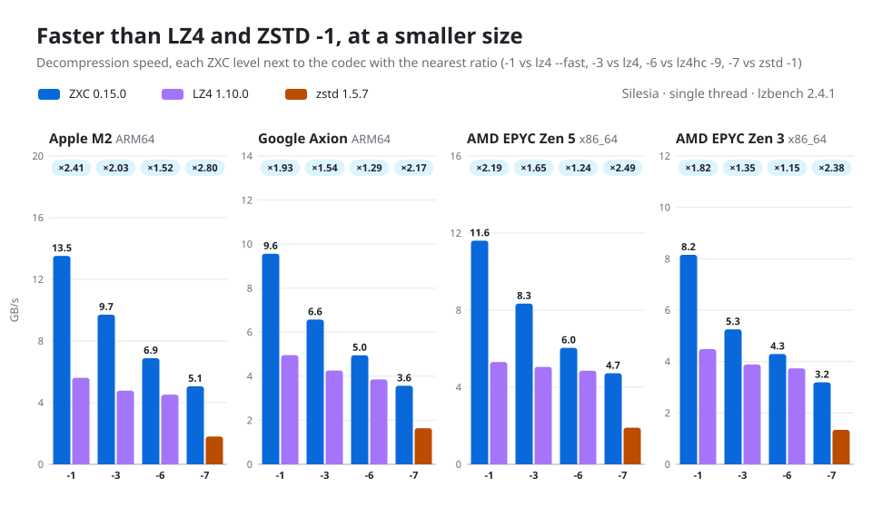
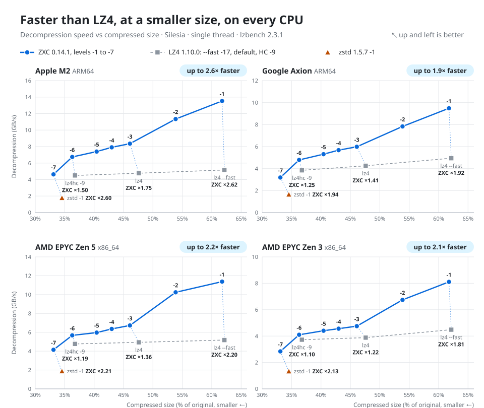
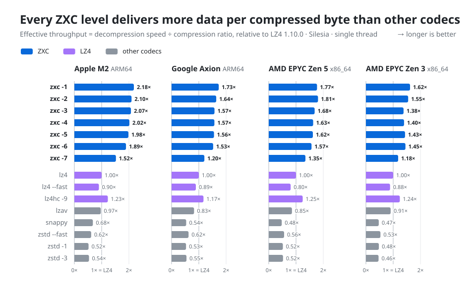

# ZXC - Lossless Compression Built for Ultra-Fast Decode

[](https://github.com/hellobertrand/zxc/actions/workflows/build.yml)
[](https://oss-fuzz-build-logs.storage.googleapis.com/index.html#zxc)
[](https://codecov.io/github/hellobertrand/zxc)
[](https://scorecard.dev/viewer/?uri=github.com/hellobertrand/zxc)
[](LICENSE)

<!-- [](https://github.com/hellobertrand/zxc/releases/latest) -->

ZXC is a fast lossless compression algorithm, targeting write-once, read-many workloads: data compressed once at build time, then decompressed on every device that reads it. It features an extremely fast decoder, with speeds of multiple GB/s per core: levels -1 to -6 decode 1.1x to 2.6x faster than LZ4 (`lz4 --fast`, `lz4` or `lz4hc`, whichever matches the ratio) at an equal or better compression ratio.

Seven compression levels trade compression speed for ratio, and the decoder stays fast at every one of them: the densest level compresses better than `zstd -1` while decoding about twice as fast. ZXC also provides seekable archives for O(1) random access, in-place decompression, and dictionary compression for small data.

The ZXC format is fully specified in [FORMAT.md](docs/FORMAT.md) and guarded by public conformance vectors. This repository is the reference implementation, provided as an open-source BSD 3-Clause licensed C library and a command line utility producing and decoding `.zxc` files, with official bindings for Rust, Python, Node.js, Go and WASM. The design is described in the [whitepaper](docs/WHITEPAPER.md).

## Benchmarks

**Decompression speedup against the closest competitor at each ratio tier** — Silesia corpus (202 MB), single thread, reproducible with [lzbench](https://github.com/inikep/lzbench) and [TurboBench](https://github.com/powturbo/TurboBench):

| Machine | `-1` vs `lz4 --fast` | `-3` vs `lz4` | `-6` vs `lz4hc -9` | `-7` vs `zstd -1` |
| :--- | ---: | ---: | ---: | ---: |
| Apple M2 | **2.62x** | **1.75x** | **1.50x** | **2.60x** |
| Axion (Neoverse-V2) | **1.92x** | **1.41x** | **1.25x** | **1.94x** |
| EPYC 9B45 (Zen 5) | **2.20x** | **1.36x** | **1.19x** | **2.21x** |
| EPYC 7B13 (Zen 3) | **1.81x** | **1.22x** | **1.10x** | **2.13x** |

ZXC also compresses smaller in each pairing: 61.76 % vs 62.15 %, 46.09 % vs 47.60 %, 36.28 % vs
36.75 % and 33.09 % vs 34.53 % of the original size.

<p align="center">
  <a href="docs/images/bench-bars.svg">
    
  </a>
</p>

Measured with [lzbench](https://github.com/inikep/lzbench) 2.3.1 (from
[@inikep](https://github.com/inikep)) built with `MOREFLAGS="-march=native"`, on four reference
machines: Apple M2 (Clang 21, macOS 26), Google Axion / Neoverse-V2 (GCC 14, GCP C4A), AMD EPYC 9B45
/ Zen 5 (GCP C4D) and AMD EPYC 7B13 / Zen 3 (GCP C2D) — both x86 with SMT disabled. Re-run on every
commit ([latest logs](https://github.com/hellobertrand/zxc/actions/workflows/benchmark.yml)); every
number is reproducible with lzbench or [TurboBench](https://github.com/powturbo/TurboBench), where
ZXC is merged alongside 70+ other codecs. Cycles per byte and memory figures live in the
**[whitepaper](docs/WHITEPAPER.md#7-performance-analysis-benchmarks)**.

### Every level, on every CPU



### All codecs

| Codec | Compression | Decompression | Ratio |
| :--- | ---: | ---: | ---: |
| **zxc 0.14.1 -1** | 875 MB/s | **13524 MB/s** | **61.76 %** |
| **zxc 0.14.1 -2** | 581 MB/s | **11338 MB/s** | **53.86 %** |
| **zxc 0.14.1 -3** | 244 MB/s | **8356 MB/s** | **46.09 %** |
| **zxc 0.14.1 -4** | 156 MB/s | **7906 MB/s** | **42.99 %** |
| **zxc 0.14.1 -5** | 92.0 MB/s | **7394 MB/s** | **40.43 %** |
| **zxc 0.14.1 -6** | 12.6 MB/s | **6740 MB/s** | **36.28 %** |
| **zxc 0.14.1 -7** | 8.36 MB/s | **4628 MB/s** | **33.09 %** |
| lz4 1.10.0 --fast -17 | 1347 MB/s | 5166 MB/s | 62.15 % |
| lz4 1.10.0 | 796 MB/s | 4770 MB/s | 47.60 % |
| lz4hc 1.10.0 -9 | 42.2 MB/s | 4503 MB/s | 36.75 % |
| lzav 5.16 -1 | 681 MB/s | 3860 MB/s | 39.91 % |
| snappy 1.2.2 | 877 MB/s | 3253 MB/s | 47.85 % |
| zstd 1.5.7 --fast --1 | 690 MB/s | 2513 MB/s | 41.01 % |
| zstd 1.5.7 -1 | 572 MB/s | 1777 MB/s | 34.53 % |
| zstd 1.5.7 -3 | 392 MB/s | 1695 MB/s | 31.20 % |
| zlib 1.3.2 -1 | 148 MB/s | 410 MB/s | 36.45 % |

<details>
<summary>Google Axion (Neoverse-V2, ARM64)</summary>

| Codec | Compression | Decompression | Ratio |
| :--- | ---: | ---: | ---: |
| **zxc 0.14.1 -1** | 878 MB/s | **9487 MB/s** | **61.76 %** |
| **zxc 0.14.1 -2** | 589 MB/s | **7834 MB/s** | **53.86 %** |
| **zxc 0.14.1 -3** | 237 MB/s | **5980 MB/s** | **46.09 %** |
| **zxc 0.14.1 -4** | 163 MB/s | **5675 MB/s** | **42.99 %** |
| **zxc 0.14.1 -5** | 95.7 MB/s | **5310 MB/s** | **40.43 %** |
| **zxc 0.14.1 -6** | 11.5 MB/s | **4787 MB/s** | **36.28 %** |
| **zxc 0.14.1 -7** | 7.81 MB/s | **3186 MB/s** | **33.09 %** |
| lz4 1.10.0 --fast -17 | 1272 MB/s | 4940 MB/s | 62.15 % |
| lz4 1.10.0 | 728 MB/s | 4256 MB/s | 47.60 % |
| lz4hc 1.10.0 -9 | 44.2 MB/s | 3843 MB/s | 36.75 % |
| lzav 5.16 -1 | 649 MB/s | 2916 MB/s | 39.91 % |
| snappy 1.2.2 | 755 MB/s | 2289 MB/s | 47.85 % |
| zstd 1.5.7 --fast --1 | 605 MB/s | 2291 MB/s | 41.01 % |
| zstd 1.5.7 -1 | 522 MB/s | 1643 MB/s | 34.53 % |
| zstd 1.5.7 -3 | 324 MB/s | 1518 MB/s | 31.20 % |
| zlib 1.3.2 -1 | 115 MB/s | 389 MB/s | 36.45 % |

</details>

<details>
<summary>AMD EPYC 9B45 (Zen 5, x86_64)</summary>

| Codec | Compression | Decompression | Ratio |
| :--- | ---: | ---: | ---: |
| **zxc 0.14.1 -1** | 848 MB/s | **11377 MB/s** | **61.76 %** |
| **zxc 0.14.1 -2** | 570 MB/s | **10243 MB/s** | **53.86 %** |
| **zxc 0.14.1 -3** | 240 MB/s | **6730 MB/s** | **46.09 %** |
| **zxc 0.14.1 -4** | 164 MB/s | **6357 MB/s** | **42.99 %** |
| **zxc 0.14.1 -5** | 97.7 MB/s | **5970 MB/s** | **40.43 %** |
| **zxc 0.14.1 -6** | 12.4 MB/s | **5675 MB/s** | **36.28 %** |
| **zxc 0.14.1 -7** | 7.32 MB/s | **4149 MB/s** | **33.09 %** |
| lz4 1.10.0 --fast -17 | 1284 MB/s | 5179 MB/s | 62.15 % |
| lz4 1.10.0 | 767 MB/s | 4938 MB/s | 47.60 % |
| lz4hc 1.10.0 -9 | 45.0 MB/s | 4766 MB/s | 36.75 % |
| lzav 5.16 -1 | 683 MB/s | 3483 MB/s | 39.91 % |
| snappy 1.2.2 | 741 MB/s | 2073 MB/s | 47.89 % |
| zstd 1.5.7 --fast --1 | 657 MB/s | 2423 MB/s | 41.01 % |
| zstd 1.5.7 -1 | 599 MB/s | 1877 MB/s | 34.53 % |
| zstd 1.5.7 -3 | 363 MB/s | 1709 MB/s | 31.20 % |
| zlib 1.3.2 -1 | 135 MB/s | 392 MB/s | 36.45 % |

</details>

<details>
<summary>AMD EPYC 7B13 (Zen 3, x86_64)</summary>

| Codec | Compression | Decompression | Ratio |
| :--- | ---: | ---: | ---: |
| **zxc 0.14.1 -1** | 712 MB/s | **8106 MB/s** | **61.76 %** |
| **zxc 0.14.1 -2** | 470 MB/s | **6746 MB/s** | **53.86 %** |
| **zxc 0.14.1 -3** | 198 MB/s | **4752 MB/s** | **46.09 %** |
| **zxc 0.14.1 -4** | 139 MB/s | **4562 MB/s** | **42.99 %** |
| **zxc 0.14.1 -5** | 83.3 MB/s | **4403 MB/s** | **40.43 %** |
| **zxc 0.14.1 -6** | 10.2 MB/s | **4101 MB/s** | **36.28 %** |
| **zxc 0.14.1 -7** | 6.89 MB/s | **2840 MB/s** | **33.09 %** |
| lz4 1.10.0 --fast -17 | 1113 MB/s | 4486 MB/s | 62.15 % |
| lz4 1.10.0 | 640 MB/s | 3882 MB/s | 47.60 % |
| lz4hc 1.10.0 -9 | 37.0 MB/s | 3725 MB/s | 36.75 % |
| lzav 5.16 -1 | 491 MB/s | 2958 MB/s | 39.91 % |
| snappy 1.2.2 | 663 MB/s | 1737 MB/s | 47.89 % |
| zstd 1.5.7 --fast --1 | 482 MB/s | 1766 MB/s | 41.01 % |
| zstd 1.5.7 -1 | 439 MB/s | 1332 MB/s | 34.53 % |
| zstd 1.5.7 -3 | 231 MB/s | 1194 MB/s | 31.20 % |
| zlib 1.3.2 -1 | 106 MB/s | 356 MB/s | 36.45 % |

</details>

### Effective throughput



> **What is Effective Throughput?**
>
> Raw decode speed misses half the picture: in real workloads (asset streaming, container pulls, microservice payloads), the decoder is fed by a compressed-byte source - disk, network, inter-core - whose bandwidth is the bottleneck. The right question is *how much original data is delivered per MB of compressed input*.
>
> Formula: `Effective (MB/s) = Decode × 100 / Ratio (%)`: combines decode speed and ratio in one number. **Every ZXC level from -1 to -7 sits above LZ4** on every architecture, peaking at **2.19x on Apple Silicon** and ranging **1.26x–1.83x** on x86 and ARM cloud platforms for levels -1 to -6. The density-optimized ULTRA level -7 now clears LZ4 as well (**1.05x–1.40x**), at a 33.09% ratio.

## Features

- **1.1–2.6× faster decode than LZ4** at levels -1 to -6, at an equal or better ratio. Level -7 trades that lead for density: it decodes 1.9–2.6× faster than `zstd -1`, at a better ratio ([benchmarks](#benchmarks)).
- **Write once, read many.** The encoder does the heavy lifting, so every device that reads the data decodes faster: content delivery, game assets, app bundles, firmware. Gains are largest on modern ARM cores (Apple Silicon, Graviton, Axion).
- **O(1) random access.** A built-in seek table decompresses any block without reading the rest.
- **Decodes in place.** One buffer instead of two, zero allocations with a static context: made for firmware, FOTA and bootloaders ([details](#in-place-decompression)).
- **Small payloads too.** A trained dictionary recovers ratio on 4–128 KB blocks ([details](#dictionary-compression)).
- **Runs everywhere.** x86_64, ARM64, ARMv7, ARMv6, RISC-V, POWER, s390x, i386, with hand-tuned SIMD (AVX2/AVX-512/NEON).
- **Production-grade.** Continuously fuzzed by OSS-Fuzz, ASan/UBSan/Valgrind-clean, a [specified wire format](docs/FORMAT.md) with conformance vectors, signed releases, BSD-3-Clause.

**Used in** [ClickHouse](https://clickhouse.com/docs/reference/statements/create/table/codec) (experimental column codec) · **Packaged in** Debian 14, Ubuntu 26.10, Homebrew, vcpkg, Conan, Winget · **Benchmarked in** lzbench & TurboBench

## Compression Levels

*   **Level 1, 2 (Fast):** Optimized for real-time assets (Gaming, UI).
*   **Level 3, 4 (Balanced):** A strong middle-ground offering efficient compression speed and a ratio superior to LZ4.
*   **Level 5 (Compact):** A good choice for Embedded and Firmware. Better compression than LZ4 and significantly faster decoding than Zstd.
*   **Level 6 (Density):** Beats LZ4HC on both axes — better ratio *and* faster decode on every measured platform — while staying in the multi-GB/s decode class. Best for Archival and write-once / read-many workloads where compression time is amortized over many reads.
*   **Level 7 (Ultra):** Maximum density. Deep parse plus Huffman-coded literals *and* tokens (11-bit codes) push the ratio past `zstd -1` while decoding several times faster than it. Choose it when storage or bandwidth dominates but decode must remain fast; compression is the slowest tier.

## Usage

### 1. CLI

The CLI is perfect for benchmarking or manually compressing assets.

```bash
# Compress. -z is implied, and the output name defaults to <input>.zxc
zxc assets.tar                        # level 3 (default) -> assets.tar.zxc
zxc -z -5 assets.tar assets.tar.zxc   # level 5
zxc -z -S assets.tar assets.tar.zxc   # seekable: O(1) random-access decompression

# Decompress. "unzxc" is installed as an alias for "zxc -d"
zxc -d assets.tar.zxc assets.tar
unzxc assets.tar.zxc assets.tar

# Benchmark mode (testing speed on your machine)
zxc -b assets.tar
```

Every option is in `zxc --help` and the [man page](docs/man/zxc.1.md).

#### Using with `tar`

ZXC works as a drop-in external compressor for `tar` (reads stdin, writes stdout, returns 0 on success):

```bash
# GNU tar (Linux)
tar -I 'zxc -5' -cf archive.tar.zxc data/
tar -I 'zxc -d' -xf archive.tar.zxc

# bsdtar (macOS)
tar --use-compress-program='zxc -5' -cf archive.tar.zxc data/
tar --use-compress-program='zxc -d' -xf archive.tar.zxc

# Pipes (universal)
tar cf - data/ | zxc > archive.tar.zxc
zxc -d < archive.tar.zxc | tar xf -
```

### 2. API

ZXC provides a **thread-safe API** with two usage patterns. Parameters are passed through dedicated
options structs, making call sites self-documenting and forward-compatible. Buffers are
caller-allocated with explicit bounds, calls are stateless, checksum validation is optional, block
sizes run from 4 KB to 2 MB (powers of two), and streaming is multi-threaded with auto-detection of
the CPU core count.

```c
#include "zxc.h"

// Compression
uint64_t bound = zxc_compress_bound(src_size);
zxc_compress_opts_t c_opts = {
    .level            = ZXC_LEVEL_DEFAULT,
    .checksum_enabled = 1,
    /* .block_size = 0 -> 512 KB default */
};
int64_t compressed_size = zxc_compress(src, src_size, dst, bound, &c_opts);

// Decompression
zxc_decompress_opts_t d_opts = { .checksum_enabled = 1 };
int64_t decompressed_size = zxc_decompress(src, src_size, dst, dst_capacity, &d_opts);
```

The same options structs drive the other entry points: `zxc_stream_compress()` /
`zxc_stream_decompress()` for multi-threaded file streaming, reusable `zxc_cctx` / `zxc_dctx`
contexts for tight loops where per-call `malloc`/`free` overhead matters (settings are **sticky**,
so passing `NULL` reuses those given at creation), and `.seekable = 1` to append a seek table for
O(1) random-access decompression.

**[👉 See complete examples and advanced usage](docs/EXAMPLES.md)** — stream API, reusable contexts,
seekable readers, dictionaries and numeric pre-filters, as full compilable programs.

## Installation

ZXC is packaged across major ecosystems and kept current by their maintainers:

[](https://repology.org/project/zxc/versions)
[](https://repology.org/project/zxc/versions)
[](https://repology.org/project/zxc/versions)
[](https://repology.org/project/zxc/versions)
[](https://repology.org/project/zxc/versions)

| Ecosystem | Install |
| :--- | :--- |
| [vcpkg](https://vcpkg.io/) | `vcpkg install zxc`, or `"dependencies": ["zxc"]` in `vcpkg.json` |
| [Conan](https://conan.io/) | `conan install -r conancenter --requires="zxc/[*]" --build=missing`, or `zxc/[*]` under `[requires]` in `conanfile.txt` |
| [Homebrew](https://formulae.brew.sh/formula/zxc) | `brew install zxc` |
| winget (Windows 10 1709+) | `winget install hellobertrand.zxc` |
| Rust / Python / Node.js | `cargo add zxc-compress` &middot; `pip install zxc-compress` &middot; `npm install zxc-compress` |

The vcpkg, Conan Center and winget recipes are maintained by their respective communities, so they
can lag a release behind; if one does, open an issue on that registry's index repository.

### From a release archive

Prebuilt binaries for Linux, macOS and Windows (x86_64 and ARM64) are on the
[Releases page](https://github.com/hellobertrand/zxc/releases), with a signed checksum manifest
and build attestations: [verification steps](docs/INSTALL.md#release-archives).

### In your project

```cmake
find_package(zxc REQUIRED)          # find_package(zxc CONFIG REQUIRED) via vcpkg or Conan
target_link_libraries(myapp PRIVATE zxc::zxc_lib)
```

```bash
cc myapp.c $(pkg-config --cflags --libs libzxc) -o myapp
```

Vendoring zxc instead — CMake `FetchContent` or `add_subdirectory()`, a Meson subproject or WrapDB —
and building from source, with the full option table and the PGO workflow:
**[docs/INSTALL.md](docs/INSTALL.md)**.

### Packaging Status

[](https://repology.org/project/zxc/versions)

## Language Bindings

[](https://crates.io/crates/zxc-compress)
[](https://pypi.org/project/zxc-compress)
[](https://www.npmjs.com/package/zxc-compress)

Official wrappers maintained in this repository:

| Language | Package Manager | Install Command | Documentation | Author |
|----------|-----------------|-----------------|---------------|--------|
| **Rust** | [`crates.io`](https://crates.io/crates/zxc-compress) | `cargo add zxc-compress` | [README](wrappers/rust/zxc/README.md) | [@hellobertrand](https://github.com/hellobertrand) |
| **Python**| [`PyPI`](https://pypi.org/project/zxc-compress) | `pip install zxc-compress` | [README](wrappers/python/README.md) | [@nuberchardzer1](https://github.com/nuberchardzer1) |
| **Node.js**| [`npm`](https://www.npmjs.com/package/zxc-compress) | `npm install zxc-compress` | [README](wrappers/nodejs/README.md) | [@hellobertrand](https://github.com/hellobertrand) |
| **Go** | `go get` | `go get github.com/hellobertrand/zxc/wrappers/go` | [README](wrappers/go/README.md) | [@hellobertrand](https://github.com/hellobertrand) |
| **WASM** | [`npm`](https://www.npmjs.com/package/zxc-wasm) | `npm install zxc-wasm` | [README](wrappers/wasm/README.md) | [@hellobertrand](https://github.com/hellobertrand) |

Community-maintained bindings:

| Language | Package Manager | Install Command | Repository | Author |
| -------- | --------------- | --------------- | ---------- | ------ |
| **Go** | pkg.go.dev | `go get github.com/meysam81/go-zxc` | <https://github.com/meysam81/go-zxc> | [@meysam81](https://github.com/meysam81) |
| **Nim** | nimble | `nimble install zxc` | <https://github.com/openpeeps/zxc-nim> | [@georgelemon](https://github.com/georgelemon) |
| **Free Pascal** | Build from source | Clone the repository | <https://github.com/Xelitan/Free-Pascal-port-of-ZXC-compressor-decompressor> | [@Xelitan](https://github.com/Xelitan) |

## In-Place Decompression

A normal decode needs two buffers: the archive and the output, so peak memory is *compressed + decompressed*. ZXC can decode **inside a single buffer**: you place the archive at its end, and the decoder writes the output from its start.

```
buffer:  [ output → → →          | archive → → → ]
           ^ write cursor           ^ read cursor
```

Both cursors move right, and a ZXC block never expands, so with a small safety margin the write cursor provably never catches the read cursor. Peak memory drops to roughly *decompressed* alone. This is the shape of firmware images, FOTA payloads, bootloaders, game assets: anything read-only that already sits in RAM.

**One buffer:**

```c
size_t need = zxc_decompress_inplace_bound(archive, archive_size);   // reads header + footer only
uint8_t* buf = malloc(need);
memcpy(buf + (need - archive_size), archive, archive_size);          // archive at the end
int64_t n = zxc_decompress_inplace(buf, need, archive_size, NULL);   // decode from buf[0]
// buf[0 .. n) now holds the decompressed data
```

**One buffer, zero allocations.** `zxc_decompress_inplace` still allocates its decode context for the duration of the call. Where the library must not touch an allocator at all (kernel code, heapless targets, fixed memory budgets), hand it a context living in memory you own:

```c
// Once, up front: sized for the block size your archives use.
size_t ws_size = zxc_static_dctx_workspace_size(64 * 1024);
void* ws = aligned_alloc(64, ws_size);                                // or .bss, kmalloc, vmalloc
zxc_dctx* dctx = zxc_init_static_dctx(ws, ws_size, 64 * 1024);

// Per archive: no allocation inside the library.
int64_t n = zxc_decompress_inplace_dctx(dctx, buf, need, archive_size, NULL);
```

A static context accepts only archives compressed with its block size (`-B`), and no dictionary; anything else is refused with an error before decoding.

**What it costs.** The margin is one block, plus 8–16 bytes per block of framing, plus ~2 KB of tail; the static context is three to four blocks. So the block size decides both, and small payloads want small blocks:

| Block size (`-B`) | Margin, 8 MB payload | Static context |
| ---: | ---: | ---: |
| 4 KB | 22–31 KB (0.3–0.4 %) | 16 KB |
| 64 KB | 69 KB (0.8 %) | 212 KB |
| 512 KB (default) | 526 KB (6.3 %) | 1.7 MB |

The higher margin is with block checksums, which the CLI writes by default. Smaller blocks cost some ratio and decode speed; measure on your data. Always size the buffer with `zxc_decompress_inplace_bound` rather than the formula.

**What it guarantees.** An undersized buffer is rejected with `ZXC_ERROR_DST_TOO_SMALL`. An archive whose output would reach input not yet read (padding, forged block sizes) is rejected with `ZXC_ERROR_CORRUPT_DATA`. Never silent corruption: both entry points are covered by a dedicated fuzzer.

## Dictionary Compression

For workloads compressed in **small blocks** (4 KB–128 KB), a pre-trained dictionary dramatically
improves compression ratio. It prefills the LZ77 sliding window at the *start of each block*, so the
benefit is per-block: the smaller the block, the less history of its own it has and the more it
leans on the dictionary. That holds for a single small payload as much as for a large one split into
many small blocks — anywhere early bytes would otherwise have nothing to match against.

A `.zxd` also carries a **shared literal Huffman table**, trained on the post-LZ literal
distribution of the corpus: blocks it encodes well drop their own 128-byte table header, a fixed
cost small blocks cannot amortize. It codes literals at levels 6-7 only, and the CLI handles it end
to end — `--train` always writes one, `-D` always loads it.

**Typical use cases:** JSON API responses, small game assets, structured logs, key-value store
records, RPC messages, and any large but homogeneous corpus compressed in small blocks for random
access (e.g. seekable archives).

```bash
# Train from a corpus of similar files. Without -o: ./dictionary_<dict_id>.zxd
zxc --train samples/*.json
zxc --train -o corpus.zxd samples/*.json     # -o also accepts a directory

# The same dictionary is required to decompress: pass it with -D, there is no auto-lookup
zxc -z -D corpus.zxd input.json
zxc -d -D corpus.zxd input.json.zxc
```

The dictionary is an external `.zxd` file — content plus shared literal table — referenced by a
32-bit `dict_id` in the archive header that covers both parts. Decompressing an archive that needs
one without supplying it returns `ZXC_ERROR_DICT_REQUIRED`; supplying the wrong one returns
`ZXC_ERROR_DICT_MISMATCH`. Training and attaching a dictionary from C:
[EXAMPLES.md](docs/EXAMPLES.md#using-a-pre-trained-dictionary) and
[API.md §11b](docs/API.md#11b-dictionary-api). Wire format:
[FORMAT.md §12](docs/FORMAT.md#12-pre-trained-dictionary-support).

## Block Size Tuning

The default block size is **512 KB**, tuned for bulk/archival workloads where ratio and decompression throughput matter most. For **memory-constrained or streaming use cases**, **256 KB blocks** halve the per-context memory footprint at a small cost in ratio and decompression speed.

**Why larger blocks help:** Each block starts with a cold hash table, so the LZ match-finder has no history and produces more literals until the table warms up. Doubling the block size halves the number of cold-start penalties, improving both ratio and decompression speed.

| Block Size | cctx memory | dctx memory | Ratio (level -3) | Decompression gain vs 256 KB |
|:----------:|:-----------:|:-----------:|:----------------:|:----------------------------:|
| 256 KB | ~1.03 MB | ~256 KB | 46.68% | — |
| 512 KB *(default)* | ~1.78 MB | ~512 KB | 46.09% *(−0.59 pp)* | +1% to +8% depending on CPU |

```bash
# CLI — fall back to 256 KB blocks (e.g. embedded / streaming)
zxc -B 256K -5 input_file output_file

# API
zxc_compress_opts_t opts = {
    .level      = ZXC_LEVEL_COMPACT,
    .block_size = 256 * 1024,
};
```

**Guideline:** Stick with 512 KB (default) for bulk compression pipelines, CI/CD asset packaging, and high-throughput servers. Use 256 KB (`-B 256K`) for streaming, embedded, or memory-constrained environments.

## Format & Conformance

The ZXC on-disk wire format is fully specified in [`docs/FORMAT.md`](docs/FORMAT.md) (format version 9), so any third party can build an independent, interoperable decoder.

> **Upgrading?** The current format is **v9** — block checksums now cover the decoded bytes and are seeded by block position, the footer carries an optional archive digest, and the seek table became self-validating groups announced by a header flag. Like every break before it, this one is clean: v9 tools reject v8 archives (see [`docs/MIGRATION.md`](docs/MIGRATION.md) to convert).

Two complementary, byte-frozen suites guard that format:

* **Decoder conformance** — [`conformance/`](conformance/README.md) ships public reference vectors, frozen per format version: `valid/*.zxc` streams paired with their expected decompressed output, plus `invalid/*.zxc` streams that a correct decoder **must** reject, one per row of the format's error table. Point your own decoder at them to prove interoperability — no dependency on this implementation. Run locally via the `conformance` CTest.
* **Wire-format stability** — [`tests/format/`](tests/format/README.md) pins the exact bytes the encoder emits for every block type and integrity field. A CI job ([`vector-stability.yml`](.github/workflows/vector-stability.yml)) fails on any single-byte drift, so an encoder change can only ever be deliberate.

The distinction: conformance freezes decoder *behaviour* (`decode(x) == expected`), while the golden suite freezes the encoder's *bytes*. Together they make the format both interoperable and stable.

## Safety & Quality
* **Unit Tests**: Comprehensive test suite with CTest integration.
* **Continuous Fuzzing**: Enrolled in Google [OSS-Fuzz](https://github.com/google/oss-fuzz), which fuzzes five harnesses (roundtrip, decompress, streaming, seekable, dictionary) around the clock. The same harnesses run under ClusterFuzzLite (ASan + UBSan) on every pull request touching the library.
* **Static Analysis**: Checked with Cppcheck & Clang Static Analyzer.
* **CodeQL Analysis**: GitHub Advanced Security scanning for vulnerabilities.
* **Snyk**: Continuous security and code analysis for dependencies and source.
* **Code Coverage**: Automated tracking with Codecov integration.
* **Dynamic Analysis**: Validated with Valgrind and ASan/UBSan in CI pipelines.
* **Safe API**: Explicit buffer capacity is required for all operations.

## License & Credits

**ZXC** Copyright © Bertrand Lebonnois and contributors.
Licensed under the **BSD 3-Clause License**. See LICENSE for details.

**Third-Party Components:**
- **[rapidhash](https://github.com/Nicoshev/rapidhash)** by Nicolas De Carli (MIT) - Used for high-speed, platform-independent checksums.

**Acknowledgements:**
- **[PivCo-Huffman](https://github.com/MarcinZukowski/pivco-huffman)** (PIVoted COding) by Marcin Żukowski - the level-ordered layout and merge-based decode of ZXC's Huffman sections follow its design; implemented independently here. Special thanks to Dougall Johnson, whose idea of jointly nudging flat and length codes is behind the level 6 / 7 decode speedups.
