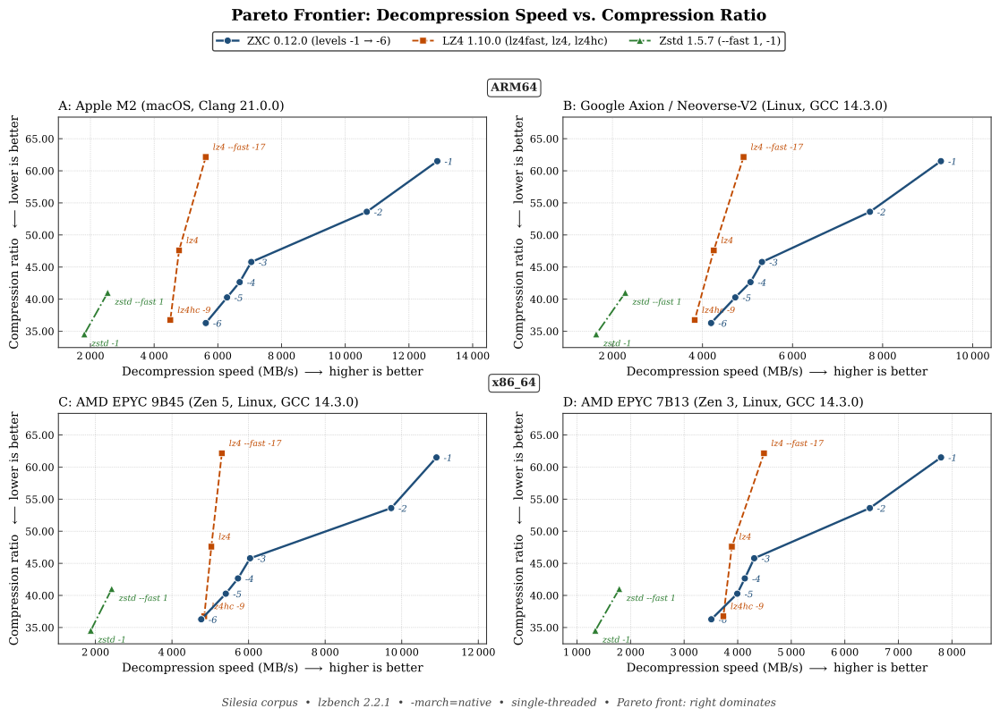
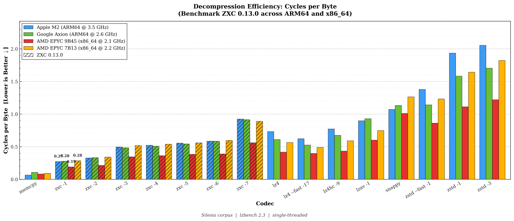
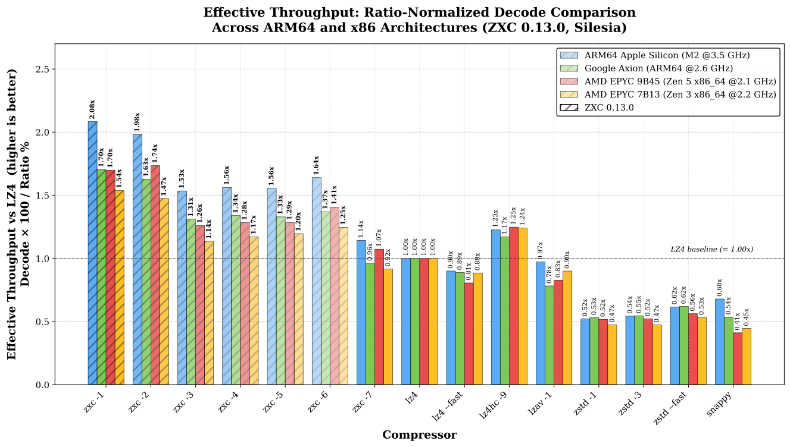

# ZXC: High-Performance Asymmetric Lossless Compression

**Version**: 0.12.0
**Date**: June 2026
**Author**: Bertrand Lebonnois

---

## 1. Executive Summary

In modern software delivery pipelines-specifically **Mobile Gaming**, **Embedded Systems**, and **FOTA (Firmware Over-The-Air)**-data is typically generated on high-performance x86 workstations but consumed on energy-constrained ARM devices.

Standard industry codecs like LZ4 offer excellent performance but fail to exploit the "Write-Once, Read-Many" (WORM) nature of these pipelines. **ZXC** is a lossless codec designed to bridge this gap. By utilizing an **asymmetric compression model**, ZXC achieves a **>40% increase in decompression speed on ARM** compared to LZ4, while simultaneously reducing storage footprints. On x86 development architecture, ZXC maintains competitive throughput, ensuring no disruption to build pipelines.

## 2. The Efficiency Gap

The industry standard, LZ4, prioritizes symmetric speed (fast compression and fast decompression). While ideal for real-time logs or RAM swapping, this symmetry is useless for asset distribution.

*   **Wasted Cycles**: CPU cycles saved during the single compression event (on a build server) do not benefit the millions of end-users decoding the data.
*   **The Battery Tax**: On mobile devices, slower decompression keeps the CPU active longer, draining battery and generating heat.

## 3. The ZXC Solution

ZXC utilizes a computationally intensive encoder to generate a bitstream specifically structured to **maximize decompression throughput**. By performing heavy analysis upfront, the encoder produces a layout optimized for the instruction pipelining and branch prediction capabilities of modern CPUs, particularly ARMv8, effectively offloading complexity from the decoder to the encoder.

### 3.1 Asymmetric Pipeline
ZXC employs a Producer-Consumer architecture to decouple I/O operations from CPU-intensive tasks. This allows for parallel processing where input reading, compression/decompression, and output writing occur simultaneously, effectively hiding I/O latency.

### 3.2 Modular Architecture
The ZXC file format is inherently modular. **Each block is independent and is encoded with whichever of ZXC's block codecs yields the smallest output** — GLO or GHI (the LZ paths) or RAW (stored). Independent blocks keep the format simple, enable O(1) seekable random access, and let it evolve without breaking backward compatibility.

> **ZXC is a pure LZ byte codec.** It compresses byte streams via LZ77 matching plus entropy coding; it has no type-aware or numeric block codec. Numeric and columnar data (timestamps, IDs, float columns) compress best when a **reversible pre-filter** — delta or byte-shuffle — is applied *before* compression and inverted *after* decompression. ZXC keeps such transforms **out of the codec and the format on purpose**: the caller, which knows the element type, owns the filter. See the *Compressing Numeric Data* example in [`EXAMPLES.md`](EXAMPLES.md).

## 4. Core Algorithms

ZXC utilizes a hybrid approach combining LZ77 (Lempel-Ziv) dictionary matching with advanced entropy coding and specialized data transforms.

### 4.1 LZ77 Engine
The heart of ZXC is a heavily optimized LZ77 engine that adapts its behavior based on the requested compression level:
*   **Hash Chain & Collision Resolution**: Uses a fast hash table with chaining to find matches in the history window (configurable sliding window, power-of-2 from 4 KB to 2 MB, default 512 KB).
*   **Lazy Matching**: Implements a "lookahead" strategy to find better matches at the cost of slight encoding speed, significantly improving decompression density.

### 4.2 Specialized SIMD Acceleration & Hardware Hashing
ZXC leverages modern instruction sets to maximize throughput on both ARM and x86 architectures.
* **ARM NEON Optimization**: Extensive usage of vld1q_u8 (vector load) and vceqq_u8 (parallel comparison) allows scanning data at wire speed, while vminvq_u8 provides fast rejection of non-matches.
* **x86 Vectorization**: Maintains high performance on Intel/AMD platforms via dedicated AVX2 and AVX512 paths, falling back to a portable **SSE2** baseline — the x86-64 architectural guarantee, present on every 64-bit Intel/AMD CPU. The SSE2 tier emulates the few SSE4.1 operations it needs (e.g. unsigned 32-bit max, byte blend, saturating `u32`→`u16` pack), so no SSE4.x hardware is required. This ensures parity with ARM throughput across the full x86 range.
* **High-Speed Integrity**: Block validation relies on **rapidhash**, a modern non-cryptographic hash algorithm that fully exploits hardware acceleration to verify data integrity without bottlenecking the decompression pipeline.

### 4.3 Entropy Coding & Bitpacking
*   **RLE (Run-Length Encoding)**: Automatically detects runs of identical bytes.
*   **Prefix Varint Encoding**: Variable-length integer encoding (similar to LEB128 but prefix-based) for overflow values.
*   **Canonical Huffman (Literals, level ≥ 6)**: Length-limited (`L = 8`) canonical Huffman code over the literal byte distribution, split into 4 LSB-first interleaved bit-streams. Decoded via a cache-line-aligned 2048-entry lookup table (11-bit window) that returns **1 or 2 symbols per access** depending on whether the next two codes fit the window. On typical literal distributions ~50–70 % of lookups yield 2 symbols, pushing effective throughput above one symbol per memory access.
*   **Bit-Packing**: Compressed sequences are packed into dedicated streams using minimal bit widths.

#### Multi-Symbol Huffman LUT

The Huffman decoder is the hot path for high-compression levels, so ZXC trades a larger table for fewer lookups. The classical trade-off is between table size (cache footprint) and the number of symbols decoded per memory access. ZXC's design:

*   **Length limit `L = 8`**: With a maximum codeword length of 8 bits, the longest *pair* of codes never exceeds 16 bits, which keeps the multi-symbol lookup tractable.
*   **11-bit window**: The LUT is indexed by 11 bits read ahead from the stream. Each entry stores either a single symbol (when the first code is ≥ 4 bits and the cumulative length of the *first two codes* would exceed 11 bits) or a pair of symbols (when both fit). This single branch (fits-in-window?) is resolved by a precomputed flag in the LUT entry, no per-lookup re-decoding.
*   **2048-entry, cache-aligned**: 2048 × 4-byte entries = 8 KB, aligned on a cache line. Easily fits L1d on every target CPU.
*   **4 parallel bit-streams**: Literals are interleaved across 4 LSB-first streams so each decoder consumes independent bits, breaking the serial dependency that limits classical Huffman to one symbol per cycle.
*   **Scalar tail**: A small per-stream scalar epilogue (≤ 9 symbols) handles the trailing bytes safely without speculative writes past the destination buffer.

Selection is conservative: `enc_lit = 2` (Huffman) is chosen only if the Huffman section is at least ~3 % smaller than the RAW or RLE baseline, avoiding setup overhead on near-uniform literal distributions where the entropy savings would not justify the decoder cost.

#### Prefix Varint Format

ZXC uses a **Prefix Varint** encoding for overflow values. Unlike standard VByte (which uses a continuation bit in every byte), Prefix Varint encodes the total length of the integer in the **unary prefix of the first byte**. This allows the decoder to determine the sequence length immediately, enabling branchless or highly predictable decoding without serial dependencies.

**Encoding Scheme:**

The prefix-length encoding generalizes to **N bytes** by construction: the
number of leading `1` bits in the first byte (followed by a terminating
`0`) determines how many additional payload bytes follow. An N-byte varint
carries `7*N` payload bits (`8 - N` bits in the first byte plus 8 bits per
following byte). ZXC caps the format at 3 bytes because no legitimate
value exceeds 21 bits (see below); longer prefixes (`1110xxxx`, `11110xxx`,
...) are reserved for a future format version that would raise
`ZXC_BLOCK_SIZE_MAX`.

Encodings used:

| Prefix (Binary) | Total Bytes | Data Bits (1st Byte) | Total Data Bits | Range (Value < X) |
|-----------------|-------------|----------------------|-----------------|-------------------|
| `0xxxxxxx`      | 1           | 7                    | 7               | 128               |
| `10xxxxxx`      | 2           | 6                    | 14 (6+8)        | 16,384            |
| `110xxxxx`      | 3           | 5                    | 21 (5+8+8)      | 2,097,152 (2 MiB) |

A varint encodes `(LL - MASK)` or `(ML - MASK)`, both bounded by
`ZXC_BLOCK_SIZE_MAX = 2 MiB`. **All legitimate ZXC varints fit in at
most 3 bytes.** Any prefix indicating a length >= 4 bytes (first byte
`>= 0xE0`) is out of spec for v1: encoders must never emit such a varint,
and conforming decoders reject it as corrupt input. This caps the varint
surface to the format-defined block size limit and neutralizes
integer-overflow attacks in downstream bounds arithmetic.

**Example**: Encoding value `300` (binary: `100101100`):
```text
Value 300 > 127 and < 16383 -> Uses 2-byte format (Prefix '10').

Step 1: Low 6 bits
300 & 0x3F = 44 (0x2C, binary 101100)
Byte 1 = Prefix '10' | 101100 = 10101100 (0xAC)

Step 2: Remaining high bits
300 >> 6 = 4 (0x04, binary 00000100)
Byte 2 = 0x04

Result: 0xAC 0x04

Decoding Verification:
Byte 1 (0xAC) & 0x3F = 44
Byte 2 (0x04) << 6   = 256
Total = 256 + 44 = 300
```

## 5. File Format Specification

The ZXC file format is block-based, robust, and designed for parallel processing.

### 5.1 Global Structure (File Header)

The file begins with a **16-byte** header that identifies the format and specifies decompression parameters.

**FILE Header (16 bytes):**

```
  Offset:  0               4       5       6       7                       14      16
           +---------------+-------+-------+-------+-----------------------+-------+
           | Magic Word    | Ver   | Chunk | Flags | Reserved / Dict ID    | CRC   |
           | (4 bytes)     | (1B)  | (1B)  | (1B)  | (7 bytes)             | (2B)  |
           +---------------+-------+-------+-------+-----------------------+-------+
```

* **Magic Word (4 bytes)**: `0x9 0xCB 0x02E 0xF5`.
* **Version (1 byte)**: Current version is `6`.
* **Chunk Size Code (1 byte)**: Defines the processing block size using **exponent encoding**:
  - The value is in `[12, 21]`: block size = `2^value` bytes (4 KB to 2 MB).
    - `12` = 4 KB, `13` = 8 KB, `14` = 16 KB, `15` = 32 KB, `16` = 64 KB, `17` = 128 KB, `18` = 256 KB, `19` = 512 KB (default), `20` = 1 MB, `21` = 2 MB.
  - All other values are rejected; block sizes are powers of 2.
* **Flags (1 byte)**: Global configuration flags.
  - **Bit 7 (MSB)**: `HAS_CHECKSUM`. If `1`, checksums are enabled for the stream. Every block will carry a trailing 4-byte checksum, and the footer will contain a global checksum. If `0`, no checksums are present.
  - **Bit 6**: `HAS_DICTIONARY`. If `1`, the stream was compressed with a pre-trained dictionary and **requires** it for decompression; the reserved field carries the `dict_id` (see below and §5.10).
  - **Bits 4-5**: Reserved.
  - **Bits 0-3**: Checksum Algorithm ID (e.g., `0` = RapidHash).
* **Reserved / Dictionary ID (7 bytes)**: Zero when `HAS_DICTIONARY` is clear. When `HAS_DICTIONARY` is set, bytes `0x07..0x0A` hold the `dict_id` (`u32` LE, a 32-bit hash of the dictionary content); the remaining bytes `0x0B..0x0D` stay zero.
* **CRC (2 bytes)**: 16-bit Header Checksum. Calculated on the 16-byte header (with CRC bytes set to 0) using `zxc_hash16`.

### 5.2 Block Header Structure
Each data block consists of an **8-byte** generic header that precedes the specific payload. This header allows the decoder to navigate the stream and identify the processing method required for the next chunk of data.

**BLOCK Header (8 bytes):**

```
  Offset:  0       1       2       3                       7       8
          +-------+-------+-------+-----------------------+-------+
          | Type  | Flags | Rsrvd | Comp Size             | CRC   |
          | (1B)  | (1B)  | (1B)  | (4 bytes)             | (1B)  |
          +-------+-------+-------+-----------------------+-------+

  Block Layout:
  [ Header (8B) ] + [ Compressed Payload (Comp Size bytes) ] + [ Optional Checksum (4B) ]

```

**Note**: The Checksum (if enabled in File Header) is **4 bytes** (32-bit), is always located **at the end** of the compressed data, and is calculated **on the compressed payload**.

* **Type**: Block encoding type (0=RAW, 1=GLO, 2=GHI, 255=EOF).
* **Flags**: Not used for now.
* **Rsrvd**: Reserved for future use (must be 0).
* **Comp Size**: Compressed payload size (excluding header and optional checksum).
* **CRC**: 1-byte Header Checksum (located at the end of the header). Calculated on the 8-byte header (with CRC byte set to 0) using `zxc_hash8`.

> **Note**: The decompressed size is not stored in the block header. It is derived from internal Section Descriptors within the compressed payload (for GLO/GHI blocks), or equals `Comp Size` (for RAW blocks).

> **Note**: While the format is designed for threaded execution, a single-threaded API is also available for constrained environments or simple integration cases.

### 5.3 Specific Header: GLO (Generic Low)
(Present immediately after the Block Header)

**GLO Header (16 bytes):**

```
  Offset:  0               4               8   9  10  11  12              16
          +---------------+---------------+---+---+---+---+---------------+
          | N Sequences   | N Literals    |Lit|LL |ML |Off| Reserved      |
          | (4 bytes)     | (4 bytes)     |Enc|Enc|Enc|Enc| (4 bytes)     |
          +---------------+---------------+---+---+---+---+---------------+
```

* **N Sequences**: Total count of LZ sequences in the block.
* **N Literals**: Total count of literal bytes.
* **Encoding Types**
  - `Lit Enc`: Literal stream encoding (0=RAW, 1=RLE, 2=HUFFMAN, 3=HUFFMAN_DICT). **Currently used.**
    `HUFFMAN_DICT` uses the same bitstream as `HUFFMAN` but omits the 128-byte
    code-lengths header: the codes come from the shared literal table carried
    by the dictionary (see §5.10). Only valid in dictionary-compressed archives.
  - `LL Enc`: Literal lengths encoding. **Reserved for future use** (lengths are packed in tokens).
  - `ML Enc`: Match lengths encoding. **Reserved for future use** (lengths are packed in tokens).
  - `Off Enc`: Offset encoding mode. **Currently used**
    - `0` = 16-bit offsets (2 bytes each, max distance 65535)
    - `1` = 8-bit offsets (1 byte each, max distance 255)
* **Reserved**: Padding for alignment.

**Section Descriptors (4 × 8 bytes = 32 bytes total):**

Each descriptor stores sizes as a packed 64-bit value:

```
  Single Descriptor (8 bytes):
  +-----------------------------------+-----------------------------------+
  | Compressed Size (4 bytes)         | Raw Size (4 bytes)                |
  | (low 32 bits)                     | (high 32 bits)                    |
  +-----------------------------------+-----------------------------------+

  Full Layout (32 bytes):
  Offset:  0               8               16              24              32
          +---------------+---------------+---------------+---------------+
          | Literals Desc | Tokens Desc   | Offsets Desc  | Extras Desc   |
          | (8 bytes)     | (8 bytes)     | (8 bytes)     | (8 bytes)     |
          +---------------+---------------+---------------+---------------+
```

**Section Contents:**

| # | Section     | Description                                           |
|---|-------------|-------------------------------------------------------|
| 0 | **Literals**| Raw bytes to copy, or RLE-compressed if `enc_lit=1`  |
| 1 | **Tokens**  | Packed bytes: `(LiteralLen << 4) \| MatchLen`        |
| 2 | **Offsets** | Match distances: 8-bit if `enc_off=1`, else 16-bit LE |
| 3 | **Extras**  | Prefix Varint overflow values when LitLen or MatchLen ≥ 15   |

**Data Flow Example:**

```
GLO Block Data Layout:
+------------------------------------------------------------------------+
| Literals Stream | Tokens Stream | Offsets Stream | Extras Stream      |
| (desc[0] bytes) | (desc[1] bytes)| (desc[2] bytes)| (desc[3] bytes)   |
+------------------------------------------------------------------------+
       ↓                 ↓                 ↓                 ↓
   Raw bytes      Token parsing      Match lookup      Length overflow
```

**Why Comp Size and Raw Size?**

Each descriptor stores both a compressed and raw size to support secondary encoding of streams:

| Section     | Comp Size            | Raw Size            | Different?           |
|-------------|----------------------|---------------------|----------------------|
| **Literals**| RLE size (if used)   | Original byte count | Yes, if RLE enabled |
| **Tokens**  | Stream size          | Stream size         | No                   |
| **Offsets** | N×1 or N×2 bytes     | N×1 or N×2 bytes    | No (size depends on `enc_off`) |
| **Extras**  | Prefix Varint stream size | Prefix Varint stream size | No                   |

Currently, the **Literals** section uses different sizes when RLE compression is applied (`enc_lit=1`). The **Offsets** section size depends on `enc_off`: N sequences × 1 byte (if `enc_off=1`) or N sequences × 2 bytes (if `enc_off=0`).

> **Design Note**: This format is designed for future extensibility. The dual-size architecture allows adding entropy coding (FSE/ANS) or bitpacking to any stream without breaking backward compatibility.


### 5.4 Specific Header: GHI (Generic High)
(Present immediately after the Block Header)

The **GHI** (Generic High-Velocity) block format is optimized for maximum decompression speed. It uses a **packed 32-bit sequence** format that allows 4-byte aligned reads, reducing memory access latency and enabling efficient SIMD processing.

**GHI Header (16 bytes):**

```
  Offset:  0               4               8   9  10  11  12              16
          +---------------+---------------+---+---+---+---+---------------+
          | N Sequences   | N Literals    |Lit|LL |ML |Off| Reserved      |
          | (4 bytes)     | (4 bytes)     |Enc|Enc|Enc|Enc| (4 bytes)     |
          +---------------+---------------+---+---+---+---+---------------+
```

* **N Sequences**: Total count of LZ sequences in the block.
* **N Literals**: Total count of literal bytes.
* **Encoding Types**
  - `Lit Enc`: Literal stream encoding (0=RAW).
  - `LL Enc`: Reserved for future use.
  - `ML Enc`: Reserved for future use.
  - `Off Enc`: Offset encoding mode:
    - `0` = 16-bit offsets (max distance 65535)
    - `1` = 8-bit offsets (max distance 255, enables smaller sequence packing)
* **Reserved**: Padding for alignment.

**Section Descriptors (3 × 8 bytes = 24 bytes total):**

```
  Full Layout (24 bytes):
  Offset:  0               8               16              24
          +---------------+---------------+---------------+
          | Literals Desc | Sequences Desc| Extras Desc   |
          | (8 bytes)     | (8 bytes)     | (8 bytes)     |
          +---------------+---------------+---------------+
```

**Section Contents:**

| # | Section       | Description                                           |
|---|---------------|-------------------------------------------------------|
| 0 | **Literals**  | Raw bytes to copy                                    |
| 1 | **Sequences** | Packed 32-bit sequences (see format below)           |
| 2 | **Extras**    | Prefix Varint overflow values when LitLen or MatchLen ≥ 255  |

**Packed Sequence Format (32 bits):**

Unlike GLO which uses separate token and offset streams, GHI packs all sequence data into a single 32-bit word for cache-friendly sequential access:

```
  32-bit Sequence Word (Little Endian):
  +--------+--------+------------------+
  |   LL   |   ML   |     Offset       |
  | 8 bits | 8 bits |     16 bits      |
  +--------+--------+------------------+
   [31:24]  [23:16]      [15:0]

  Byte Layout in Memory:
  Offset: 0        1        2        3
         +--------+--------+--------+--------+
         | Off Lo | Off Hi |   ML   |   LL   |
         +--------+--------+--------+--------+
```

* **LL (Literal Length)**: 8 bits (0-254, value 255 triggers Prefix Varint overflow)
* **ML (Match Length - 5)**: 8 bits (actual length = ML + 5, range 5-259, value 255 triggers Prefix Varint overflow)
* **Offset**: 16 bits (match distance, 1-65535)

**Data Flow Example:**

```
GHI Block Data Layout:
+------------------------------------------------------------+
| Literals Stream | Sequences Stream       | Extras Stream   |
| (desc[0] bytes) | (desc[1] bytes = N×4)  | (desc[2] bytes) |
+------------------------------------------------------------+
       ↓                    ↓                      ↓
   Raw bytes        32-bit seq read         Length overflow
```

**Key Differences: GLO vs GHI**

| Feature            | GLO (Global)                    | GHI (High-Velocity)              |
|--------------------|---------------------------------|----------------------------------|
| **Sections**       | 4 (Lit, Tokens, Offsets, Extras)| 3 (Lit, Sequences, Extras)       |
| **Sequence Format**| 1-byte token + separate offset  | Packed 32-bit word               |
| **LL/ML Bits**     | 4 bits each (overflow at 15)    | 8 bits each (overflow at 255)    |
| **Memory Access**  | Multiple stream pointers        | Single aligned 4-byte reads      |
| **Decoder Speed**  | Fast                            | Fastest (optimized for ARM/x86)  |
| **RLE Support**    | Yes (literals)                  | No                               |
| **Huffman Literals** | Yes (level ≥ 6, ≥ 1024 lits)  | No                               |
| **Parser**         | Lazy (≤ L5), Optimal DP (L6)    | Lazy                             |
| **Best For**       | General data, good compression  | Maximum decode throughput        |

> **Design Rationale**: The 32-bit packed format eliminates pointer chasing between token and offset streams. By reading a single aligned word per sequence, the decoder achieves better cache utilization and enables aggressive loop unrolling (4x) for maximum throughput on modern CPUs.


### 5.5 Specific Header: EOF (End of File)
(Block Type 255)

The **EOF** block marks the end of the ZXC stream. It ensures that the decompressor knows exactly when to stop processing, allowing for robust stream termination even when file size metadata is unavailable or when concatenating streams.

*   **Structure**: Standard 8-byte Block Header.
*   **Flags**:
    *   **Bit 7 (0x80)**: `has_checksum`. If set, implies the **Global Stream Checksum** in the footer is valid and should be verified.
*   **Comp Size**: Unlike other blocks, these **MUST be set to 0**. The decoder enforces strict validation (`Type == EOF` AND `Comp Size == 0`) to prevent processing of malformed termination blocks.
*   **CRC**: 1-byte Header Checksum (located at the end of the header). Calculated on the 8-byte header (with CRC byte set to 0) using `zxc_hash8`.


### 5.6 File Footer
(Present immediately after the EOF Block)

A mandatory **12-byte footer** closes the stream, providing total source size information and the global checksum.

**Footer Structure (12 bytes):**

```
  Offset:  0                               8               12
          +-------------------------------+---------------+
          | Original Source Size          | Global Hash   |
          | (8 bytes)                     | (4 bytes)     |
          +-------------------------------+---------------+
```

*   **Original Source Size** (8 bytes): Total size of the uncompressed data.
*   **Global Hash** (4 bytes): The **Global Stream Checksum**. Valid only if the EOF block has the `has_checksum` flag set (or the decoder context requires it).
    *   **Algorithm**: `Rotation + XOR`.
    *   For each block with a checksum: `global_hash = (global_hash << 1) | (global_hash >> 31); global_hash ^= block_hash;`

### 5.7 Block Encoding & Processing Algorithms

The efficiency of ZXC relies on specialized algorithmic pipelines for each block type.

#### Type 1: GLO (Global)
This format is used for standard data. It employs a **multi-stage encoding pipeline**:

**Encoding Process**:
1.  **LZ77 Parsing**: The encoder iterates through the input using a rolling hash to detect matches.
    *   *Hash Chain*: Collisions are resolved via a chain table to find optimal matches in dense data.
    *   *Lazy Matching* (levels 3–5): If a match is found, the encoder checks the next position. If a better match starts there, the current byte is emitted as a literal (deferred matching).
    *   *Price-Based Optimal Parser* (level 6): A forward dynamic-programming pass replaces the lazy parser. `dp[p]` holds the minimum bit-cost to encode `src[0..p)`; transitions consider either emitting a single literal or any sub-length of the longest match found at `p`, using static prices (literal ≈ 9 bits, match ≈ 24 bits + varint extras). Backtracking from `dp[N]` yields the globally optimal token sequence. A long-match guard skips re-search at intra-match positions to keep the parser O(N) on highly repetitive data.
2.  **Tokenization**: Matches are split into three components:
    *   *Literal Length*: Number of raw bytes before the match.
    *   *Match Length*: Duration of the repeated pattern.
    *   *Offset*: Distance back to the pattern start.
3.  **Stream Separation**: These components are routed to separate buffers:
    *   *Literals Buffer*: Raw bytes.
    *   *Tokens Buffer*: Packed `(LitLen << 4) | MatchLen`.
    *   *Offsets Buffer*: Variable-width distances (8-bit or 16-bit, see below).
    *   *Extras Buffer*: Overflow values for lengths >= 15 (Prefix Varint encoded).
    *   *Offset Mode Selection*: The encoder tracks the maximum offset across all sequences. If all offsets are ≤ 255, the 8-bit mode (`enc_off=1`) is selected, saving 1 byte per sequence compared to 16-bit mode.
4.  **RLE Pass**: The literals buffer is scanned for run-length encoding opportunities (runs of identical bytes). If beneficial (>10% gain), it is compressed in place.
5.  **Huffman Pass** (level ≥ 6 only, ≥ 1024 literals only): A length-limited canonical Huffman code (`L = 8`) is fitted to the literal byte distribution and the literals are split into 4 LSB-first interleaved bit-streams. The encoding is selected (`enc_lit = 2`) only if it is at least ~3 % smaller than the chosen RAW or RLE baseline.
    *   **Shared-Table Candidate** (dictionary archives only): when the dictionary carries a shared literal table (§5.10), a second Huffman candidate is sized with the dictionary's code lengths and **no per-block table header** (6 bytes of sub-stream sizes instead of 134). Exact byte accounting picks the smallest of {RAW, RLE, per-block Huffman, shared-table Huffman} (`enc_lit = 3` for the latter), so the choice is never a regression. Because the shared table only covers symbols seen in training, a block containing an uncovered literal byte automatically falls back to its per-block table. The 128-byte header amortization makes `enc_lit = 3` viable on literal sections far below the 1024-literal threshold of the per-block table — precisely the small-block regime dictionaries target.
6.  **Final Serialization**: All buffers are concatenated into the payload, preceded by section descriptors.

**Decoding Process**:
1.  **Deserizalization**: The decoder reads the section descriptors to obtain pointers to the start of each stream (Literals, Tokens, Offsets).
2.  **Literal Decompression**:
    *   `enc_lit = 0` (RAW): zero-copy view into the source buffer.
    *   `enc_lit = 1` (RLE): single pass that expands runs and copies literal chunks.
    *   `enc_lit = 2` (HUFFMAN): canonical Huffman section decoded by 4 parallel decoders sharing a cache-line-aligned 2048-entry lookup table (11-bit window). Each lookup returns 1 or 2 symbols depending on whether the cumulative length of the next two codes fits in the 11-bit window — on typical literal distributions ~50–70 % of lookups yield 2 symbols, raising effective throughput well above one symbol per memory access. A small per-stream scalar tail (≤ 9 symbols) handles the trailing bytes safely without speculative writes.
    *   `enc_lit = 3` (HUFFMAN_DICT): same 4-way decode loop, but the 2048-entry lookup table is **built once per context** from the dictionary's shared table when the dictionary is attached — instead of being unpacked and rebuilt for every block. At small block sizes this per-block rebuild dominates the decode cost, so the shared table compounds the ratio gain with a substantial decode speedup; both effects shrink as blocks grow and vanish where the per-block table wins on its own.
3.  **Vertical Execution**: The main loop reads from all three streams simultaneously.
4.  **Wild Copy**:
    *   *Literals*: Copied using unaligned 16-byte SIMD loads/stores (`vld1/vst1` on ARM).
    *   *Matches*: Copied using 16-byte stores. Overlapping matches (e.g., repeating pattern "ABC" for 100 bytes) are handled naturally by the CPU's store forwarding or by specific overlapped-copy primitives.
    *   **Safety**: A "Safe Zone" at the end of the buffer forces a switch to a cautious byte-by-byte loop, allowing the main loop to run without bounds checks.

#### Type 2: GHI (High-Velocity)
This format prioritizes decompression throughput over compression ratio. It uses a **unified sequence stream**:

**Encoding Process**:
1.  **LZ77 Parsing**: Same as GLO, with aggressive lazy matching and step skipping for optimal matches.
2.  **Sequence Packing**: Each match is packed into a 32-bit word:
    *   Bits [31:24]: Literal Length (8 bits)
    *   Bits [23:16]: Match Length - 5 (8 bits)
    *   Bits [15:0]: Offset (16 bits)
3.  **Stream Assembly**: Only three streams are generated:
    *   *Literals Buffer*: Raw bytes (no RLE).
    *   *Sequences Buffer*: Packed 32-bit words (4 bytes each).
    *   *Extras Buffer*: Prefix Varint overflow values for lengths >= 255.
4.  **Final Serialization**: Streams are concatenated with 3 section descriptors.

**Decoding Process**:
1.  **Single-Read Loop**: The decoder reads one 32-bit word per sequence, extracting LL, ML, and offset in a single operation.
2.  **4x Unrolled Fast Path**: When sufficient buffer margin exists, the decoder processes 4 sequences per iteration:
    *   Pre-reads 4 sequences into registers
    *   Copies literals and matches with 32-byte SIMD operations
    *   Minimal branching for maximum instruction-level parallelism
3.  **Offset Validation Threshold**: For the first 256 (8-bit mode) or 65536 (16-bit mode) bytes, offsets are validated against written bytes. After this threshold, all offsets are guaranteed valid.
4.  **Wild Copy**: Same 32-byte SIMD copies as GLO, with special handling for overlapping matches (offset < 32).

### 5.8 Data Integrity
Every compressed block can optionally be protected by a **32-bit checksum** to ensure data reliability.

#### Post-Compression Verification
Unlike traditional codecs that verify the integrity of the original uncompressed data, ZXC calculates checksums on the **compressed** payload.

*   **Zero-Overhead Decompression**: Verifying uncompressed data requires computing a hash over the output *after* decompression, contending for cache and CPU resources with the decompression logic itself. By checksumming the compressed stream, verification happens *during* the read phase, before the data even enters the decoder.
*   **Early Failure Detection**: Corruption is detected before attempting to decompress, preventing potential crashes or buffer overruns in the decoder caused by malformed data.
*   **Reduced Memory Bandwidth**: The checksum is computed over a much smaller dataset (the compressed block), saving significant memory bandwidth.

#### Multi-Algorithm Support
ZXC supports multiple integrity verification algorithms (though currently standardized on rapidhash).

*   **Identified Algorithm (0x00: rapidhash)**: The default algorithm. The 64-bit rapidhash result is folded (XORed) into a 32-bit value to minimize storage overhead while maintaining strong collision resistance for block-level integrity.
*   **Performance First**: By using a modern non-cryptographic hash, ZXC ensures that integrity checks do not bottleneck decompression throughput.

#### Credit
The default `rapidhash` algorithm is based on wyhash and was developed by Nicolas De Carli. It is designed to fully exploit hardware performance while maintaining top-tier mathematical distribution qualities.

### 5.9 Seekable Archives (Random Access)
ZXC supports **O(1)** random-access decompression without decoding the entire stream. This is achieved by appending an optional **Seek Table** (a `SEK` block) at the end of the archive, immediately before the file footer.

*   **Structure**: The seek table contains an array of 4-byte entries (compressed block size, LE uint32) for every block in the archive.
*   **Performance**: Reading backward from the file footer instantly locates the seek table. Since blocks have a fixed power-of-2 size, the target block is found by a single division (`block_index = offset / block_size`), with no binary search required.
*   **Use Cases**: This feature transforms ZXC from a sequential stream into a random-access volume format.

### 5.10 Pre-Trained Dictionaries

For workloads compressed in **small blocks** (4 KB–128 KB), a pre-trained dictionary substantially improves the compression ratio. Because each block is encoded independently — a deliberate choice that preserves the O(1) seekable random access of §5.9 — a block only has its own preceding bytes as match history. The smaller the block, the less history it has, and the more it benefits from external priming.

*   **Mechanism**: A dictionary is raw byte content (max 64 KB, bounded by the 64 KB LZ window). At compression, it is logically prepended to every block's input, seeding the hash tables so the match finder can reference dictionary content from the first byte. At decompression, it is prepended to the output buffer so match copies that point into dictionary bytes resolve naturally by pointer arithmetic. The prefill is **per-block**, so random access is preserved: load the dictionary once, then decode any block independently.

*   **External, content-addressed model**: Dictionaries are **external** files (`.zxd`), referenced from the file header by a 32-bit `dict_id`. This follows the industry-standard train-once / reuse-many model (the dictionary is amortized across many archives rather than duplicated inside each). The `dict_id` is **self-validating**: it identifies *which* dictionary is required and simultaneously detects an accidentally wrong one. A decoder **MUST** reject decompression when the required dictionary is absent (`ZXC_ERROR_DICT_REQUIRED`) or when the supplied dictionary's id does not match `header.dict_id` (`ZXC_ERROR_DICT_MISMATCH`). The per-block and global checksums of §5.9 are a second line of defense: a wrong dictionary yields wrong output that fails the checksum (when enabled).

*   **Shared literal Huffman table**: Beyond LZ priming, a dictionary carries a **shared canonical Huffman table** for the literal stream (128 bytes of packed code lengths, trained on the corpus' *post-LZ* literal distribution). Blocks whose literals compress better with this table use `enc_lit = 3` (§5.7) and skip the 134-byte per-block table header entirely — decisive at small block sizes, where the header never amortizes. The decoder builds its lookup table **once per context** instead of once per block, which also removes the dominant per-block decode cost in the small-block regime. The result is a simultaneous ratio *and* decode-speed improvement on homogeneous corpora at small block sizes, tapering to neutral as blocks grow and per-block tables win on their own. The selection is by exact byte accounting, so the shared table is never a regression.

*   **Two binding flavours**: the `dict_id` binds exactly what the encoder used. A **raw in-memory dictionary** (library API, content bytes only, no table) yields `dict_id = checksum(content)`; such archives never contain `enc_lit = 3` blocks. A **table-carrying dictionary** (the `.zxd` path) yields `dict_id = checksum(LE32(checksum(content)) || table)`, binding the exact (content, table) pair. There is no flag on the wire: the decoder simply computes the id for the pair it was given and matches it against the header.

*   **`.zxd` file format**: A standalone dictionary file has a 16-byte header (magic `0x9CB0D1C7`, version, content size, `dict_id`, header CRC16) followed by the raw content bytes and the **128-byte shared Huffman table (always present)**. The `.zxd` extension is cosmetic — files are identified by their magic word, not their name.

*   **Training**: `zxc_train_dict()` analyzes a corpus of representative samples and selects the byte segments that maximize LZ77 match coverage, placing the most frequently matched segments at the **end** of the dictionary so they produce the shortest (most efficient) offsets in the virtual window. `zxc_train_dict_huf()` then compresses the same samples *with* the trained dictionary to histogram the **real post-LZ literals** (raw sample bytes are a poor proxy: LZ matches against the dictionary remove most repeated content first) and derives the shared table from that distribution. Training cost is bounded: past an 8 MiB budget, 4 KB sample slices are strided evenly across the corpus — a 256-symbol histogram converges long before, so even multi-hundred-MB corpora train in well under a second. Symbols unseen in training stay code-less by design: with `L = 8`, a code covering all 256 symbols would be forced by Kraft equality to the degenerate uniform 8-bit code; the encoder's per-block fallback handles uncovered bytes instead.

*   **Naming**: training to a directory writes `dictionary_<dict_id>.zxd` (the `dict_id` is the lowercase 8-digit hex stored in the archive header). The dictionary must be supplied explicitly with `-D` to decompress; the `dict_id` lets the decoder verify the supplied dictionary matches (`ZXC_ERROR_DICT_MISMATCH` otherwise). This naming is a tooling convention and does not affect bytes on the wire.

## 6. System Architecture (Threading)

ZXC leverages a threaded **Producer-Consumer** model to saturate modern multi-core CPUs.

### 6.1 Asynchronous Compression Pipeline
1.  **Block Splitting (Main Thread)**: The input file is read and sliced into fixed-size chunks (configurable, default 512 KB, power of 2 from 4 KB to 2 MB).
2.  **Ring Buffer Submission**: Chunks are placed into a lock-free ring buffer.
3.  **Parallel Compression (Worker Threads)**:
    *   Workers pull chunks from the queue.
    *   Each worker compresses its chunk independently in its own context (`zxc_cctx_t`).
    *   Output is written to a thread-local buffer.
4.  **Reordering & Write (Writer Thread)**: The writer thread ensures chunks are written to disk in the correct original order, regardless of which worker finished first.

### 6.2 Asynchronous Decompression Pipeline
1.  **Header Parsing (Main Thread)**: The main thread scans block headers to identify boundaries and payload sizes.
2.  **Dispatch**: Compressed payloads are fed into the worker job queue.
3.  **Parallel Decoding (Worker Threads)**:
    *   Workers decode chunks into pre-allocated output buffers.
    *   **Fast Path**: If the output buffer has sufficient margin, the decoder uses "wild copies" (16-byte SIMD stores) to bypass bounds checking for maximal speed.
4.  **Serialization**: Decompressed blocks are committed to the output stream sequentially.

## 7. Performance Analysis (Benchmarks)

**Methodology:**
Benchmarks were conducted using `lzbench` (by inikep) with a **block size of 256 KB**, checksums disabled, single-threaded execution, on the standard Silesia Corpus ([silesia.tar](https://github.com/DataCompression/corpus-collection/tree/main/Silesia-Corpus), 202 MB). The three Google Cloud instances run with **1 thread per core** (SMT disabled on the x86 C4D and C2D instances).
* **Target 1 (Client):** Apple M2 / macOS 26 (Clang 21)
* **Target 2 (Cloud):** Google Axion — Google Cloud C4A / Linux (GCC 14)
* **Target 3 (Build):** AMD EPYC 9B45 — Google Cloud C4D / Linux (GCC 14)
* **Target 4 (Production):** AMD EPYC 7B13 — Google Cloud C2D / Linux (GCC 14)

**Figure A**: Pareto Frontier — Decompression Speed vs. Compressed Size (across 4 CPUs)




### 7.1 Client ARM64 Summary (Apple Silicon M2)

| Compressor | Decompression Speed (Ratio vs LZ4) | Compressed Size (Index LZ4=100) (Lower is Better) |
| :--- | :--- | :--- |
| **zxc 0.12.0 -1** | **2.69x** | **129.22** |
| **zxc 0.12.0 -2** | **2.23x** | **112.64** |
| **zxc 0.12.0 -3** | **1.47x** | **96.20** |
| **zxc 0.12.0 -4** | **1.40x** | **89.60** |
| **zxc 0.12.0 -5** | **1.31x** | **84.59** |
| **zxc 0.12.0 -6** | **1.18x** | **76.21** |
| lz4 1.10.0 --fast -17 | 1.17x | 130.58 |
| lz4 1.10.0 (Ref) | 1.00x | 100.00 |
| lz4hc 1.10.0 -9 | 0.94x | 77.20 |
| lzav 5.7 -1 | 0.81x | 83.91 |
| snappy 1.2.2 | 0.68x | 100.53 |
| zstd 1.5.7 --fast --1 | 0.53x | 86.16 |
| zstd 1.5.7 -1 | 0.38x | 72.55 |
| zlib 1.3.1 -1 | 0.09x | 76.58 |

**Decompression Efficiency (Cycles per Byte @ 3.5 GHz)**

| Compressor.             | Cycles/Byte | Performance vs memcpy (*) |
| ----------------------- | ----------- | --------------------- |
| memcpy                  | 0.066       | 1.00x (baseline)      |
| **zxc 0.12.0 -1**       | **0.272**   | **4.1x**              |
| **zxc 0.12.0 -2**       | **0.328**   | **5.0x**              |
| **zxc 0.12.0 -3**       | **0.496**   | **7.5x**              |
| **zxc 0.12.0 -4**       | **0.523**   | **7.9x**              |
| **zxc 0.12.0 -5**       | **0.557**   | **8.4x**              |
| **zxc 0.12.0 -6**       | **0.623**   | **9.4x**              |
| lz4 1.10.0              | 0.732       | 11.1x                 |
| lz4 1.10.0 --fast -17   | 0.623       | 9.4x                  |
| lz4hc 1.10.0 -9         | 0.776       | 11.7x                 |
| lzav 5.7 -1             | 0.905       | 13.7x                 |
| zstd 1.5.7 -1           | 1.936       | 29.2x                 |
| zstd 1.5.7 --fast --1   | 1.377       | 20.8x                 |
| snappy 1.2.2            | 1.072       | 16.2x                 |
| zlib 1.3.1 -1           | 8.495       | 128x                  |

*Lower is better. Calculated using Apple M2 Performance Core frequency (3.5 GHz). Formula: `Cycles/Byte = 3500 / Decompression Speed (MB/s)`.*

**Effective Throughput (Ratio-normalized decode)**

| Compressor | Decode (MB/s) | Ratio (%) | Effective (MB/s) | vs LZ4 |
| :--- | ---: | ---: | ---: | ---: |
| **zxc 0.12.0 -1** | 12 890 | 61.50 | **20 959** | **2.09x** |
| **zxc 0.12.0 -2** | 10 676 | 53.61 | **19 914** | **1.98x** |
| **zxc 0.12.0 -3** |  7 051 | 45.79 | **15 399** | **1.53x** |
| **zxc 0.12.0 -4** |  6 686 | 42.65 | **15 676** | **1.56x** |
| **zxc 0.12.0 -5** |  6 289 | 40.27 | **15 617** | **1.55x** |
| **zxc 0.12.0 -6** |  5 622 | 36.27 | **15 500** | **1.54x** |
| lz4 1.10.0 (Ref) | 4 783 | 47.60 | 10 048 | 1.00x |
| lz4 1.10.0 --fast -17 | 5 620 | 62.15 | 9 043 | 0.90x |
| lz4hc 1.10.0 -9 | 4 508 | 36.75 | 12 267 | 1.22x |
| lzav 5.7 -1 | 3 869 | 39.94 | 9 687 | 0.96x |
| snappy 1.2.2 | 3 264 | 47.85 | 6 821 | 0.68x |
| zstd 1.5.7 --fast --1 | 2 541 | 41.01 | 6 196 | 0.62x |
| zstd 1.5.7 -1 | 1 808 | 34.53 | 5 237 | 0.52x |
| zlib 1.3.1 -1 | 412 | 36.45 | 1 130 | 0.11x |

*Higher is better. Captures how much *original* data is delivered per unit of compressed input bandwidth. Formula: `Effective (MB/s) = Decompression Speed × 100 / Compression Ratio (%)`.*

*Reading: on Apple M2, ZXC's full level range delivers between **1.53x** and **2.09x** LZ4 effective bandwidth. ZXC -6 (15 500 MB/s, 1.54x LZ4) clearly leads `lz4hc -9` (12 267 MB/s, 1.22x) on this platform — **1.26x more effective bandwidth at equivalent ratio**. Apple Silicon's deep pipelines amplify ZXC's lead at every level.*


### 7.2 Cloud Server Summary (ARM64 / Google Axion Neoverse-V2)

| Compressor | Decompression Speed (Ratio vs LZ4) | Compressed Size (Index LZ4=100) (Lower is Better) |
| :--- | :--- | :--- |
| **zxc 0.12.0 -1** | **2.19x** | **129.22** |
| **zxc 0.12.0 -2** | **1.82x** | **112.64** |
| **zxc 0.12.0 -3** | **1.25x** | **96.20** |
| **zxc 0.12.0 -4** | **1.19x** | **89.60** |
| **zxc 0.12.0 -5** | **1.11x** | **84.59** |
| **zxc 0.12.0 -6** | **0.99x** | **76.21** |
| lz4 1.10.0 --fast -17 | 1.16x | 130.58 |
| lz4 1.10.0 (Ref) | 1.00x | 100.00 |
| lz4hc 1.10.0 -9 | 0.90x | 77.20 |
| lzav 5.7 -1 | 0.64x | 83.91 |
| snappy 1.2.2 | 0.54x | 100.53 |
| zstd 1.5.7 --fast --1 | 0.54x | 86.16 |
| zstd 1.5.7 -1 | 0.39x | 72.55 |
| zlib 1.3.1 -1 | 0.09x | 76.58 |

**Decompression Efficiency (Cycles per Byte @ 2.6 GHz)**

| Compressor.             | Cycles/Byte | Performance vs memcpy (*) |
| ----------------------- | ----------- | --------------------- |
| memcpy                  | 0.108       | 1.00x (baseline)      |
| **zxc 0.12.0 -1**       | **0.280**   | **2.6x**              |
| **zxc 0.12.0 -2**       | **0.337**   | **3.1x**              |
| **zxc 0.12.0 -3**       | **0.489**   | **4.5x**              |
| **zxc 0.12.0 -4**       | **0.513**   | **4.7x**              |
| **zxc 0.12.0 -5**       | **0.550**   | **5.1x**              |
| **zxc 0.12.0 -6**       | **0.620**   | **5.7x**              |
| lz4 1.10.0              | 0.612       | 5.7x                  |
| lz4 1.10.0 --fast -17   | 0.529       | 4.9x                  |
| lz4hc 1.10.0 -9         | 0.679       | 6.3x                  |
| lzav 5.7 -1             | 0.957       | 8.9x                  |
| zstd 1.5.7 -1           | 1.586       | 14.7x                 |
| zstd 1.5.7 --fast --1   | 1.138       | 10.5x                 |
| snappy 1.2.2            | 1.125       | 10.4x                 |
| zlib 1.3.1 -1           | 6.684       | 61.8x                 |

*Lower is better. Calculated using Neoverse-V2 base frequency (2.6 GHz). Formula: `Cycles/Byte = 2600 / Decompression Speed (MB/s)`.*

**Effective Throughput (Ratio-normalized decode)**

This metric expresses how much *original* data is delivered per unit of compressed input bandwidth. Formula: `Effective (MB/s) = Decompression Speed × 100 / Ratio (%)`. It captures the combined benefit of fast decode and good ratio: a smaller compressed file feeds the decoder with less bandwidth pressure on the source (storage / network / inter-core), so each MB of compressed data yields more MB of original data per second of decode work. *Higher is better.*

| Compressor | Decode (MB/s) | Ratio (%) | Effective (MB/s) | vs LZ4 |
| :--- | ---: | ---: | ---: | ---: |
| **zxc 0.12.0 -1** | 9 295 | 61.50 | **15 114** | **1.69x** |
| **zxc 0.12.0 -2** | 7 719 | 53.61 | **14 398** | **1.61x** |
| **zxc 0.12.0 -3** | 5 321 | 45.79 | **11 620** | **1.30x** |
| **zxc 0.12.0 -4** | 5 066 | 42.65 | **11 878** | **1.33x** |
| **zxc 0.12.0 -5** | 4 728 | 40.27 | **11 741** | **1.31x** |
| **zxc 0.12.0 -6** | 4 191 | 36.27 | **11 556** | **1.29x** |
| lz4 1.10.0 (Ref) | 4 251 | 47.60 | 8 932 | 1.00x |
| lz4 1.10.0 --fast -17 | 4 912 | 62.15 | 7 904 | 0.88x |
| lz4hc 1.10.0 -9 | 3 827 | 36.75 | 10 414 | 1.17x |
| lzav 5.7 -1 | 2 718 | 39.94 | 6 805 | 0.76x |
| snappy 1.2.2 | 2 312 | 47.85 | 4 832 | 0.54x |
| zstd 1.5.7 --fast --1 | 2 285 | 41.01 | 5 572 | 0.62x |
| zstd 1.5.7 -1 | 1 639 | 34.53 | 4 747 | 0.53x |
| zlib 1.3.1 -1 | 389 | 36.45 | 1 067 | 0.12x |

*Higher is better. Captures how much *original* data is delivered per unit of compressed input bandwidth. Formula: `Effective (MB/s) = Decompression Speed × 100 / Compression Ratio (%)`.*

*Reading: at ZXC -6, every MB/s of compressed input yields **11 556 MB/s** of original output — **1.11x** more effective bandwidth than `lz4hc -9` at equivalent ratio (36.27 vs 36.75), and **1.29x** more than LZ4 default. ZXC's full level range stays above 1.29x LZ4 across all levels.*


### 7.3 Build Server Summary (x86_64 / AMD EPYC 9B45, Zen 5)

| Compressor | Decompression Speed (Ratio vs LZ4) | Compressed Size (Index LZ4=100) (Lower is Better) |
| :--- | :--- | :--- |
| **zxc 0.12.0 -1** | **2.17x** | **129.22** |
| **zxc 0.12.0 -2** | **1.93x** | **112.64** |
| **zxc 0.12.0 -3** | **1.20x** | **96.20** |
| **zxc 0.12.0 -4** | **1.14x** | **89.60** |
| **zxc 0.12.0 -5** | **1.07x** | **84.59** |
| **zxc 0.12.0 -6** | **0.95x** | **76.21** |
| lz4 1.10.0 --fast -17 | 1.05x | 130.58 |
| lz4 1.10.0 (Ref) | 1.00x | 100.00 |
| lz4hc 1.10.0 -9 | 0.96x | 77.20 |
| lzav 5.7 -1 | 0.71x | 83.91 |
| snappy 1.2.2 | 0.41x | 100.63 |
| zstd 1.5.7 --fast --1 | 0.48x | 86.16 |
| zstd 1.5.7 -1 | 0.37x | 72.55 |
| zlib 1.3.1 -1 | 0.08x | 76.58 |

**Decompression Efficiency (Cycles per Byte @ 2.1 GHz)**

| Compressor.             | Cycles/Byte | Performance vs memcpy (*) |
| ----------------------- | ----------- | --------------------- |
| memcpy                  | 0.082       | 1.00x (baseline)      |
| **zxc 0.12.0 -1**       | **0.193**   | **2.4x**              |
| **zxc 0.12.0 -2**       | **0.216**   | **2.6x**              |
| **zxc 0.12.0 -3**       | **0.348**   | **4.2x**              |
| **zxc 0.12.0 -4**       | **0.367**   | **4.5x**              |
| **zxc 0.12.0 -5**       | **0.389**   | **4.7x**              |
| **zxc 0.12.0 -6**       | **0.441**   | **5.4x**              |
| lz4 1.10.0              | 0.418       | 5.1x                  |
| lz4 1.10.0 --fast -17   | 0.396       | 4.8x                  |
| lz4hc 1.10.0 -9         | 0.434       | 5.3x                  |
| lzav 5.7 -1             | 0.588       | 7.2x                  |
| zstd 1.5.7 -1           | 1.118       | 13.6x                 |
| zstd 1.5.7 --fast --1   | 0.866       | 10.6x                 |
| snappy 1.2.2            | 1.007       | 12.3x                 |
| zlib 1.3.1 -1           | 5.357       | 65.4x                 |

*Lower is better. Calculated using AMD EPYC 9B45 base frequency (2.1 GHz). Formula: `Cycles/Byte = 2100 / Decompression Speed (MB/s)`.*

**Effective Throughput (Ratio-normalized decode)**

| Compressor | Decode (MB/s) | Ratio (%) | Effective (MB/s) | vs LZ4 |
| :--- | ---: | ---: | ---: | ---: |
| **zxc 0.12.0 -1** | 10 907 | 61.50 | **17 734** | **1.68x** |
| **zxc 0.12.0 -2** | 9 725 | 53.61 | **18 140** | **1.72x** |
| **zxc 0.12.0 -3** | 6 040 | 45.79 | **13 190** | **1.25x** |
| **zxc 0.12.0 -4** | 5 724 | 42.65 | **13 421** | **1.27x** |
| **zxc 0.12.0 -5** | 5 405 | 40.27 | **13 423** | **1.27x** |
| **zxc 0.12.0 -6** | 4 764 | 36.27 | **13 134** | **1.24x** |
| lz4 1.10.0 (Ref) | 5 028 | 47.60 | 10 563 | 1.00x |
| lz4 1.10.0 --fast -17 | 5 302 | 62.15 | 8 531 | 0.81x |
| lz4hc 1.10.0 -9 | 4 843 | 36.75 | 13 178 | 1.25x |
| lzav 5.7 -1 | 3 574 | 39.94 | 8 948 | 0.85x |
| snappy 1.2.2 | 2 085 | 47.89 | 4 354 | 0.41x |
| zstd 1.5.7 --fast --1 | 2 425 | 41.01 | 5 913 | 0.56x |
| zstd 1.5.7 -1 | 1 879 | 34.53 | 5 442 | 0.52x |
| zlib 1.3.1 -1 | 392 | 36.45 | 1 075 | 0.10x |

*Higher is better. Captures how much *original* data is delivered per unit of compressed input bandwidth. Formula: `Effective (MB/s) = Decompression Speed × 100 / Compression Ratio (%)`.*

*Reading: on EPYC 9B45, ZXC's full level range delivers between 1.24x and 1.72x LZ4 effective bandwidth. Note that on this x86_64 platform `lz4hc -9` (1.25x) edges out ZXC -6 (1.24x) on this metric — lz4hc's decode (4 843 MB/s) runs ~2% faster than ZXC -6 (4 764 MB/s) here, while ZXC -6 keeps the ratio advantage (36.27 vs 36.75). The two are practically tied on this platform.*


### 7.4 Production Server Summary (x86_64 / AMD EPYC 7B13, Zen 3)

| Compressor | Decompression Speed (Ratio vs LZ4) | Compressed Size (Index LZ4=100) (Lower is Better) |
| :--- | :--- | :--- |
| **zxc 0.12.0 -1** | **2.00x** | **129.22** |
| **zxc 0.12.0 -2** | **1.66x** | **112.64** |
| **zxc 0.12.0 -3** | **1.11x** | **96.20** |
| **zxc 0.12.0 -4** | **1.06x** | **89.60** |
| **zxc 0.12.0 -5** | **1.03x** | **84.59** |
| **zxc 0.12.0 -6** | **0.90x** | **76.21** |
| lz4 1.10.0 --fast -17 | 1.15x | 130.58 |
| lz4 1.10.0 (Ref) | 1.00x | 100.00 |
| lz4hc 1.10.0 -9 | 0.96x | 77.20 |
| lzav 5.7 -1 | 0.74x | 83.91 |
| snappy 1.2.2 | 0.45x | 100.63 |
| zstd 1.5.7 --fast --1 | 0.46x | 86.16 |
| zstd 1.5.7 -1 | 0.34x | 72.55 |
| zlib 1.3.1 -1 | 0.09x | 76.58 |

**Decompression Efficiency (Cycles per Byte @ 2.2 GHz)**

| Compressor.             | Cycles/Byte | Performance vs memcpy (*) |
| ----------------------- | ----------- | --------------------- |
| memcpy                  | 0.091       | 1.00x (baseline)      |
| **zxc 0.12.0 -1**       | **0.282**   | **3.1x**              |
| **zxc 0.12.0 -2**       | **0.340**   | **3.7x**              |
| **zxc 0.12.0 -3**       | **0.511**   | **5.6x**              |
| **zxc 0.12.0 -4**       | **0.532**   | **5.8x**              |
| **zxc 0.12.0 -5**       | **0.551**   | **6.1x**              |
| **zxc 0.12.0 -6**       | **0.627**   | **6.9x**              |
| lz4 1.10.0              | 0.565       | 6.2x                  |
| lz4 1.10.0 --fast -17   | 0.490       | 5.4x                  |
| lz4hc 1.10.0 -9         | 0.589       | 6.5x                  |
| lzav 5.7 -1             | 0.762       | 8.4x                  |
| zstd 1.5.7 -1           | 1.639       | 18.0x                 |
| zstd 1.5.7 --fast --1   | 1.230       | 13.5x                 |
| snappy 1.2.2            | 1.265       | 13.9x                 |
| zlib 1.3.1 -1           | 6.128       | 67.3x                 |

*Lower is better. Calculated using AMD EPYC 7B13 base frequency (2.2 GHz). Formula: `Cycles/Byte = 2200 / Decompression Speed (MB/s)`.*

**Effective Throughput (Ratio-normalized decode)**

| Compressor | Decode (MB/s) | Ratio (%) | Effective (MB/s) | vs LZ4 |
| :--- | ---: | ---: | ---: | ---: |
| **zxc 0.12.0 -1** |  7 796 | 61.50 | **12 676** | **1.55x** |
| **zxc 0.12.0 -2** |  6 477 | 53.61 | **12 082** | **1.48x** |
| **zxc 0.12.0 -3** |  4 308 | 45.79 |  **9 408** | **1.15x** |
| **zxc 0.12.0 -4** |  4 133 | 42.65 |  **9 691** | **1.19x** |
| **zxc 0.12.0 -5** |  3 992 | 40.27 |  **9 913** | **1.21x** |
| **zxc 0.12.0 -6** |  3 508 | 36.27 |  **9 673** | **1.18x** |
| lz4 1.10.0 (Ref) | 3 891 | 47.60 | 8 174 | 1.00x |
| lz4 1.10.0 --fast -17 | 4 491 | 62.15 | 7 227 | 0.88x |
| lz4hc 1.10.0 -9 | 3 732 | 36.75 | 10 155 | 1.24x |
| lzav 5.7 -1 | 2 886 | 39.94 | 7 226 | 0.88x |
| snappy 1.2.2 | 1 739 | 47.89 | 3 631 | 0.44x |
| zstd 1.5.7 --fast --1 | 1 789 | 41.01 | 4 362 | 0.53x |
| zstd 1.5.7 -1 | 1 342 | 34.53 | 3 887 | 0.48x |
| zlib 1.3.1 -1 | 359 | 36.45 | 985 | 0.12x |

*Higher is better. Captures how much *original* data is delivered per unit of compressed input bandwidth. Formula: `Effective (MB/s) = Decompression Speed × 100 / Compression Ratio (%)`.*

*Reading: on EPYC 7B13 (Zen 3), ZXC's full level range delivers between 1.15x and 1.55x LZ4 effective bandwidth. Like on EPYC 9B45, `lz4hc -9` (1.24x) slightly edges out ZXC -6 (1.18x) at the densest level on this older Zen 3 microarchitecture — its decoder is ~6% faster while the ratio gap stays minimal. ZXC's lead is preserved on the speed-oriented levels (-1 to -2) where the bitstream layout amortizes well over the EPYC 7B13 pipeline.*


### 7.5 Benchmarks Results

**Figure B**: Decompression Efficiency : Cycles Per Byte Comparaison



**Figure C**: Effective Throughput — Ratio-Normalized Decode (vs LZ4 baseline = 1.00x)




#### 7.5.1 ARM64 Architecture (Apple Silicon M2)

Benchmarks were conducted using lzbench 2.2.1 (from @inikep), compiled with Clang 21.0.0 using *MOREFLAGS="-march=native"* on macOS Tahoe 26.4 (Build 25E246). The reference hardware is an Apple M2 processor (ARM64).

**All performance metrics reflect single-threaded execution on the standard Silesia Corpus and the benchmark made use of [silesia.tar](https://github.com/DataCompression/corpus-collection/tree/main/Silesia-Corpus), which contains tarred files from the Silesia compression corpus.**

| Compressor name         | Compression| Decompress.| Compr. size | Ratio | Filename |
| ---------------         | -----------| -----------| ----------- | ----- | -------- |
| memcpy                  | 52913 MB/s | 52862 MB/s |   211947520 |100.00 | 1 files|
| **zxc 0.12.0 -1**           |   878 MB/s | **12890 MB/s** |   130356147 | **61.50** | 1 files|
| **zxc 0.12.0 -2**           |   588 MB/s | **10676 MB/s** |   113633866 | **53.61** | 1 files|
| **zxc 0.12.0 -3**           |   257 MB/s |  **7051 MB/s** |    97051444 | **45.79** | 1 files|
| **zxc 0.12.0 -4**           |   176 MB/s |  **6686 MB/s** |    90392857 | **42.65** | 1 files|
| **zxc 0.12.0 -5**           |   104 MB/s |  **6289 MB/s** |    85341256 | **40.27** | 1 files|
| **zxc 0.12.0 -6**           |  12.7 MB/s |  **5622 MB/s** |    76882010 | **36.27** | 1 files|
| lz4 1.10.0              |   815 MB/s |  4783 MB/s |   100880800 | 47.60 | 1 files|
| lz4 1.10.0 --fast -17   |  1354 MB/s |  5620 MB/s |   131732802 | 62.15 | 1 files|
| lz4hc 1.10.0 -9         |  48.4 MB/s |  4508 MB/s |    77884448 | 36.75 | 1 files|
| lzav 5.7 -1             |   658 MB/s |  3869 MB/s |    84644732 | 39.94 | 1 files|
| snappy 1.2.2            |   882 MB/s |  3264 MB/s |   101415443 | 47.85 | 1 files|
| zstd 1.5.7 --fast --1   |   726 MB/s |  2541 MB/s |    86916294 | 41.01 | 1 files|
| zstd 1.5.7 -1           |   647 MB/s |  1808 MB/s |    73193704 | 34.53 | 1 files|
| zlib 1.3.1 -1           |   150 MB/s |   412 MB/s |    77259029 | 36.45 | 1 files|


#### 7.5.2 ARM64 Architecture (Google Axion Neoverse-V2)

Benchmarks were conducted using lzbench 2.2.1 (from @inikep), compiled with GCC 14.3.0 using *MOREFLAGS="-march=native"* on 64-bit Linux. The reference hardware is a Google Axion (Neoverse-V2) processor on a **Google Cloud C4A** instance (ARM64, 1 thread per core).

**All performance metrics reflect single-threaded execution on the standard Silesia Corpus and the benchmark made use of [silesia.tar](https://github.com/DataCompression/corpus-collection/tree/main/Silesia-Corpus), which contains tarred files from the Silesia compression corpus.**

| Compressor name         | Compression| Decompress.| Compr. size | Ratio | Filename |
| ---------------         | -----------| -----------| ----------- | ----- | -------- |
| memcpy                  | 24656 MB/s | 24056 MB/s |   211947520 |100.00 | 1 files|
| **zxc 0.12.0 -1**           |   872 MB/s |  **9295 MB/s** |   130356147 | **61.50** | 1 files|
| **zxc 0.12.0 -2**           |   589 MB/s |  **7719 MB/s** |   113633866 | **53.61** | 1 files|
| **zxc 0.12.0 -3**           |   246 MB/s |  **5321 MB/s** |    97051444 | **45.79** | 1 files|
| **zxc 0.12.0 -4**           |   170 MB/s |  **5066 MB/s** |    90392857 | **42.65** | 1 files|
| **zxc 0.12.0 -5**           |  99.7 MB/s |  **4728 MB/s** |    85341256 | **40.27** | 1 files|
| **zxc 0.12.0 -6**           |  11.8 MB/s |  **4191 MB/s** |    76882010 | **36.27** | 1 files|
| lz4 1.10.0              |   728 MB/s |  4251 MB/s |   100880800 | 47.60 | 1 files|
| lz4 1.10.0 --fast -17   |  1273 MB/s |  4912 MB/s |   131732802 | 62.15 | 1 files|
| lz4hc 1.10.0 -9         |  21.3 MB/s |  3827 MB/s |    77884448 | 36.75 | 1 files|
| lzav 5.7 -1             |   540 MB/s |  2718 MB/s |    84644732 | 39.94 | 1 files|
| snappy 1.2.2            |   753 MB/s |  2312 MB/s |   101415443 | 47.85 | 1 files|
| zstd 1.5.7 --fast --1   |   604 MB/s |  2285 MB/s |    86916294 | 41.01 | 1 files|
| zstd 1.5.7 -1           |   522 MB/s |  1639 MB/s |    73193704 | 34.53 | 1 files|
| zlib 1.3.1 -1           |   115 MB/s |   389 MB/s |    77259029 | 36.45 | 1 files|


#### 7.5.3 x86_64 Architecture (AMD EPYC 9B45)

Benchmarks were conducted using lzbench 2.2.1 (from @inikep), compiled with GCC 14.3.0 using *MOREFLAGS="-march=native"* on 64-bit Linux. The reference hardware is an AMD EPYC 9B45 processor on a **Google Cloud C4D** instance (x86_64, Zen 5, 2.1 GHz, SMT disabled — 1 thread per core).

**All performance metrics reflect single-threaded execution on the standard Silesia Corpus and the benchmark made use of [silesia.tar](https://github.com/DataCompression/corpus-collection/tree/main/Silesia-Corpus), which contains tarred files from the Silesia compression corpus.**

| Compressor name         | Compression| Decompress.| Compr. size | Ratio | Filename |
| ---------------         | -----------| -----------| ----------- | ----- | -------- |
| memcpy                  | 25130 MB/s | 25640 MB/s |   211947520 |100.00 | 1 files|
| **zxc 0.12.0 -1**           |   868 MB/s | **10907 MB/s** |   130356147 | **61.50** | 1 files|
| **zxc 0.12.0 -2**           |   589 MB/s |  **9725 MB/s** |   113633866 | **53.61** | 1 files|
| **zxc 0.12.0 -3**           |   243 MB/s |  **6040 MB/s** |    97051444 | **45.79** | 1 files|
| **zxc 0.12.0 -4**           |   167 MB/s |  **5724 MB/s** |    90392857 | **42.65** | 1 files|
| **zxc 0.12.0 -5**           |  99.8 MB/s |  **5405 MB/s** |    85341256 | **40.27** | 1 files|
| **zxc 0.12.0 -6**           |  12.7 MB/s |  **4764 MB/s** |    76882010 | **36.27** | 1 files|
| lz4 1.10.0              |   771 MB/s |  5028 MB/s |   100880800 | 47.60 | 1 files|
| lz4 1.10.0 --fast -17   |  1290 MB/s |  5302 MB/s |   131732802 | 62.15 | 1 files|
| lz4hc 1.10.0 -9         |  45.3 MB/s |  4843 MB/s |    77884448 | 36.75 | 1 files|
| lzav 5.7 -1             |   606 MB/s |  3574 MB/s |    84644732 | 39.94 | 1 files|
| snappy 1.2.2            |   772 MB/s |  2085 MB/s |   101512076 | 47.89 | 1 files|
| zstd 1.5.7 --fast --1   |   328 MB/s |  2425 MB/s |    86916294 | 41.01 | 1 files|
| zstd 1.5.7 -1           |   600 MB/s |  1879 MB/s |    73193704 | 34.53 | 1 files|
| zlib 1.3.1 -1           |   136 MB/s |   392 MB/s |    77259029 | 36.45 | 1 files|


#### 7.5.4 x86_64 Architecture (AMD EPYC 7B13, Zen 3)

Benchmarks were conducted using lzbench 2.2.1 (from @inikep), compiled with GCC 14.3.0 using *MOREFLAGS="-march=native"* on 64-bit Linux. The reference hardware is an AMD EPYC 7B13 64-Core processor on a **Google Cloud C2D** instance (x86_64, Zen 3, 2.2 GHz, SMT disabled — 1 thread per core).

**All performance metrics reflect single-threaded execution on the standard Silesia Corpus and the benchmark made use of [silesia.tar](https://github.com/DataCompression/corpus-collection/tree/main/Silesia-Corpus), which contains tarred files from the Silesia compression corpus.**

| Compressor name         | Compression| Decompress.| Compr. size | Ratio | Filename |
| ---------------         | -----------| -----------| ----------- | ----- | -------- |
| memcpy                  | 24142 MB/s | 24155 MB/s |   211947520 |100.00 | 1 files|
| **zxc 0.12.0 -1**           |   724 MB/s |  **7796 MB/s** |   130356147 | **61.50** | 1 files|
| **zxc 0.12.0 -2**           |   486 MB/s |  **6477 MB/s** |   113633866 | **53.61** | 1 files|
| **zxc 0.12.0 -3**           |   205 MB/s |  **4308 MB/s** |    97051444 | **45.79** | 1 files|
| **zxc 0.12.0 -4**           |   143 MB/s |  **4133 MB/s** |    90392857 | **42.65** | 1 files|
| **zxc 0.12.0 -5**           |  85.8 MB/s |  **3992 MB/s** |    85341256 | **40.27** | 1 files|
| **zxc 0.12.0 -6**           |  10.6 MB/s |  **3508 MB/s** |    76882010 | **36.27** | 1 files|
| lz4 1.10.0              |   640 MB/s |  3891 MB/s |   100880800 | 47.60 | 1 files|
| lz4 1.10.0 --fast -17   |  1111 MB/s |  4491 MB/s |   131732802 | 62.15 | 1 files|
| lz4hc 1.10.0 -9         |  37.1 MB/s |  3732 MB/s |    77884448 | 36.75 | 1 files|
| lzav 5.7 -1             |   443 MB/s |  2886 MB/s |    84644732 | 39.94 | 1 files|
| snappy 1.2.2            |   665 MB/s |  1739 MB/s |   101512076 | 47.89 | 1 files|
| zstd 1.5.7 --fast --1   |   488 MB/s |  1789 MB/s |    86916294 | 41.01 | 1 files|
| zstd 1.5.7 -1           |   443 MB/s |  1342 MB/s |    73193704 | 34.53 | 1 files|
| zlib 1.3.1 -1           |   106 MB/s |   359 MB/s |    77259029 | 36.45 | 1 files|


### 7.6 Memory Usage per Compression Context

| Block Size            | Levels -1 to -5 | Level -6 (DENSITY) |
|:---------------------:|----------------:|-------------------:|
| 256 KB                |        ~1.03 MB |           ~3.06 MB |
| **512 KB** *(default)*|    **~1.78 MB** |       **~5.84 MB** |
| 2 MB *(max)*          |        ~6.28 MB |          ~22.53 MB |

*Levels -1 to -5 share the same context layout (LZ77 hash + chain + sequence / literal buffers) and scale linearly with block size. Level -6 (DENSITY) lazily allocates the optimal-parser scratch (per-position DP cost, parent length / offset, packed match-end bitmap), adding ~×3 overhead. Exact values for any (block, level) combination are reproducible via the public API call `zxc_estimate_cctx_size(block_size, level)`.*

> **Guideline:** Default 512 KB block keeps cctx under 6 MB even at the densest level (-6) — well within reach for typical server / desktop pipelines. For streaming, embedded, or memory-constrained environments, use `-B 256K` (or smaller) and stick to levels -1 to -5. Level -6 is best reserved for offline encoding pipelines where ratio matters and per-thread RAM is plentiful.


## 8. Strategic Implementation

ZXC is designed to adapt to various deployment scenarios by selecting the appropriate compression level:

*   **Interactive Media & Gaming (Levels 1-2-3)**:
    Optimized for hard real-time constraints. Ideal for texture streaming and asset loading, offering **~40% faster** load times to minimize latency and frame drops.

*   **Embedded Systems & Firmware (Levels 3-4-5)**:
    The sweet spot for maximizing storage density on limited flash memory (e.g., Kernel, Initramfs) while ensuring rapid "instant-on" (XIP-like) boot performance.

*   **Data Archival (Levels 5-6)**:
    A high-efficiency alternative for cold storage, providing better compression ratios than LZ4 and significantly faster retrieval speeds than Zstd. **Level 6** (DENSITY) matches LZ4-HC's ratio while keeping ZXC's decode advantage: ideal for write-once / read-many archives where compression time is amortized over many reads.

*   **Small & Homogeneous Payloads — Pre-Trained Dictionaries (§5.10)**:
    An orthogonal lever, combinable with any level. Where data is compressed in **small blocks** (4 KB–128 KB) — JSON API responses, RPC messages, key-value records, structured logs, small game assets, or any large homogeneous corpus split for seekable random access — a pre-trained dictionary primes the LZ77 window per block and recovers the ratio that small blocks would otherwise lose. The external, content-addressed model (`.zxd` + `dict_id`) fits the **train-once / reuse-many** deployment pattern: a single dictionary is built offline on the build pipeline and amortized across millions of independently decodable payloads — no per-archive storage overhead, and O(1) seekable access preserved.

## 9. Conclusion

ZXC redefines asset distribution by prioritizing the end-user experience. Through its asymmetric design and modular architecture, it shifts computational cost to the build pipeline, unlocking unparalleled decompression speeds on ARM devices. This efficiency translates directly into faster load times, reduced battery consumption, and a smoother user experience, making ZXC a best choice for modern, high-performance deployment constraints.
