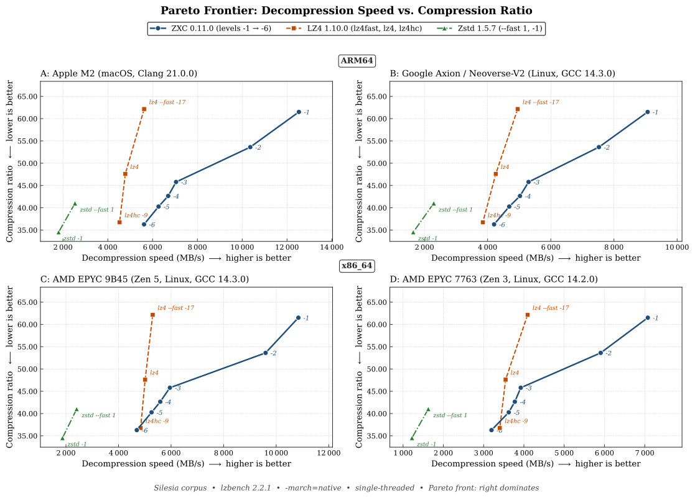
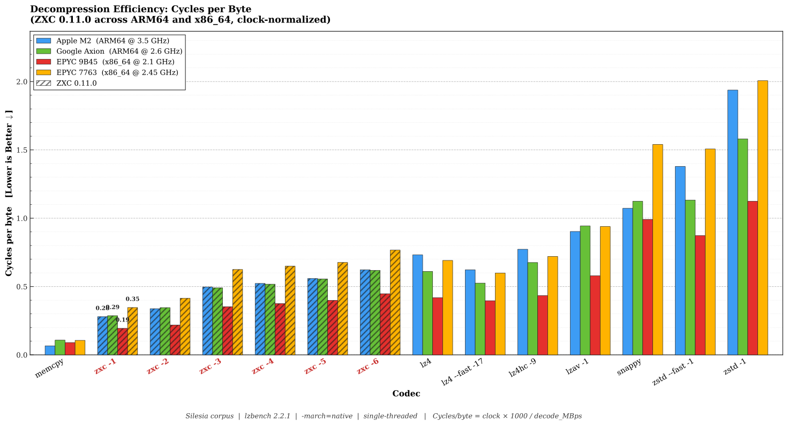
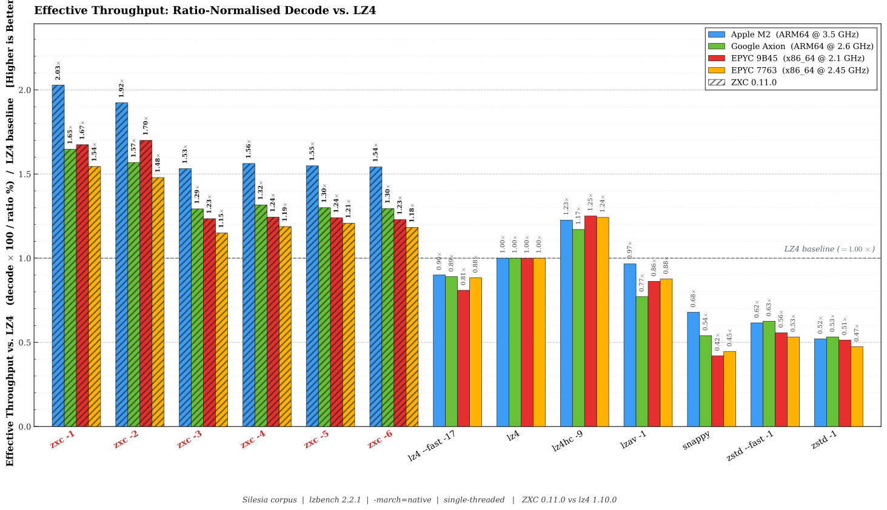

# ZXC: High-Performance Asymmetric Lossless Compression

**Version**: 0.11.0
**Date**: May 2026
**Author**: Bertrand Lebonnois

---

## 1. Executive Summary

In modern software delivery pipelines-specifically **Mobile Gaming**, **Embedded Systems**, and **FOTA (Firmware Over-The-Air)**-data is typically generated on high-performance x86 workstations but consumed on energy-constrained ARM devices.

Standard industry codecs like LZ4 offer excellent performance but fail to exploit the "Write-Once, Read-Many" (WORM) nature of these pipelines. **ZXC** is a lossless codec designed to bridge this gap. By utilizing an **asymmetric compression model**, ZXC achieves a **>40% increase in decompression speed on ARM** compared to LZ4, while simultaneously reducing storage footprints. On x86 development architecture, ZXC maintains competitive throughput, ensuring no disruption to build pipelines.

## 2. The Efficiency Gap

The industry standard, LZ4, prioritizes symmetric speed (fast compression and fast decompression). While ideal for real-time logs or RAM swapping, this symmetry is useless for asset distribution.

*   **Wasted Cycles**: CPU cycles saved during the single compression event (on a build server) do not benefit the millions of end-users decoding the data.
*   **The Battery Tax**: On mobile devices, slower decompression keeps the CPU active longer, draining battery and generating heat.

## 3. The ZXC Solution

ZXC utilizes a computationally intensive encoder to generate a bitstream specifically structured to **maximize decompression throughput**. By performing heavy analysis upfront, the encoder produces a layout optimized for the instruction pipelining and branch prediction capabilities of modern CPUs, particularly ARMv8, effectively offloading complexity from the decoder to the encoder.

### 3.1 Asymmetric Pipeline
ZXC employs a Producer-Consumer architecture to decouple I/O operations from CPU-intensive tasks. This allows for parallel processing where input reading, compression/decompression, and output writing occur simultaneously, effectively hiding I/O latency.

### 3.2 Modular Architecture
The ZXC file format is inherently modular. **Each block is independent and can be encoded and decoded using the algorithm best suited** for that specific data type. This flexibility allows the format to evolve and incorporate new compression strategies without breaking backward compatibility.

## 4. Core Algorithms

ZXC utilizes a hybrid approach combining LZ77 (Lempel-Ziv) dictionary matching with advanced entropy coding and specialized data transforms.

### 4.1 LZ77 Engine
The heart of ZXC is a heavily optimized LZ77 engine that adapts its behavior based on the requested compression level:
*   **Hash Chain & Collision Resolution**: Uses a fast hash table with chaining to find matches in the history window (configurable sliding window, power-of-2 from 4 KB to 2 MB, default 512 KB).
*   **Lazy Matching**: Implements a "lookahead" strategy to find better matches at the cost of slight encoding speed, significantly improving decompression density.

### 4.2 Specialized SIMD Acceleration & Hardware Hashing
ZXC leverages modern instruction sets to maximize throughput on both ARM and x86 architectures.
* **ARM NEON Optimization**: Extensive usage of vld1q_u8 (vector load) and vceqq_u8 (parallel comparison) allows scanning data at wire speed, while vminvq_u8 provides fast rejection of non-matches.
* **x86 Vectorization**: Maintains high performance on Intel/AMD platforms via dedicated AVX2 and AVX512 paths (falling back to SSE4.1 on older hardware), ensuring parity with ARM throughput.
* **High-Speed Integrity**: Block validation relies on **rapidhash**, a modern non-cryptographic hash algorithm that fully exploits hardware acceleration to verify data integrity without bottlenecking the decompression pipeline.

### 4.3 Entropy Coding & Bitpacking
*   **RLE (Run-Length Encoding)**: Automatically detects runs of identical bytes.
*   **Prefix Varint Encoding**: Variable-length integer encoding (similar to LEB128 but prefix-based) for overflow values.
*   **Bit-Packing**: Compressed sequences are packed into dedicated streams using minimal bit widths.

#### Prefix Varint Format

ZXC uses a **Prefix Varint** encoding for overflow values. Unlike standard VByte (which uses a continuation bit in every byte), Prefix Varint encodes the total length of the integer in the **unary prefix of the first byte**. This allows the decoder to determine the sequence length immediately, enabling branchless or highly predictable decoding without serial dependencies.

**Encoding Scheme:**

| Prefix (Binary) | Total Bytes | Data Bits (1st Byte) | Total Data Bits | Range (Value < X) |
|-----------------|-------------|----------------------|-----------------|-------------------|
| `0xxxxxxx`      | 1           | 7                    | 7               | 128               |
| `10xxxxxx`      | 2           | 6                    | 14 (6+8)        | 16,384            |
| `110xxxxx`      | 3           | 5                    | 21 (5+8+8)      | 2,097,152         |
| `1110xxxx`      | 4           | 4                    | 28 (4+8+8+8)    | 268,435,456       |
| `11110xxx`      | 5           | 3                    | 35 (3+8+8+8+8)  | 34,359,738,368    |

**Example**: Encoding value `300` (binary: `100101100`):
```text
Value 300 > 127 and < 16383 -> Uses 2-byte format (Prefix '10').

Step 1: Low 6 bits
300 & 0x3F = 44 (0x2C, binary 101100)
Byte 1 = Prefix '10' | 101100 = 10101100 (0xAC)

Step 2: Remaining high bits
300 >> 6 = 4 (0x04, binary 00000100)
Byte 2 = 0x04

Result: 0xAC 0x04

Decoding Verification:
Byte 1 (0xAC) & 0x3F = 44
Byte 2 (0x04) << 6   = 256
Total = 256 + 44 = 300
```

## 5. File Format Specification

The ZXC file format is block-based, robust, and designed for parallel processing.

### 5.1 Global Structure (File Header)

The file begins with a **16-byte** header that identifies the format and specifies decompression parameters.

**FILE Header (16 bytes):**

```
  Offset:  0               4       5       6       7                       14      16
           +---------------+-------+-------+-------+-----------------------+-------+
           | Magic Word    | Ver   | Chunk | Flags | Reserved              | CRC   |
           | (4 bytes)     | (1B)  | (1B)  | (1B)  | (7 bytes, must be 0)  | (2B)  |
           +---------------+-------+-------+-------+-----------------------+-------+
```

* **Magic Word (4 bytes)**: `0x9 0xCB 0x02E 0xF5`.
* **Version (1 byte)**: Current version is `5`.
* **Chunk Size Code (1 byte)**: Defines the processing block size using **exponent encoding**:
  - If the value is in `[12, 21]`: block size = `2^value` bytes (4 KB to 2 MB).
    - `12` = 4 KB, `13` = 8 KB, `14` = 16 KB, `15` = 32 KB, `16` = 64 KB, `17` = 128 KB, `18` = 256 KB, `19` = 512 KB (default), `20` = 1 MB, `21` = 2 MB.
  - Legacy value `64` is accepted for backward compatibility (maps to 256 KB).
  - Block sizes must be powers of 2.
* **Flags (1 byte)**: Global configuration flags.
  - **Bit 7 (MSB)**: `HAS_CHECKSUM`. If `1`, checksums are enabled for the stream. Every block will carry a trailing 4-byte checksum, and the footer will contain a global checksum. If `0`, no checksums are present.
  - **Bits 4-6**: Reserved.
  - **Bits 0-3**: Checksum Algorithm ID (e.g., `0` = RapidHash).
* **Reserved (7 bytes)**: Reserved for future use (must be 0).
* **CRC (2 bytes)**: 16-bit Header Checksum. Calculated on the 16-byte header (with CRC bytes set to 0) using `zxc_hash16`.

### 5.2 Block Header Structure
Each data block consists of an **8-byte** generic header that precedes the specific payload. This header allows the decoder to navigate the stream and identify the processing method required for the next chunk of data.

**BLOCK Header (8 bytes):**

```
  Offset:  0       1       2       3                       7       8
          +-------+-------+-------+-----------------------+-------+
          | Type  | Flags | Rsrvd | Comp Size             | CRC   |
          | (1B)  | (1B)  | (1B)  | (4 bytes)             | (1B)  |
          +-------+-------+-------+-----------------------+-------+

  Block Layout:
  [ Header (8B) ] + [ Compressed Payload (Comp Size bytes) ] + [ Optional Checksum (4B) ]

```

**Note**: The Checksum (if enabled in File Header) is **4 bytes** (32-bit), is always located **at the end** of the compressed data, and is calculated **on the compressed payload**.

* **Type**: Block encoding type (0=RAW, 1=GLO, 2=NUM, 3=GHI, 255=EOF).
* **Flags**: Not used for now.
* **Rsrvd**: Reserved for future use (must be 0).
* **Comp Size**: Compressed payload size (excluding header and optional checksum).
* **CRC**: 1-byte Header Checksum (located at the end of the header). Calculated on the 8-byte header (with CRC byte set to 0) using `zxc_hash8`.

> **Note**: The decompressed size is not stored in the block header. It is derived from internal Section Descriptors within the compressed payload (for GLO/GHI blocks), from the NUM header (for NUM blocks), or equals `Comp Size` (for RAW blocks).

> **Note**: While the format is designed for threaded execution, a single-threaded API is also available for constrained environments or simple integration cases.

### 5.3 Specific Header: NUM (Numeric)
(Present immediately after the Block Header)

**NUM Header (16 bytes):**

```
  Offset:  0                               8       10                      16
          +-------------------------------+-------+-------------------------+
          | N Values                      | Frame | Reserved                |
          | (8 bytes)                     | (2B)  | (6 bytes)               |
          +-------------------------------+-------+-------------------------+
```

* **N Values**: Total count of integers encoded in the block.
* **Frame**: Processing window size (currently always 128).
* **Reserved**: Padding for alignment.

### 5.4 Specific Header: GLO (Generic Low)
(Present immediately after the Block Header)

**GLO Header (16 bytes):**

```
  Offset:  0               4               8   9  10  11  12              16
          +---------------+---------------+---+---+---+---+---------------+
          | N Sequences   | N Literals    |Lit|LL |ML |Off| Reserved      |
          | (4 bytes)     | (4 bytes)     |Enc|Enc|Enc|Enc| (4 bytes)     |
          +---------------+---------------+---+---+---+---+---------------+
```

* **N Sequences**: Total count of LZ sequences in the block.
* **N Literals**: Total count of literal bytes.
* **Encoding Types**
  - `Lit Enc`: Literal stream encoding (0=RAW, 1=RLE). **Currently used.**
  - `LL Enc`: Literal lengths encoding. **Reserved for future use** (lengths are packed in tokens).
  - `ML Enc`: Match lengths encoding. **Reserved for future use** (lengths are packed in tokens).
  - `Off Enc`: Offset encoding mode. **Currently used**
    - `0` = 16-bit offsets (2 bytes each, max distance 65535)
    - `1` = 8-bit offsets (1 byte each, max distance 255)
* **Reserved**: Padding for alignment.

**Section Descriptors (4 × 8 bytes = 32 bytes total):**

Each descriptor stores sizes as a packed 64-bit value:

```
  Single Descriptor (8 bytes):
  +-----------------------------------+-----------------------------------+
  | Compressed Size (4 bytes)         | Raw Size (4 bytes)                |
  | (low 32 bits)                     | (high 32 bits)                    |
  +-----------------------------------+-----------------------------------+

  Full Layout (32 bytes):
  Offset:  0               8               16              24              32
          +---------------+---------------+---------------+---------------+
          | Literals Desc | Tokens Desc   | Offsets Desc  | Extras Desc   |
          | (8 bytes)     | (8 bytes)     | (8 bytes)     | (8 bytes)     |
          +---------------+---------------+---------------+---------------+
```

**Section Contents:**

| # | Section     | Description                                           |
|---|-------------|-------------------------------------------------------|
| 0 | **Literals**| Raw bytes to copy, or RLE-compressed if `enc_lit=1`  |
| 1 | **Tokens**  | Packed bytes: `(LiteralLen << 4) \| MatchLen`        |
| 2 | **Offsets** | Match distances: 8-bit if `enc_off=1`, else 16-bit LE |
| 3 | **Extras**  | Prefix Varint overflow values when LitLen or MatchLen ≥ 15   |

**Data Flow Example:**

```
GLO Block Data Layout:
+------------------------------------------------------------------------+
| Literals Stream | Tokens Stream | Offsets Stream | Extras Stream      |
| (desc[0] bytes) | (desc[1] bytes)| (desc[2] bytes)| (desc[3] bytes)   |
+------------------------------------------------------------------------+
       ↓                 ↓                 ↓                 ↓
   Raw bytes      Token parsing      Match lookup      Length overflow
```

**Why Comp Size and Raw Size?**

Each descriptor stores both a compressed and raw size to support secondary encoding of streams:

| Section     | Comp Size            | Raw Size            | Different?           |
|-------------|----------------------|---------------------|----------------------|
| **Literals**| RLE size (if used)   | Original byte count | Yes, if RLE enabled |
| **Tokens**  | Stream size          | Stream size         | No                   |
| **Offsets** | N×1 or N×2 bytes     | N×1 or N×2 bytes    | No (size depends on `enc_off`) |
| **Extras**  | Prefix Varint stream size | Prefix Varint stream size | No                   |

Currently, the **Literals** section uses different sizes when RLE compression is applied (`enc_lit=1`). The **Offsets** section size depends on `enc_off`: N sequences × 1 byte (if `enc_off=1`) or N sequences × 2 bytes (if `enc_off=0`).

> **Design Note**: This format is designed for future extensibility. The dual-size architecture allows adding entropy coding (FSE/ANS) or bitpacking to any stream without breaking backward compatibility.


### 5.5 Specific Header: GHI (Generic High)
(Present immediately after the Block Header)

The **GHI** (Generic High-Velocity) block format is optimized for maximum decompression speed. It uses a **packed 32-bit sequence** format that allows 4-byte aligned reads, reducing memory access latency and enabling efficient SIMD processing.

**GHI Header (16 bytes):**

```
  Offset:  0               4               8   9  10  11  12              16
          +---------------+---------------+---+---+---+---+---------------+
          | N Sequences   | N Literals    |Lit|LL |ML |Off| Reserved      |
          | (4 bytes)     | (4 bytes)     |Enc|Enc|Enc|Enc| (4 bytes)     |
          +---------------+---------------+---+---+---+---+---------------+
```

* **N Sequences**: Total count of LZ sequences in the block.
* **N Literals**: Total count of literal bytes.
* **Encoding Types**
  - `Lit Enc`: Literal stream encoding (0=RAW).
  - `LL Enc`: Reserved for future use.
  - `ML Enc`: Reserved for future use.
  - `Off Enc`: Offset encoding mode:
    - `0` = 16-bit offsets (max distance 65535)
    - `1` = 8-bit offsets (max distance 255, enables smaller sequence packing)
* **Reserved**: Padding for alignment.

**Section Descriptors (3 × 8 bytes = 24 bytes total):**

```
  Full Layout (24 bytes):
  Offset:  0               8               16              24
          +---------------+---------------+---------------+
          | Literals Desc | Sequences Desc| Extras Desc   |
          | (8 bytes)     | (8 bytes)     | (8 bytes)     |
          +---------------+---------------+---------------+
```

**Section Contents:**

| # | Section       | Description                                           |
|---|---------------|-------------------------------------------------------|
| 0 | **Literals**  | Raw bytes to copy                                    |
| 1 | **Sequences** | Packed 32-bit sequences (see format below)           |
| 2 | **Extras**    | Prefix Varint overflow values when LitLen or MatchLen ≥ 255  |

**Packed Sequence Format (32 bits):**

Unlike GLO which uses separate token and offset streams, GHI packs all sequence data into a single 32-bit word for cache-friendly sequential access:

```
  32-bit Sequence Word (Little Endian):
  +--------+--------+------------------+
  |   LL   |   ML   |     Offset       |
  | 8 bits | 8 bits |     16 bits      |
  +--------+--------+------------------+
   [31:24]  [23:16]      [15:0]

  Byte Layout in Memory:
  Offset: 0        1        2        3
         +--------+--------+--------+--------+
         | Off Lo | Off Hi |   ML   |   LL   |
         +--------+--------+--------+--------+
```

* **LL (Literal Length)**: 8 bits (0-254, value 255 triggers Prefix Varint overflow)
* **ML (Match Length - 5)**: 8 bits (actual length = ML + 5, range 5-259, value 255 triggers Prefix Varint overflow)
* **Offset**: 16 bits (match distance, 1-65535)

**Data Flow Example:**

```
GHI Block Data Layout:
+------------------------------------------------------------+
| Literals Stream | Sequences Stream       | Extras Stream   |
| (desc[0] bytes) | (desc[1] bytes = N×4)  | (desc[2] bytes) |
+------------------------------------------------------------+
       ↓                    ↓                      ↓
   Raw bytes        32-bit seq read         Length overflow
```

**Key Differences: GLO vs GHI**

| Feature            | GLO (Global)                    | GHI (High-Velocity)              |
|--------------------|---------------------------------|----------------------------------|
| **Sections**       | 4 (Lit, Tokens, Offsets, Extras)| 3 (Lit, Sequences, Extras)       |
| **Sequence Format**| 1-byte token + separate offset  | Packed 32-bit word               |
| **LL/ML Bits**     | 4 bits each (overflow at 15)    | 8 bits each (overflow at 255)    |
| **Memory Access**  | Multiple stream pointers        | Single aligned 4-byte reads      |
| **Decoder Speed**  | Fast                            | Fastest (optimized for ARM/x86)  |
| **RLE Support**    | Yes (literals)                  | No                               |
| **Huffman Literals** | Yes (level ≥ 6, ≥ 1024 lits)  | No                               |
| **Parser**         | Lazy (≤ L5), Optimal DP (L6)    | Lazy                             |
| **Best For**       | General data, good compression  | Maximum decode throughput        |

> **Design Rationale**: The 32-bit packed format eliminates pointer chasing between token and offset streams. By reading a single aligned word per sequence, the decoder achieves better cache utilization and enables aggressive loop unrolling (4x) for maximum throughput on modern CPUs.


### 5.6 Specific Header: EOF (End of File)
(Block Type 255)

The **EOF** block marks the end of the ZXC stream. It ensures that the decompressor knows exactly when to stop processing, allowing for robust stream termination even when file size metadata is unavailable or when concatenating streams.

*   **Structure**: Standard 8-byte Block Header.
*   **Flags**:
    *   **Bit 7 (0x80)**: `has_checksum`. If set, implies the **Global Stream Checksum** in the footer is valid and should be verified.
*   **Comp Size**: Unlike other blocks, these **MUST be set to 0**. The decoder enforces strict validation (`Type == EOF` AND `Comp Size == 0`) to prevent processing of malformed termination blocks.
*   **CRC**: 1-byte Header Checksum (located at the end of the header). Calculated on the 8-byte header (with CRC byte set to 0) using `zxc_hash8`.


### 5.7 File Footer
(Present immediately after the EOF Block)

A mandatory **12-byte footer** closes the stream, providing total source size information and the global checksum.

**Footer Structure (12 bytes):**

```
  Offset:  0                               8               12
          +-------------------------------+---------------+
          | Original Source Size          | Global Hash   |
          | (8 bytes)                     | (4 bytes)     |
          +-------------------------------+---------------+
```

*   **Original Source Size** (8 bytes): Total size of the uncompressed data.
*   **Global Hash** (4 bytes): The **Global Stream Checksum**. Valid only if the EOF block has the `has_checksum` flag set (or the decoder context requires it).
    *   **Algorithm**: `Rotation + XOR`.
    *   For each block with a checksum: `global_hash = (global_hash << 1) | (global_hash >> 31); global_hash ^= block_hash;`

### 5.8 Block Encoding & Processing Algorithms

The efficiency of ZXC relies on specialized algorithmic pipelines for each block type.

#### Type 1: GLO (Global)
This format is used for standard data. It employs a **multi-stage encoding pipeline**:

**Encoding Process**:
1.  **LZ77 Parsing**: The encoder iterates through the input using a rolling hash to detect matches.
    *   *Hash Chain*: Collisions are resolved via a chain table to find optimal matches in dense data.
    *   *Lazy Matching* (levels 3–5): If a match is found, the encoder checks the next position. If a better match starts there, the current byte is emitted as a literal (deferred matching).
    *   *Price-Based Optimal Parser* (level 6): A forward dynamic-programming pass replaces the lazy parser. `dp[p]` holds the minimum bit-cost to encode `src[0..p)`; transitions consider either emitting a single literal or any sub-length of the longest match found at `p`, using static prices (literal ≈ 9 bits, match ≈ 24 bits + varint extras). Backtracking from `dp[N]` yields the globally optimal token sequence. A long-match guard skips re-search at intra-match positions to keep the parser O(N) on highly repetitive data.
2.  **Tokenization**: Matches are split into three components:
    *   *Literal Length*: Number of raw bytes before the match.
    *   *Match Length*: Duration of the repeated pattern.
    *   *Offset*: Distance back to the pattern start.
3.  **Stream Separation**: These components are routed to separate buffers:
    *   *Literals Buffer*: Raw bytes.
    *   *Tokens Buffer*: Packed `(LitLen << 4) | MatchLen`.
    *   *Offsets Buffer*: Variable-width distances (8-bit or 16-bit, see below).
    *   *Extras Buffer*: Overflow values for lengths >= 15 (Prefix Varint encoded).
    *   *Offset Mode Selection*: The encoder tracks the maximum offset across all sequences. If all offsets are ≤ 255, the 8-bit mode (`enc_off=1`) is selected, saving 1 byte per sequence compared to 16-bit mode.
4.  **RLE Pass**: The literals buffer is scanned for run-length encoding opportunities (runs of identical bytes). If beneficial (>10% gain), it is compressed in place.
5.  **Huffman Pass** (level ≥ 6 only, ≥ 1024 literals only): A length-limited canonical Huffman code (`L = 8`) is fitted to the literal byte distribution and the literals are split into 4 LSB-first interleaved bit-streams. The encoding is selected (`enc_lit = 2`) only if it is at least ~3 % smaller than the chosen RAW or RLE baseline.
6.  **Final Serialization**: All buffers are concatenated into the payload, preceded by section descriptors.

**Decoding Process**:
1.  **Deserizalization**: The decoder reads the section descriptors to obtain pointers to the start of each stream (Literals, Tokens, Offsets).
2.  **Literal Decompression**:
    *   `enc_lit = 0` (RAW): zero-copy view into the source buffer.
    *   `enc_lit = 1` (RLE): single pass that expands runs and copies literal chunks.
    *   `enc_lit = 2` (HUFFMAN): canonical Huffman section decoded by 4 parallel decoders sharing a cache-line-aligned 2048-entry lookup table (11-bit window). Each lookup returns 1 or 2 symbols depending on whether the cumulative length of the next two codes fits in the 11-bit window — on typical literal distributions ~50–70 % of lookups yield 2 symbols, raising effective throughput well above one symbol per memory access. A small per-stream scalar tail (≤ 9 symbols) handles the trailing bytes safely without speculative writes.
3.  **Vertical Execution**: The main loop reads from all three streams simultaneously.
4.  **Wild Copy**:
    *   *Literals*: Copied using unaligned 16-byte SIMD loads/stores (`vld1/vst1` on ARM).
    *   *Matches*: Copied using 16-byte stores. Overlapping matches (e.g., repeating pattern "ABC" for 100 bytes) are handled naturally by the CPU's store forwarding or by specific overlapped-copy primitives.
    *   **Safety**: A "Safe Zone" at the end of the buffer forces a switch to a cautious byte-by-byte loop, allowing the main loop to run without bounds checks.

#### Type 3: GHI (High-Velocity)
This format prioritizes decompression throughput over compression ratio. It uses a **unified sequence stream**:

**Encoding Process**:
1.  **LZ77 Parsing**: Same as GLO, with aggressive lazy matching and step skipping for optimal matches.
2.  **Sequence Packing**: Each match is packed into a 32-bit word:
    *   Bits [31:24]: Literal Length (8 bits)
    *   Bits [23:16]: Match Length - 5 (8 bits)
    *   Bits [15:0]: Offset (16 bits)
3.  **Stream Assembly**: Only three streams are generated:
    *   *Literals Buffer*: Raw bytes (no RLE).
    *   *Sequences Buffer*: Packed 32-bit words (4 bytes each).
    *   *Extras Buffer*: Prefix Varint overflow values for lengths >= 255.
4.  **Final Serialization**: Streams are concatenated with 3 section descriptors.

**Decoding Process**:
1.  **Single-Read Loop**: The decoder reads one 32-bit word per sequence, extracting LL, ML, and offset in a single operation.
2.  **4x Unrolled Fast Path**: When sufficient buffer margin exists, the decoder processes 4 sequences per iteration:
    *   Pre-reads 4 sequences into registers
    *   Copies literals and matches with 32-byte SIMD operations
    *   Minimal branching for maximum instruction-level parallelism
3.  **Offset Validation Threshold**: For the first 256 (8-bit mode) or 65536 (16-bit mode) bytes, offsets are validated against written bytes. After this threshold, all offsets are guaranteed valid.
4.  **Wild Copy**: Same 32-byte SIMD copies as GLO, with special handling for overlapping matches (offset < 32).

#### Type 2: NUM (Numeric)
Triggered when data is detected as a dense array of 32-bit integers.

**Encoding Process**:
1.  **Vectorized Delta**: Computes `delta[i] = val[i] - val[i-1]` using SIMD integers (AVX2/NEON).
2.  **ZigZag Transform**: Maps signed deltas to unsigned space: `(d << 1) ^ (d >> 31)`.
3.  **Bit Analysis**: Determines the maximum number of bits `B` needed to represent the deltas in a 128-value frame.
4.  **Bit-Packing**: Packs 128 integers into `128 * B` bits.

**Decoding Process**:
1.  **Bit-Unpacking**: Unpacks bitstreams back into integers.
2.  **ZigZag Decode**: Reverses the mapping.
3.  **Integration**: Computes the prefix sum (cumulative addition) to restore original values. *Note: ZXC utilizes a 4x unrolled loop here to pipeline the dependency chain.*

### 5.9 Data Integrity
Every compressed block can optionally be protected by a **32-bit checksum** to ensure data reliability.

#### Post-Compression Verification
Unlike traditional codecs that verify the integrity of the original uncompressed data, ZXC calculates checksums on the **compressed** payload.

*   **Zero-Overhead Decompression**: Verifying uncompressed data requires computing a hash over the output *after* decompression, contending for cache and CPU resources with the decompression logic itself. By checksumming the compressed stream, verification happens *during* the read phase, before the data even enters the decoder.
*   **Early Failure Detection**: Corruption is detected before attempting to decompress, preventing potential crashes or buffer overruns in the decoder caused by malformed data.
*   **Reduced Memory Bandwidth**: The checksum is computed over a much smaller dataset (the compressed block), saving significant memory bandwidth.

#### Multi-Algorithm Support
ZXC supports multiple integrity verification algorithms (though currently standardized on rapidhash).

*   **Identified Algorithm (0x00: rapidhash)**: The default algorithm. The 64-bit rapidhash result is folded (XORed) into a 32-bit value to minimize storage overhead while maintaining strong collision resistance for block-level integrity.
*   **Performance First**: By using a modern non-cryptographic hash, ZXC ensures that integrity checks do not bottleneck decompression throughput.

#### Credit
The default `rapidhash` algorithm is based on wyhash and was developed by Nicolas De Carli. It is designed to fully exploit hardware performance while maintaining top-tier mathematical distribution qualities.

### 5.10 Seekable Archives (Random Access)
ZXC supports **O(1)** random-access decompression without decoding the entire stream. This is achieved by appending an optional **Seek Table** (a `SEK` block) at the end of the archive, immediately before the file footer.

*   **Structure**: The seek table contains an array of 4-byte entries (compressed block size, LE uint32) for every block in the archive.
*   **Performance**: Reading backward from the file footer instantly locates the seek table. Since blocks have a fixed power-of-2 size, the target block is found by a single division (`block_index = offset / block_size`), with no binary search required.
*   **Use Cases**: This feature transforms ZXC from a sequential stream into a random-access volume format.

## 6. System Architecture (Threading)

ZXC leverages a threaded **Producer-Consumer** model to saturate modern multi-core CPUs.

### 6.1 Asynchronous Compression Pipeline
1.  **Block Splitting (Main Thread)**: The input file is read and sliced into fixed-size chunks (configurable, default 512 KB, power of 2 from 4 KB to 2 MB).
2.  **Ring Buffer Submission**: Chunks are placed into a lock-free ring buffer.
3.  **Parallel Compression (Worker Threads)**:
    *   Workers pull chunks from the queue.
    *   Each worker compresses its chunk independently in its own context (`zxc_cctx_t`).
    *   Output is written to a thread-local buffer.
4.  **Reordering & Write (Writer Thread)**: The writer thread ensures chunks are written to disk in the correct original order, regardless of which worker finished first.

### 6.2 Asynchronous Decompression Pipeline
1.  **Header Parsing (Main Thread)**: The main thread scans block headers to identify boundaries and payload sizes.
2.  **Dispatch**: Compressed payloads are fed into the worker job queue.
3.  **Parallel Decoding (Worker Threads)**:
    *   Workers decode chunks into pre-allocated output buffers.
    *   **Fast Path**: If the output buffer has sufficient margin, the decoder uses "wild copies" (16-byte SIMD stores) to bypass bounds checking for maximal speed.
4.  **Serialization**: Decompressed blocks are committed to the output stream sequentially.

## 7. Performance Analysis (Benchmarks)

**Methodology:**
Benchmarks were conducted using `lzbench` (by inikep) with a **block size of 256 KB**, checksums disabled, single-threaded execution, on the standard Silesia Corpus ([silesia.tar](https://github.com/DataCompression/corpus-collection/tree/main/Silesia-Corpus), 202 MB).
* **Target 1 (Client):** Apple M2 / macOS 26 (Clang 21)
* **Target 2 (Cloud):** Google Axion / Linux (GCC 14)
* **Target 3 (Build):** AMD EPYC 9B45 / Linux (GCC 14)
* **Target 4 (Production):** AMD EPYC 7763 / Linux (GCC 14)

**Figure A**: Pareto Frontier — Decompression Speed vs. Compressed Size (across 4 CPUs)




### 7.1 Client ARM64 Summary (Apple Silicon M2)

| Compressor | Decompression Speed (Ratio vs LZ4) | Compressed Size (Index LZ4=100) (Lower is Better) |
| :--- | :--- | :--- |
| **zxc 0.11.0 -1** | **2.62x** | **129.22** |
| **zxc 0.11.0 -2** | **2.17x** | **112.64** |
| **zxc 0.11.0 -3** | **1.47x** | **96.20** |
| **zxc 0.11.0 -4** | **1.40x** | **89.60** |
| **zxc 0.11.0 -5** | **1.31x** | **84.59** |
| **zxc 0.11.0 -6** | **1.17x** | **76.21** |
| lz4 1.10.0 --fast -17 | 1.18x | 130.58 |
| lz4 1.10.0 (Ref) | 1.00x | 100.00 |
| lz4hc 1.10.0 -9 | 0.95x | 77.20 |
| lzav 5.7 -1 | 0.81x | 83.91 |
| snappy 1.2.2 | 0.68x | 100.53 |
| zstd 1.5.7 --fast --1 | 0.53x | 86.16 |
| zstd 1.5.7 -1 | 0.38x | 72.55 |
| zlib 1.3.1 -1 | 0.09x | 76.58 |

**Decompression Efficiency (Cycles per Byte @ 3.5 GHz)**

| Compressor.             | Cycles/Byte | Performance vs memcpy (*) |
| ----------------------- | ----------- | --------------------- |
| memcpy                  | 0.066       | 1.00x (baseline)      |
| **zxc 0.11.0 -1**       | **0.279**   | **4.2x**              |
| **zxc 0.11.0 -2**       | **0.338**   | **5.1x**              |
| **zxc 0.11.0 -3**       | **0.497**   | **7.5x**              |
| **zxc 0.11.0 -4**       | **0.523**   | **7.9x**              |
| **zxc 0.11.0 -5**       | **0.559**   | **8.4x**              |
| **zxc 0.11.0 -6**       | **0.623**   | **9.4x**              |
| lz4 1.10.0              | 0.732       | 11.1x                 |
| lz4 1.10.0 --fast -17   | 0.622       | 9.4x                  |
| lz4hc 1.10.0 -9         | 0.773       | 11.7x                 |
| lzav 5.7 -1             | 0.903       | 13.6x                 |
| zstd 1.5.7 -1           | 1.938       | 29.3x                 |
| zstd 1.5.7 --fast --1   | 1.379       | 20.8x                 |
| snappy 1.2.2            | 1.072       | 16.2x                 |
| zlib 1.3.1 -1           | 8.537       | 129x                  |

*Lower is better. Calculated using Apple M2 Performance Core frequency (3.5 GHz). Formula: `Cycles/Byte = 3500 / Decompression Speed (MB/s)`.*

**Effective Throughput (Ratio-normalized decode)**

| Compressor | Decode (MB/s) | Ratio (%) | Effective (MB/s) | vs LZ4 |
| :--- | ---: | ---: | ---: | ---: |
| **zxc 0.11.0 -1** | 12 530 | 61.50 | **20 374** | **2.03x** |
| **zxc 0.11.0 -2** | 10 360 | 53.61 | **19 324** | **1.92x** |
| **zxc 0.11.0 -3** |  7 049 | 45.79 | **15 394** | **1.53x** |
| **zxc 0.11.0 -4** |  6 697 | 42.65 | **15 703** | **1.56x** |
| **zxc 0.11.0 -5** |  6 267 | 40.27 | **15 563** | **1.55x** |
| **zxc 0.11.0 -6** |  5 620 | 36.28 | **15 490** | **1.54x** |
| lz4 1.10.0 (Ref) | 4 783 | 47.60 | 10 048 | 1.00x |
| lz4 1.10.0 --fast -17 | 5 623 | 62.15 | 9 047 | 0.90x |
| lz4hc 1.10.0 -9 | 4 528 | 36.75 | 12 321 | 1.23x |
| lzav 5.7 -1 | 3 877 | 39.94 | 9 707 | 0.97x |
| snappy 1.2.2 | 3 264 | 47.85 | 6 822 | 0.68x |
| zstd 1.5.7 --fast --1 | 2 538 | 41.01 | 6 189 | 0.62x |
| zstd 1.5.7 -1 | 1 806 | 34.53 | 5 230 | 0.52x |
| zlib 1.3.1 -1 | 410 | 36.45 | 1 125 | 0.11x |

*Higher is better. Captures how much *original* data is delivered per unit of compressed input bandwidth. Formula: `Effective (MB/s) = Decompression Speed × 100 / Compression Ratio (%)`.*

*Reading: on Apple M2, ZXC's full level range delivers between **1.53x** and **2.03x** LZ4 effective bandwidth. ZXC -6 (15 490 MB/s, 1.54x LZ4) clearly leads `lz4hc -9` (12 321 MB/s, 1.23x) on this platform — **1.26x more effective bandwidth at equivalent ratio**. Apple Silicon's deep pipelines amplify ZXC's lead at every level.*


### 7.2 Cloud Server Summary (ARM64 / Google Axion Neoverse-V2)

| Compressor | Decompression Speed (Ratio vs LZ4) | Compressed Size (Index LZ4=100) (Lower is Better) |
| :--- | :--- | :--- |
| **zxc 0.11.0 -1** | **2.13x** | **129.22** |
| **zxc 0.11.0 -2** | **1.77x** | **112.64** |
| **zxc 0.11.0 -3** | **1.24x** | **96.20** |
| **zxc 0.11.0 -4** | **1.18x** | **89.60** |
| **zxc 0.11.0 -5** | **1.10x** | **84.59** |
| **zxc 0.11.0 -6** | **0.99x** | **76.21** |
| lz4 1.10.0 --fast -17 | 1.16x | 130.58 |
| lz4 1.10.0 (Ref) | 1.00x | 100.00 |
| lz4hc 1.10.0 -9 | 0.90x | 77.20 |
| lzav 5.7 -1 | 0.65x | 83.91 |
| snappy 1.2.2 | 0.54x | 100.53 |
| zstd 1.5.7 --fast --1 | 0.54x | 86.16 |
| zstd 1.5.7 -1 | 0.39x | 72.55 |
| zlib 1.3.1 -1 | 0.09x | 76.58 |

**Decompression Efficiency (Cycles per Byte @ 2.6 GHz)**

| Compressor.             | Cycles/Byte | Performance vs memcpy (*) |
| ----------------------- | ----------- | --------------------- |
| memcpy                  | 0.108       | 1.00x (baseline)      |
| **zxc 0.11.0 -1**       | **0.287**   | **2.7x**              |
| **zxc 0.11.0 -2**       | **0.346**   | **3.2x**              |
| **zxc 0.11.0 -3**       | **0.491**   | **4.6x**              |
| **zxc 0.11.0 -4**       | **0.517**   | **4.8x**              |
| **zxc 0.11.0 -5**       | **0.555**   | **5.2x**              |
| **zxc 0.11.0 -6**       | **0.618**   | **5.7x**              |
| lz4 1.10.0              | 0.610       | 5.7x                  |
| lz4 1.10.0 --fast -17   | 0.525       | 4.9x                  |
| lz4hc 1.10.0 -9         | 0.676       | 6.3x                  |
| lzav 5.7 -1             | 0.943       | 8.8x                  |
| zstd 1.5.7 -1           | 1.581       | 14.7x                 |
| zstd 1.5.7 --fast --1   | 1.133       | 10.5x                 |
| snappy 1.2.2            | 1.124       | 10.4x                 |
| zlib 1.3.1 -1           | 6.667       | 61.9x                 |

*Lower is better. Calculated using Neoverse-V2 base frequency (2.6 GHz). Formula: `Cycles/Byte = 2600 / Decompression Speed (MB/s)`.*

**Effective Throughput (Ratio-normalized decode)**

This metric expresses how much *original* data is delivered per unit of compressed input bandwidth. Formula: `Effective (MB/s) = Decompression Speed × 100 / Ratio (%)`. It captures the combined benefit of fast decode and good ratio: a smaller compressed file feeds the decoder with less bandwidth pressure on the source (storage / network / inter-core), so each MB of compressed data yields more MB of original data per second of decode work. *Higher is better.*

| Compressor | Decode (MB/s) | Ratio (%) | Effective (MB/s) | vs LZ4 |
| :--- | ---: | ---: | ---: | ---: |
| **zxc 0.11.0 -1** | 9 067 | 61.50 | **14 744** | **1.65x** |
| **zxc 0.11.0 -2** | 7 524 | 53.61 | **14 035** | **1.57x** |
| **zxc 0.11.0 -3** | 5 297 | 45.79 | **11 569** | **1.29x** |
| **zxc 0.11.0 -4** | 5 025 | 42.65 | **11 782** | **1.32x** |
| **zxc 0.11.0 -5** | 4 685 | 40.27 | **11 634** | **1.30x** |
| **zxc 0.11.0 -6** | 4 205 | 36.28 | **11 591** | **1.30x** |
| lz4 1.10.0 (Ref) | 4 259 | 47.60 | 8 948 | 1.00x |
| lz4 1.10.0 --fast -17 | 4 951 | 62.15 | 7 966 | 0.89x |
| lz4hc 1.10.0 -9 | 3 849 | 36.75 | 10 473 | 1.17x |
| lzav 5.7 -1 | 2 757 | 39.94 | 6 903 | 0.77x |
| snappy 1.2.2 | 2 313 | 47.85 | 4 834 | 0.54x |
| zstd 1.5.7 --fast --1 | 2 295 | 41.01 | 5 596 | 0.63x |
| zstd 1.5.7 -1 | 1 645 | 34.53 | 4 764 | 0.53x |
| zlib 1.3.1 -1 | 390 | 36.45 | 1 070 | 0.12x |

*Higher is better. Captures how much *original* data is delivered per unit of compressed input bandwidth. Formula: `Effective (MB/s) = Decompression Speed × 100 / Compression Ratio (%)`.*

*Reading: at ZXC -6, every MB/s of compressed input yields **11 591 MB/s** of original output — **1.11x** more effective bandwidth than `lz4hc -9` at equivalent ratio (36.28 vs 36.75), and **1.30x** more than LZ4 default. ZXC's full level range stays above 1.29x LZ4 across all levels.*


### 7.3 Build Server Summary (x86_64 / AMD EPYC 9B45)

| Compressor | Decompression Speed (Ratio vs LZ4) | Compressed Size (Index LZ4=100) (Lower is Better) |
| :--- | :--- | :--- |
| **zxc 0.11.0 -1** | **2.16x** | **129.22** |
| **zxc 0.11.0 -2** | **1.91x** | **112.64** |
| **zxc 0.11.0 -3** | **1.19x** | **96.20** |
| **zxc 0.11.0 -4** | **1.11x** | **89.60** |
| **zxc 0.11.0 -5** | **1.05x** | **84.59** |
| **zxc 0.11.0 -6** | **0.94x** | **76.21** |
| lz4 1.10.0 --fast -17 | 1.06x | 130.58 |
| lz4 1.10.0 (Ref) | 1.00x | 100.00 |
| lz4hc 1.10.0 -9 | 0.97x | 77.20 |
| lzav 5.7 -1 | 0.72x | 83.91 |
| snappy 1.2.2 | 0.42x | 100.63 |
| zstd 1.5.7 --fast --1 | 0.48x | 86.16 |
| zstd 1.5.7 -1 | 0.37x | 72.55 |
| zlib 1.3.1 -1 | 0.08x | 76.58 |

**Decompression Efficiency (Cycles per Byte @ 2.1 GHz)**

| Compressor.             | Cycles/Byte | Performance vs memcpy (*) |
| ----------------------- | ----------- | --------------------- |
| memcpy                  | 0.090       | 1.00x (baseline)      |
| **zxc 0.11.0 -1**       | **0.194**   | **2.1x**              |
| **zxc 0.11.0 -2**       | **0.219**   | **2.4x**              |
| **zxc 0.11.0 -3**       | **0.353**   | **3.9x**              |
| **zxc 0.11.0 -4**       | **0.376**   | **4.2x**              |
| **zxc 0.11.0 -5**       | **0.399**   | **4.4x**              |
| **zxc 0.11.0 -6**       | **0.447**   | **5.0x**              |
| lz4 1.10.0              | 0.419       | 4.6x                  |
| lz4 1.10.0 --fast -17   | 0.396       | 4.4x                  |
| lz4hc 1.10.0 -9         | 0.434       | 4.8x                  |
| lzav 5.7 -1             | 0.579       | 6.4x                  |
| zstd 1.5.7 -1           | 1.124       | 12.5x                 |
| zstd 1.5.7 --fast --1   | 0.872       | 9.7x                  |
| snappy 1.2.2            | 0.992       | 11.0x                 |
| zlib 1.3.1 -1           | 5.426       | 60.2x                 |

*Lower is better. Calculated using AMD EPYC 9B45 base frequency (2.1 GHz). Formula: `Cycles/Byte = 2100 / Decompression Speed (MB/s)`.*

**Effective Throughput (Ratio-normalized decode)**

| Compressor | Decode (MB/s) | Ratio (%) | Effective (MB/s) | vs LZ4 |
| :--- | ---: | ---: | ---: | ---: |
| **zxc 0.11.0 -1** | 10 844 | 61.50 | **17 633** | **1.67x** |
| **zxc 0.11.0 -2** | 9 597 | 53.61 | **17 902** | **1.70x** |
| **zxc 0.11.0 -3** | 5 955 | 45.79 | **13 005** | **1.23x** |
| **zxc 0.11.0 -4** | 5 589 | 42.65 | **13 104** | **1.24x** |
| **zxc 0.11.0 -5** | 5 259 | 40.27 | **13 059** | **1.24x** |
| **zxc 0.11.0 -6** | 4 695 | 36.28 | **12 941** | **1.23x** |
| lz4 1.10.0 (Ref) | 5 013 | 47.60 | 10 532 | 1.00x |
| lz4 1.10.0 --fast -17 | 5 301 | 62.15 | 8 530 | 0.81x |
| lz4hc 1.10.0 -9 | 4 841 | 36.75 | 13 173 | 1.25x |
| lzav 5.7 -1 | 3 628 | 39.94 | 9 083 | 0.86x |
| snappy 1.2.2 | 2 118 | 47.89 | 4 423 | 0.42x |
| zstd 1.5.7 --fast --1 | 2 407 | 41.01 | 5 870 | 0.56x |
| zstd 1.5.7 -1 | 1 868 | 34.53 | 5 410 | 0.51x |
| zlib 1.3.1 -1 | 387 | 36.45 | 1 062 | 0.10x |

*Higher is better. Captures how much *original* data is delivered per unit of compressed input bandwidth. Formula: `Effective (MB/s) = Decompression Speed × 100 / Compression Ratio (%)`.*

*Reading: on EPYC 9B45, ZXC's full level range delivers between 1.23x and 1.70x LZ4 effective bandwidth. Note that on this x86_64 platform `lz4hc -9` (1.25x) edges out ZXC -6 (1.23x) on this metric — lz4hc's decode (4 841 MB/s) runs ~3% faster than ZXC -6 (4 695 MB/s) here, while ZXC -6 keeps the ratio advantage (36.28 vs 36.75). The two are practically tied on this platform.*


### 7.4 Production x86 Summary (AMD EPYC 7763, Zen 3)

| Compressor | Decompression Speed (Ratio vs LZ4) | Compressed Size (Index LZ4=100) (Lower is Better) |
| :--- | :--- | :--- |
| **zxc 0.11.0 -1** | **2.00x** | **129.22** |
| **zxc 0.11.0 -2** | **1.67x** | **112.64** |
| **zxc 0.11.0 -3** | **1.11x** | **96.20** |
| **zxc 0.11.0 -4** | **1.06x** | **89.60** |
| **zxc 0.11.0 -5** | **1.02x** | **84.59** |
| **zxc 0.11.0 -6** | **0.90x** | **76.21** |
| lz4 1.10.0 --fast -17 | 1.15x | 130.58 |
| lz4 1.10.0 (Ref) | 1.00x | 100.00 |
| lz4hc 1.10.0 -9 | 0.96x | 77.20 |
| lzav 5.7 -1 | 0.74x | 83.91 |
| snappy 1.2.2 | 0.45x | 100.63 |
| zstd 1.5.7 --fast --1 | 0.46x | 86.16 |
| zstd 1.5.7 -1 | 0.34x | 72.55 |
| zlib 1.3.1 -1 | 0.09x | 76.58 |

**Decompression Efficiency (Cycles per Byte @ 2.45 GHz)**

| Compressor.             | Cycles/Byte | Performance vs memcpy (*) |
| ----------------------- | ----------- | --------------------- |
| memcpy                  | 0.106       | 1.00x (baseline)      |
| **zxc 0.11.0 -1**       | **0.346**   | **3.3x**              |
| **zxc 0.11.0 -2**       | **0.415**   | **3.9x**              |
| **zxc 0.11.0 -3**       | **0.625**   | **5.9x**              |
| **zxc 0.11.0 -4**       | **0.649**   | **6.1x**              |
| **zxc 0.11.0 -5**       | **0.676**   | **6.4x**              |
| **zxc 0.11.0 -6**       | **0.767**   | **7.2x**              |
| lz4 1.10.0              | 0.691       | 6.5x                  |
| lz4 1.10.0 --fast -17   | 0.599       | 5.6x                  |
| lz4hc 1.10.0 -9         | 0.720       | 6.8x                  |
| lzav 5.7 -1             | 0.939       | 8.9x                  |
| zstd 1.5.7 -1           | 2.007       | 18.9x                 |
| zstd 1.5.7 --fast --1   | 1.507       | 14.2x                 |
| snappy 1.2.2            | 1.540       | 14.5x                 |
| zlib 1.3.1 -1           | 7.470       | 70.4x                 |

*Lower is better. Calculated using AMD EPYC 7763 base frequency (2.45 GHz). Formula: `Cycles/Byte = 2450 / Decompression Speed (MB/s)`.*

**Effective Throughput (Ratio-normalized decode)**

| Compressor | Decode (MB/s) | Ratio (%) | Effective (MB/s) | vs LZ4 |
| :--- | ---: | ---: | ---: | ---: |
| **zxc 0.11.0 -1** |  7 077 | 61.50 | **11 507** | **1.54x** |
| **zxc 0.11.0 -2** |  5 907 | 53.61 | **11 018** | **1.48x** |
| **zxc 0.11.0 -3** |  3 922 | 45.79 |  **8 565** | **1.15x** |
| **zxc 0.11.0 -4** |  3 775 | 42.65 |  **8 851** | **1.19x** |
| **zxc 0.11.0 -5** |  3 624 | 40.27 |  **8 999** | **1.21x** |
| **zxc 0.11.0 -6** |  3 196 | 36.28 |  **8 809** | **1.18x** |
| lz4 1.10.0 (Ref) | 3 546 | 47.60 | 7 450 | 1.00x |
| lz4 1.10.0 --fast -17 | 4 092 | 62.15 | 6 584 | 0.88x |
| lz4hc 1.10.0 -9 | 3 401 | 36.75 | 9 254 | 1.24x |
| lzav 5.7 -1 | 2 609 | 39.94 | 6 532 | 0.88x |
| snappy 1.2.2 | 1 591 | 47.89 | 3 322 | 0.45x |
| zstd 1.5.7 --fast --1 | 1 626 | 41.01 | 3 965 | 0.53x |
| zstd 1.5.7 -1 | 1 221 | 34.53 | 3 536 | 0.47x |
| zlib 1.3.1 -1 | 328 | 36.45 | 900 | 0.12x |

*Higher is better. Captures how much *original* data is delivered per unit of compressed input bandwidth. Formula: `Effective (MB/s) = Decompression Speed × 100 / Compression Ratio (%)`.*

*Reading: on EPYC 7763 (Zen 3), ZXC's full level range delivers between 1.15x and 1.54x LZ4 effective bandwidth. Like on EPYC 9B45, `lz4hc -9` (1.24x) slightly edges out ZXC -6 (1.18x) at the densest level on this older Zen 3 microarchitecture — its decoder is ~6% faster while the ratio gap stays minimal. ZXC's lead is preserved on the speed-oriented levels (-1 to -2) where the bitstream layout amortizes well over the EPYC 7763 pipeline.*


### 7.5 Benchmarks Results

**Figure B**: Decompression Efficiency : Cycles Per Byte Comparaison



**Figure C**: Effective Throughput — Ratio-Normalized Decode (vs LZ4 baseline = 1.00x)




#### 7.5.1 ARM64 Architecture (Apple Silicon M2)

Benchmarks were conducted using lzbench 2.2.1 (from @inikep), compiled with Clang 21.0.0 using *MOREFLAGS="-march=native"* on macOS Tahoe 26.4 (Build 25E246). The reference hardware is an Apple M2 processor (ARM64).

**All performance metrics reflect single-threaded execution on the standard Silesia Corpus and the benchmark made use of [silesia.tar](https://github.com/DataCompression/corpus-collection/tree/main/Silesia-Corpus), which contains tarred files from the Silesia compression corpus.**

| Compressor name         | Compression| Decompress.| Compr. size | Ratio | Filename |
| ---------------         | -----------| -----------| ----------- | ----- | -------- |
| memcpy                  | 52866 MB/s | 52887 MB/s |   211947520 |100.00 | 1 files|
| **zxc 0.11.0 -1**           |   876 MB/s | **12530 MB/s** |   130356444 | **61.50** | 1 files|
| **zxc 0.11.0 -2**           |   586 MB/s | **10360 MB/s** |   113634139 | **53.61** | 1 files|
| **zxc 0.11.0 -3**           |   253 MB/s |  **7049 MB/s** |    97051816 | **45.79** | 1 files|
| **zxc 0.11.0 -4**           |   174 MB/s |  **6697 MB/s** |    90393215 | **42.65** | 1 files|
| **zxc 0.11.0 -5**           |   102 MB/s |  **6267 MB/s** |    85341643 | **40.27** | 1 files|
| **zxc 0.11.0 -6**           |  11.8 MB/s |  **5620 MB/s** |    76888252 | **36.28** | 1 files|
| lz4 1.10.0              |   813 MB/s |  4783 MB/s |   100880800 | 47.60 | 1 files|
| lz4 1.10.0 --fast -17   |  1350 MB/s |  5623 MB/s |   131732802 | 62.15 | 1 files|
| lz4hc 1.10.0 -9         |  48.2 MB/s |  4528 MB/s |    77884448 | 36.75 | 1 files|
| lzav 5.7 -1             |   665 MB/s |  3877 MB/s |    84644732 | 39.94 | 1 files|
| snappy 1.2.2            |   880 MB/s |  3264 MB/s |   101415443 | 47.85 | 1 files|
| zstd 1.5.7 --fast --1   |   724 MB/s |  2538 MB/s |    86916294 | 41.01 | 1 files|
| zstd 1.5.7 -1           |   645 MB/s |  1806 MB/s |    73193704 | 34.53 | 1 files|
| zlib 1.3.1 -1           |   150 MB/s |   410 MB/s |    77259029 | 36.45 | 1 files|


#### 7.5.2 ARM64 Architecture (Google Axion Neoverse-V2)

Benchmarks were conducted using lzbench 2.2.1 (from @inikep), compiled with GCC 14.3.0 using *MOREFLAGS="-march=native"* on Linux 64-bits Debian GNU/Linux 12 (bookworm). The reference hardware is a Google Neoverse-V2 processor (ARM64).

**All performance metrics reflect single-threaded execution on the standard Silesia Corpus and the benchmark made use of [silesia.tar](https://github.com/DataCompression/corpus-collection/tree/main/Silesia-Corpus), which contains tarred files from the Silesia compression corpus.**

| Compressor name         | Compression| Decompress.| Compr. size | Ratio | Filename |
| ---------------         | -----------| -----------| ----------- | ----- | -------- |
| memcpy                  | 24179 MB/s | 24134 MB/s |   211947520 |100.00 | 1 files|
| **zxc 0.11.0 -1**           |   868 MB/s |  **9067 MB/s** |   130356444 | **61.50** | 1 files|
| **zxc 0.11.0 -2**           |   586 MB/s |  **7524 MB/s** |   113634139 | **53.61** | 1 files|
| **zxc 0.11.0 -3**           |   238 MB/s |  **5297 MB/s** |    97051816 | **45.79** | 1 files|
| **zxc 0.11.0 -4**           |   165 MB/s |  **5025 MB/s** |    90393215 | **42.65** | 1 files|
| **zxc 0.11.0 -5**           |  96.9 MB/s |  **4685 MB/s** |    85341643 | **40.27** | 1 files|
| **zxc 0.11.0 -6**           |  11.0 MB/s |  **4205 MB/s** |    76888252 | **36.28** | 1 files|
| lz4 1.10.0              |   732 MB/s |  4259 MB/s |   100880800 | 47.60 | 1 files|
| lz4 1.10.0 --fast -17   |  1280 MB/s |  4951 MB/s |   131732802 | 62.15 | 1 files|
| lz4hc 1.10.0 -9         |  43.4 MB/s |  3849 MB/s |    77884448 | 36.75 | 1 files|
| lzav 5.7 -1             |   562 MB/s |  2757 MB/s |    84644732 | 39.94 | 1 files|
| snappy 1.2.2            |   757 MB/s |  2313 MB/s |   101415443 | 47.85 | 1 files|
| zstd 1.5.7 --fast --1   |   607 MB/s |  2295 MB/s |    86916294 | 41.01 | 1 files|
| zstd 1.5.7 -1           |   525 MB/s |  1645 MB/s |    73193704 | 34.53 | 1 files|
| zlib 1.3.1 -1           |   115 MB/s |   390 MB/s |    77259029 | 36.45 | 1 files|


#### 7.5.3 x86_64 Architecture (AMD EPYC 9B45)

Benchmarks were conducted using lzbench 2.2.1 (from @inikep), compiled with GCC 14.3.0 using *MOREFLAGS="-march=native"* on Linux 64-bits Ubuntu 24.04. The reference hardware is an AMD EPYC 9B45 processor (x86_64).

**All performance metrics reflect single-threaded execution on the standard Silesia Corpus and the benchmark made use of [silesia.tar](https://github.com/DataCompression/corpus-collection/tree/main/Silesia-Corpus), which contains tarred files from the Silesia compression corpus.**

| Compressor name         | Compression| Decompress.| Compr. size | Ratio | Filename |
| ---------------         | -----------| -----------| ----------- | ----- | -------- |
| memcpy                  | 23351 MB/s | 23292 MB/s |   211947520 |100.00 | 1 files|
| **zxc 0.11.0 -1**           |   859 MB/s | **10844 MB/s** |   130356444 | **61.50** | 1 files|
| **zxc 0.11.0 -2**           |   584 MB/s |  **9597 MB/s** |   113634139 | **53.61** | 1 files|
| **zxc 0.11.0 -3**           |   238 MB/s |  **5955 MB/s** |    97051816 | **45.79** | 1 files|
| **zxc 0.11.0 -4**           |   163 MB/s |  **5589 MB/s** |    90393215 | **42.65** | 1 files|
| **zxc 0.11.0 -5**           |  97.0 MB/s |  **5259 MB/s** |    85341643 | **40.27** | 1 files|
| **zxc 0.11.0 -6**           |  11.7 MB/s |  **4695 MB/s** |    76888252 | **36.28** | 1 files|
| lz4 1.10.0              |   767 MB/s |  5013 MB/s |   100880800 | 47.60 | 1 files|
| lz4 1.10.0 --fast -17   |  1280 MB/s |  5301 MB/s |   131732802 | 62.15 | 1 files|
| lz4hc 1.10.0 -9         |  45.0 MB/s |  4841 MB/s |    77884448 | 36.75 | 1 files|
| lzav 5.7 -1             |   600 MB/s |  3628 MB/s |    84644732 | 39.94 | 1 files|
| snappy 1.2.2            |   768 MB/s |  2118 MB/s |   101512076 | 47.89 | 1 files|
| zstd 1.5.7 --fast --1   |   656 MB/s |  2407 MB/s |    86916294 | 41.01 | 1 files|
| zstd 1.5.7 -1           |   597 MB/s |  1868 MB/s |    73193704 | 34.53 | 1 files|
| zlib 1.3.1 -1           |   133 MB/s |   387 MB/s |    77259029 | 36.45 | 1 files|


#### 7.5.4 x86_64 Architecture (AMD EPYC 7763, Zen 3)

Benchmarks were conducted using lzbench 2.2.1 (from @inikep), compiled with GCC 14.2.0 using *MOREFLAGS="-march=native"* on Linux 64-bits Ubuntu 24.04. The reference hardware is an AMD EPYC 7763 64-Core processor (x86_64, Zen 3, 2.45 GHz).

**All performance metrics reflect single-threaded execution on the standard Silesia Corpus and the benchmark made use of [silesia.tar](https://github.com/DataCompression/corpus-collection/tree/main/Silesia-Corpus), which contains tarred files from the Silesia compression corpus.**

| Compressor name         | Compression| Decompress.| Compr. size | Ratio | Filename |
| ---------------         | -----------| -----------| ----------- | ----- | -------- |
| memcpy                  | 23023 MB/s | 23087 MB/s |   211947520 |100.00 | 1 files|
| **zxc 0.11.0 -1**           |   640 MB/s |  **7077 MB/s** |   130356444 | **61.50** | 1 files|
| **zxc 0.11.0 -2**           |   431 MB/s |  **5907 MB/s** |   113634139 | **53.61** | 1 files|
| **zxc 0.11.0 -3**           |   185 MB/s |  **3922 MB/s** |    97051816 | **45.79** | 1 files|
| **zxc 0.11.0 -4**           |   128 MB/s |  **3775 MB/s** |    90393215 | **42.65** | 1 files|
| **zxc 0.11.0 -5**           |  76.5 MB/s |  **3624 MB/s** |    85341643 | **40.27** | 1 files|
| **zxc 0.11.0 -6**           |  8.85 MB/s |  **3196 MB/s** |    76888252 | **36.28** | 1 files|
| lz4 1.10.0              |   580 MB/s |  3546 MB/s |   100880800 | 47.60 | 1 files|
| lz4 1.10.0 --fast -17   |  1015 MB/s |  4092 MB/s |   131732802 | 62.15 | 1 files|
| lz4hc 1.10.0 -9         |  33.8 MB/s |  3401 MB/s |    77884448 | 36.75 | 1 files|
| lzav 5.7 -1             |   407 MB/s |  2609 MB/s |    84644732 | 39.94 | 1 files|
| snappy 1.2.2            |   612 MB/s |  1591 MB/s |   101512076 | 47.89 | 1 files|
| zstd 1.5.7 --fast --1   |   443 MB/s |  1626 MB/s |    86916294 | 41.01 | 1 files|
| zstd 1.5.7 -1           |   400 MB/s |  1221 MB/s |    73193704 | 34.53 | 1 files|
| zlib 1.3.1 -1           |  98.1 MB/s |   328 MB/s |    77259029 | 36.45 | 1 files|


### 7.6 Memory Usage per Compression Context

| Block Size            | Levels -1 to -5 | Level -6 (DENSITY) |
|:---------------------:|----------------:|-------------------:|
| 256 KB                |        ~1.03 MB |           ~3.06 MB |
| **512 KB** *(default)*|    **~1.78 MB** |       **~5.84 MB** |
| 2 MB *(max)*          |        ~6.28 MB |          ~22.53 MB |

*Levels -1 to -5 share the same context layout (LZ77 hash + chain + sequence / literal buffers) and scale linearly with block size. Level -6 (DENSITY) lazily allocates the optimal-parser scratch (per-position DP cost, parent length / offset, packed match-end bitmap), adding ~×3 overhead. Exact values for any (block, level) combination are reproducible via the public API call `zxc_estimate_cctx_size(block_size, level)`.*

> **Guideline:** Default 512 KB block keeps cctx under 6 MB even at the densest level (-6) — well within reach for typical server / desktop pipelines. For streaming, embedded, or memory-constrained environments, use `-B 256K` (or smaller) and stick to levels -1 to -5. Level -6 is best reserved for offline encoding pipelines where ratio matters and per-thread RAM is plentiful.


## 8. Strategic Implementation

ZXC is designed to adapt to various deployment scenarios by selecting the appropriate compression level:

*   **Interactive Media & Gaming (Levels 1-2-3)**:
    Optimized for hard real-time constraints. Ideal for texture streaming and asset loading, offering **~40% faster** load times to minimize latency and frame drops.

*   **Embedded Systems & Firmware (Levels 3-4-5)**:
    The sweet spot for maximizing storage density on limited flash memory (e.g., Kernel, Initramfs) while ensuring rapid "instant-on" (XIP-like) boot performance.

*   **Data Archival (Levels 4-5)**:
    A high-efficiency alternative for cold storage, providing better compression ratios than LZ4 and significantly faster retrieval speeds than Zstd.

## 9. Conclusion

ZXC redefines asset distribution by prioritizing the end-user experience. Through its asymmetric design and modular architecture, it shifts computational cost to the build pipeline, unlocking unparalleled decompression speeds on ARM devices. This efficiency translates directly into faster load times, reduced battery consumption, and a smoother user experience, making ZXC a best choice for modern, high-performance deployment constraints.
