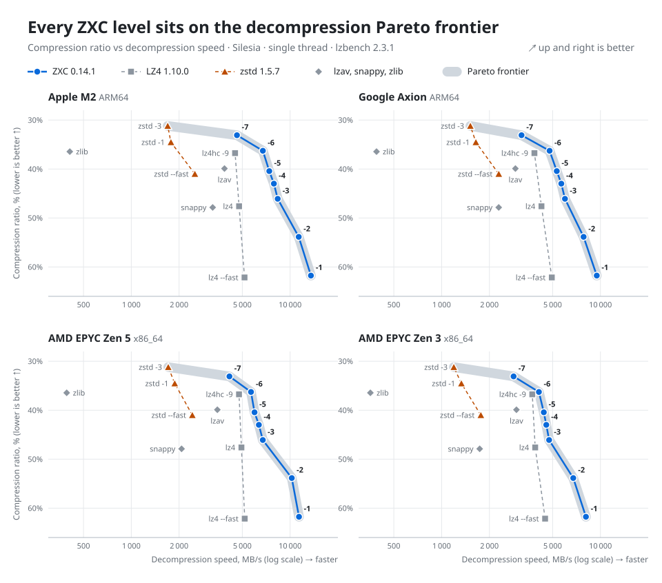
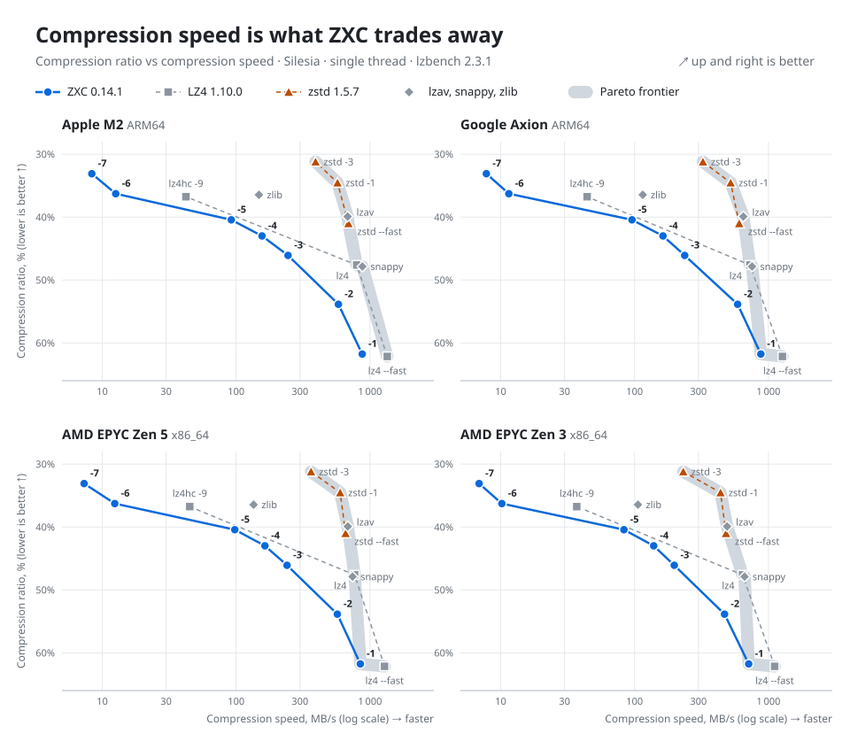
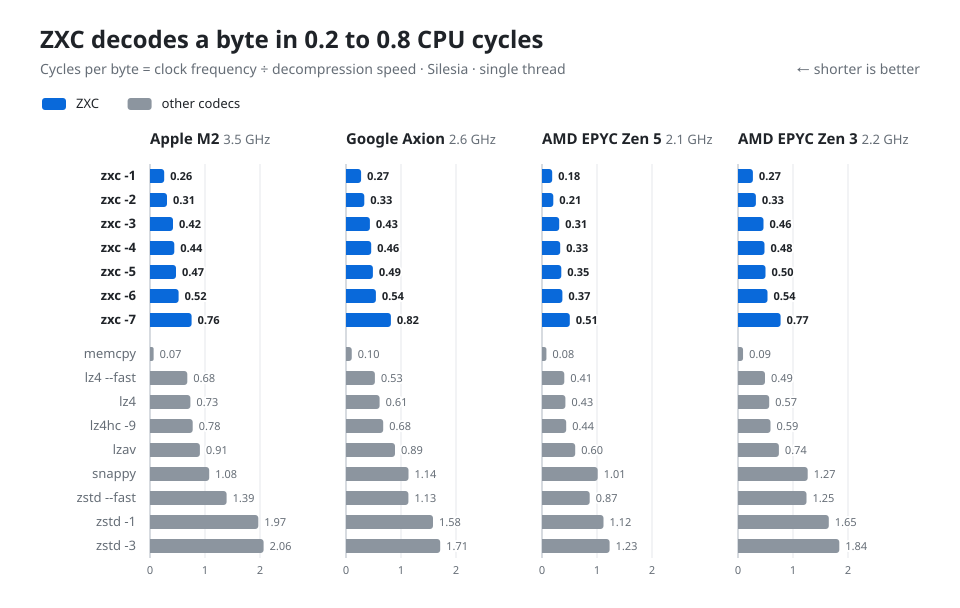

# ZXC: High-Performance Asymmetric Lossless Compression

**Version**: 0.14.1
**Date**: September 2026
**Author**: Bertrand Lebonnois

---

## 1. Executive Summary

In modern software delivery pipelines-specifically **Mobile Gaming**, **Embedded Systems**, and **FOTA (Firmware Over-The-Air)**-data is typically generated on high-performance x86 workstations but consumed on energy-constrained ARM devices.

Standard industry codecs like LZ4 offer excellent performance but fail to exploit the "Write-Once, Read-Many" (WORM) nature of these pipelines. **ZXC** is a lossless codec designed to bridge this gap. By utilizing an **asymmetric compression model**, ZXC achieves a **>75% increase in decompression speed on ARM** compared to LZ4, while simultaneously reducing storage footprints. On x86 development architecture, ZXC maintains competitive throughput, ensuring no disruption to build pipelines.

## 2. The Efficiency Gap

The industry standard, LZ4, prioritizes symmetric speed (fast compression and fast decompression). While ideal for real-time logs or RAM swapping, this symmetry is useless for asset distribution.

*   **Wasted Cycles**: CPU cycles saved during the single compression event (on a build server) do not benefit the millions of end-users decoding the data.
*   **The Battery Tax**: On mobile devices, slower decompression keeps the CPU active longer, draining battery and generating heat.

## 3. The ZXC Solution

ZXC utilizes a computationally intensive encoder to generate a bitstream specifically structured to **maximize decompression throughput**. By performing heavy analysis upfront, the encoder produces a layout optimized for the instruction pipelining and branch prediction capabilities of modern CPUs, particularly ARMv8, effectively offloading complexity from the decoder to the encoder.

### 3.1 Asymmetric Pipeline
ZXC employs a Producer-Consumer architecture to decouple I/O operations from CPU-intensive tasks. This allows for parallel processing where input reading, compression/decompression, and output writing occur simultaneously, effectively hiding I/O latency.

### 3.2 Modular Architecture
The ZXC file format is inherently modular. **Each block is independent and is encoded with whichever of ZXC's block codecs yields the smallest output** — GLO or GHI (the LZ paths) or RAW (stored). Independent blocks keep the format simple, enable O(1) seekable random access, and let it evolve without breaking backward compatibility.

> **ZXC is a pure LZ byte codec.** It compresses byte streams via LZ77 matching plus entropy coding; it has no type-aware or numeric block codec. Numeric and columnar data (timestamps, IDs, float columns) compress best when a **reversible pre-filter** — delta or byte-shuffle — is applied *before* compression and inverted *after* decompression. ZXC keeps such transforms **out of the codec and the format on purpose**: the caller, which knows the element type, owns the filter. See the *Compressing Numeric Data* example in [`EXAMPLES.md`](EXAMPLES.md).

## 4. Core Algorithms

ZXC utilizes a hybrid approach combining LZ77 (Lempel-Ziv) dictionary matching with advanced entropy coding and specialized data transforms.

### 4.1 LZ77 Engine
The heart of ZXC is a heavily optimized LZ77 engine that adapts its behavior based on the requested compression level:
*   **Hash Chain & Collision Resolution**: Uses a fast hash table with chaining to find matches in the history window (configurable sliding window, power-of-2 from 4 KB to 2 MB, default 512 KB).
*   **Lazy Matching**: Implements a "lookahead" strategy to find better matches at the cost of slight encoding speed, significantly improving decompression density.

### 4.2 Specialized SIMD Acceleration & Hardware Hashing
ZXC leverages modern instruction sets to maximize throughput on both ARM and x86 architectures.
* **ARM NEON Optimization**: Extensive usage of vld1q_u8 (vector load) and vceqq_u8 (parallel comparison) allows scanning data at wire speed, while vminvq_u8 provides fast rejection of non-matches.
* **x86 Vectorization**: Maintains high performance on Intel/AMD platforms via dedicated AVX2 and AVX512 paths, falling back to a portable **SSE2** baseline — the x86-64 architectural guarantee, present on every 64-bit Intel/AMD CPU. The SSE2 tier emulates the few SSE4.1 operations it needs (e.g. unsigned 32-bit max, byte blend, saturating `u32`→`u16` pack), so no SSE4.x hardware is required. This ensures parity with ARM throughput across the full x86 range.
* **High-Speed Integrity**: Block validation relies on **rapidhash**, a modern non-cryptographic hash algorithm that fully exploits hardware acceleration to verify data integrity without bottlenecking the decompression pipeline.

### 4.3 Entropy Coding & Bitpacking
*   **RLE (Run-Length Encoding)**: Automatically detects runs of identical bytes.
*   **Prefix Varint Encoding**: Variable-length integer encoding (similar to LEB128 but prefix-based) for overflow values.
*   **Canonical Huffman (Literals level ≥ 6, tokens level 7)**: Length-limited canonical Huffman code (max code length **8 bits** at level 6, **11 bits** at level 7 / ULTRA) over the literal byte distribution — and, at level 7, over the sequence-token distribution. The *code* is classical Huffman; only the *wire layout* is new — PivCo (format v7) transposes the code bits by tree level into per-node branch bitmaps, so the decoder runs data-parallel list merges (byte shuffles) instead of a serial bit chain. See the dedicated section below.
*   **Bit-Packing**: Compressed sequences are packed into dedicated streams using minimal bit widths.

#### Huffman decoding with the PivCo level-ordered layout

Entropy decoding is the hot path of the high-compression levels, and classical
Huffman decoding is a *serial bit chain*: each codeword's length must be known
before the next codeword's position is. Interleaving N independent streams caps the parallelism at N and
still executes a load-shift-mask dependency chain per symbol. Format v7
replaces the layout with **PivCo-Huffman** (PIVoted COding, level-ordered
Huffman). The layout and its merge-based decode are from
[Żukowski 2026](https://marcinzukowski.github.io/pivco-huffman/paper-1.0/ph.html);
the implementation here is independent:

*   **Same code, transposed layout**: The canonical code, the 128-byte packed
    code-length header and the compressed size (to within per-node byte
    padding) are unchanged from classic Huffman. Only the *order* of the bits
    on the wire changes: instead of symbol-after-symbol, the section stores,
    for every internal node of the code tree in BFS order, one branch bit per
    symbol routed through that node.
*   **Decoding = list merges, no gather**: The decoder rebuilds each tree
    level bottom-up: a node's bitmap says how to interleave its two children's
    symbol lists, which is a data-parallel *merge* — implemented with byte
    shuffles (`TBL` on NEON, `pshufb` on SSSE3/AVX2, `vpexpandb` on
    AVX-512-VBMI2, a 2-instruction merge). No gather instructions, no
    per-symbol dependency chain; throughput scales with SIMD width.
*   **Flat-subtree fast path (format rule)**: perfect subtrees whose leaves
    all sit at the same relative depth `D ≥ 2` skip the per-level bitmaps and
    store packed `D`-bit residual codes instead (FORMAT.md § 5.2.1). Dense
    tree regions — the common case for 8-bit-capped level-6 tables — then
    decode by direct table unpacking instead of `D` merge rounds.
*   **Leaf-pair kernel**: two-leaf nodes decode via an XOR/blend on the bitmap
    (`out = sym0 ^ (delta & bitmask)`) without materializing index lists.
*   **No stream-size header**: the popcount of a node's bitmap *is* its right
    child's element count, so sub-stream sizes are derived, not stored — this
    also removes the v6 u16 sub-stream size limit.

On the post-LZ literal sections of silesia.tar (level 7) it decodes **+77 %
faster than the tuned 4-stream classic decoder** it replaced, at
byte-identical compression ratio.
The scalar fallback (no SIMD) is ~4x slower than the SIMD kernels; embedded
targets typically stay on levels 1-5, which carry no entropy sections.

**Selection — space-speed Lagrangian.** Section encodings are chosen by
pricing every candidate (RAW, RLE, Huffman, shared-table Huffman) with
`J = compressed_size + premium(level) * decoded_bytes` and taking the minimum
— a Lagrangian trade of bytes saved against decode time. Below ULTRA the premium reproduces
the historical conservative margin (~3 %); at level 7 it is lowered (~1.6 %
for entropy, ~0.4 % for RLE) so the encoder buys more ratio with decode
cycles, which is exactly the level-7 contract.

**Joint flat/length nudge (levels 6-7).** Before pricing, the fitted code
lengths are themselves optimized for the *pair* (size, decode time): a DP
pass relaxes the canonical lengths toward flatter trees whenever the
modeled PivCo decode saving outweighs the size cost, using the same
per-level premium. The result is still a canonical, Kraft-exact code. Idea by
Dougall Johnson (pivco-huffman issue #20).

#### Prefix Varint Format

ZXC uses a **Prefix Varint** encoding for overflow values. Unlike standard VByte (which uses a continuation bit in every byte), Prefix Varint encodes the total length of the integer in the **unary prefix of the first byte**. This allows the decoder to determine the sequence length immediately, enabling branchless or highly predictable decoding without serial dependencies.

**Encoding Scheme:**

The prefix-length encoding generalizes to **N bytes** by construction: the
number of leading `1` bits in the first byte (followed by a terminating
`0`) determines how many additional payload bytes follow. An N-byte varint
carries `7*N` payload bits (`8 - N` bits in the first byte plus 8 bits per
following byte). ZXC caps the format at 3 bytes because no legitimate
value exceeds 21 bits (see below); longer prefixes (`1110xxxx`, `11110xxx`,
...) are reserved for a future format version that would raise
`ZXC_BLOCK_SIZE_MAX`.

Encodings used:

| Prefix (Binary) | Total Bytes | Data Bits (1st Byte) | Total Data Bits | Range (Value < X) |
|-----------------|-------------|----------------------|-----------------|-------------------|
| `0xxxxxxx`      | 1           | 7                    | 7               | 128               |
| `10xxxxxx`      | 2           | 6                    | 14 (6+8)        | 16,384            |
| `110xxxxx`      | 3           | 5                    | 21 (5+8+8)      | 2,097,152 (2 MiB) |

A varint encodes `(LL - MASK)` or `(ML - MASK)`, both bounded by
`ZXC_BLOCK_SIZE_MAX = 2 MiB`. **All legitimate ZXC varints fit in at
most 3 bytes.** Any prefix indicating a length >= 4 bytes (first byte
`>= 0xE0`) is out of spec for v1: encoders must never emit such a varint,
and conforming decoders reject it as corrupt input. This caps the varint
surface to the format-defined block size limit and neutralizes
integer-overflow attacks in downstream bounds arithmetic.

**Example**: Encoding value `300` (binary: `100101100`):
```text
Value 300 > 127 and < 16383 -> Uses 2-byte format (Prefix '10').

Step 1: Low 6 bits
300 & 0x3F = 44 (0x2C, binary 101100)
Byte 1 = Prefix '10' | 101100 = 10101100 (0xAC)

Step 2: Remaining high bits
300 >> 6 = 4 (0x04, binary 00000100)
Byte 2 = 0x04

Result: 0xAC 0x04

Decoding Verification:
Byte 1 (0xAC) & 0x3F = 44
Byte 2 (0x04) << 6   = 256
Total = 256 + 44 = 300
```

## 5. File Format Specification

The ZXC file format is block-based, robust, and designed for parallel processing.

### 5.1 Global Structure (File Header)

The file begins with a **16-byte** header that identifies the format and specifies decompression parameters.

**FILE Header (16 bytes):**

```
  Offset:  0               4       5       6       7                       14      16
           +---------------+-------+-------+-------+-----------------------+-------+
           | Magic Word    | Ver   | Chunk | Flags | Reserved / Dict ID    | Cksum |
           | (4 bytes)     | (1B)  | (1B)  | (1B)  | (7 bytes)             | (2B)  |
           +---------------+-------+-------+-------+-----------------------+-------+
```

* **Magic Word (4 bytes)**: `0x9 0xCB 0x02E 0xF5`.
* **Version (1 byte)**: Current version is `6`.
* **Chunk Size Code (1 byte)**: Defines the processing block size using **exponent encoding**:
  - The value is in `[12, 21]`: block size = `2^value` bytes (4 KB to 2 MB).
    - `12` = 4 KB, `13` = 8 KB, `14` = 16 KB, `15` = 32 KB, `16` = 64 KB, `17` = 128 KB, `18` = 256 KB, `19` = 512 KB (default), `20` = 1 MB, `21` = 2 MB.
  - All other values are rejected; block sizes are powers of 2.
* **Flags (1 byte)**: Global configuration flags.
  - **Bit 7 (MSB)**: `HAS_CHECKSUM`. If `1`, checksums are enabled for the stream: every block carries a trailing 4-byte checksum. If `0`, no checksums are present.
  - **Bit 6**: `HAS_DICTIONARY`. If `1`, the stream was compressed with a pre-trained dictionary and **requires** it for decompression; the reserved field carries the `dict_id` (see below and §5.10).
  - **Bits 4-5**: Reserved.
  - **Bits 0-3**: Checksum Algorithm ID (e.g., `0` = RapidHash).
* **Reserved / Dictionary ID (7 bytes)**: Zero when `HAS_DICTIONARY` is clear. When `HAS_DICTIONARY` is set, bytes `0x07..0x0A` hold the `dict_id` (`u32` LE, a 32-bit hash of the dictionary content); the remaining bytes `0x0B..0x0D` stay zero.
* **Checksum (2 bytes)**: 16-bit Header Checksum. Calculated on the 16-byte header (with the checksum bytes set to 0) using `zxc_hash16`.

### 5.2 Block Header Structure
Each data block consists of an **8-byte** generic header that precedes the specific payload. This header allows the decoder to navigate the stream and identify the processing method required for the next chunk of data.

**BLOCK Header (8 bytes):**

```
  Offset:  0       1       2       3                       7       8
          +-------+-------+-------+-----------------------+-------+
          | Type  | Flags | Rsrvd | Comp Size             | Cksum |
          | (1B)  | (1B)  | (1B)  | (4 bytes)             | (1B)  |
          +-------+-------+-------+-----------------------+-------+

  Block Layout:
  [ Header (8B) ] + [ Compressed Payload (Comp Size bytes) ] + [ Optional Checksum (4B) ]

```

**Note**: The Checksum (if enabled in File Header) is **4 bytes** (32-bit), is always located **at the end** of the compressed data, and is calculated **on the block's decompressed bytes**, seeded with the block's position in the frame (§5.8).

* **Type**: Block encoding type (0=RAW, 1=GLO, 2=GHI, 255=EOF).
* **Flags**: Not used for now.
* **Rsrvd**: Reserved for future use (must be 0).
* **Comp Size**: Compressed payload size (excluding header and optional checksum).
* **Checksum**: 1-byte Header Checksum (located at the end of the header). Calculated on the 8-byte header (with the checksum byte set to 0) using `zxc_hash8`.

> **Note**: The decompressed size is not stored in the block header. For GLO/GHI blocks it falls out of decoding the sequences themselves; for RAW blocks it equals `Comp Size`.

> **Note**: While the format is designed for threaded execution, a single-threaded API is also available for constrained environments or simple integration cases.

### 5.3 Specific Header: GLO (Generic Low)
(Present immediately after the Block Header)

**GLO Header (12 bytes):**

```
  Offset:  0               4               8   9  10  11  12
          +---------------+---------------+---+---+---+---+
          | N Sequences   | N Literals    |Lit|Tok|MLn|Off|
          | (4 bytes)     | (4 bytes)     |Enc|Enc|rsv|Enc|
          +---------------+---------------+---+---+---+---+
```

* **N Sequences**: Total count of LZ sequences in the block.
* **N Literals**: Total count of literal bytes.
* **Encoding Types**
  - `Lit Enc`: Literal stream encoding (0=RAW, 1=RLE, 2=HUFFMAN, 3=HUFFMAN_DICT). **Currently used.**
    `HUFFMAN_DICT` uses the same bitstream as `HUFFMAN` but omits the 128-byte
    code-lengths header: the codes come from the shared literal table carried
    by the dictionary (see §5.10). Only valid in dictionary-compressed archives.
  - `Tok Enc`: Token section encoding (0=RAW, 2=HUFFMAN at level 7). **Currently used.**
    A token byte packs both a literal length and a match length nibble, which is
    why one field covers them together.
  - `ML Enc`: **Reserved**, written 0. Match lengths have no stream of their own.
  - `Off Enc`: Offset encoding mode. **Currently used**
    - `0` = 16-bit offsets (2 bytes each, max distance 65535)
    - `1` = 8-bit offsets (1 byte each, max distance 255)

**Section Descriptors (0, 4 or 8 bytes):**

Only the two sizes the header cannot imply are written, each a `u32`:

```
  +---------------+---------------+
  | lit_comp      | tok_comp      |   lit_comp iff enc_lit != 0
  | (4 bytes)     | (4 bytes)     |   tok_comp iff enc_tok == 2
  +---------------+---------------+
```

Everything else is derived — literals raw size from `N Literals`, tokens from
`N Sequences`, offsets from `N Sequences × (1 or 2)`, and the extras section
takes whatever payload remains. Levels 3-5 therefore write **no descriptor at
all**, level 6 writes 4 bytes, level 7 writes 8.

Sizing the extras as the residue has a second use: a block with too few
sequences to naturally leave 32 readable bytes behind its literal section gets
zero padding appended there, covering the decoder's over-reading literal copy
without any header field to describe it.

**Section Contents:**

| # | Section     | Size comes from                | Description                                           |
|---|-------------|--------------------------------|-------------------------------------------------------|
| 0 | **Literals**| `lit_comp`, else `N Literals`  | Raw bytes to copy, or RLE/Huffman-coded per `enc_lit` |
| 1 | **Tokens**  | `tok_comp`, else `N Sequences` | Packed bytes: `(LiteralLen << 4) \| MatchLen`        |
| 2 | **Offsets** | `N Sequences × (1 or 2)`       | Match distances: 8-bit if `enc_off=1`, else 16-bit LE |
| 3 | **Extras**  | payload residue                | Prefix Varint overflow values when LitLen or MatchLen ≥ 15 |

**Data Flow Example:**

```
GLO Block Data Layout:
+------------------------------------------------------------------------+
| Literals Stream | Tokens Stream | Offsets Stream | Extras Stream       |
|                 |                |                | (+ slack padding)  |
+------------------------------------------------------------------------+
       ↓                 ↓                 ↓                 ↓
   Raw bytes      Token parsing      Match lookup      Length overflow
```

**Why so few descriptors?**

A size is written only when the header cannot already imply it. `N Literals`
and `N Sequences` are on the wire anyway, so a RAW literal section and a RAW
token section need no descriptor, and the offset stream never needs one — its
width is a header field. That leaves the two entropy-coded sizes, and the
extras, which are recoverable as the residue precisely because they are the
last section.

The gain is per block and matters most where blocks are small: 24 to 32 bytes
saved against the earlier fixed table, worth about 2 % of a 4 KB block.

> **Design Note**: extending a stream with a new encoding stays cheap — a new
> `enc_*` value plus, if its size becomes unimplied, one more `u32` descriptor
> gated on that value. What it costs is a format version bump, which is the
> intended mechanism rather than a pool of reserved bytes.


### 5.4 Specific Header: GHI (Generic High)
(Present immediately after the Block Header)

The **GHI** (Generic High-Velocity) block format is optimized for maximum decompression speed. It uses a **packed 32-bit sequence** format that allows 4-byte aligned reads, reducing memory access latency and enabling efficient SIMD processing.

**GHI Header (12 bytes):**

```
  Offset:  0               4               8   9  10  11  12
          +---------------+---------------+---+---+---+---+
          | N Sequences   | N Literals    |Lit|Tok|MLn|Off|
          | (4 bytes)     | (4 bytes)     |Enc|rsv|rsv|rsv|
          +---------------+---------------+---+---+---+---+
```

* **N Sequences**: Total count of LZ sequences in the block.
* **N Literals**: Total count of literal bytes.
* **Encoding Types**
  - `Lit Enc`: Literal stream encoding (0=RAW).
  - `Tok Enc`, `ML Enc`: Reserved, written 0. GHI has no token section.
  - `Off Enc`: Unused. Written as `0` and ignored on decode (see FORMAT.md §5.3).

**Section Descriptors: none.**

Every GHI size follows from the header, so the block writes no descriptor at
all: literals are `N Literals` (always RAW), sequences are `N Sequences × 4`,
and the extras take the payload residue — slack padding included, as in GLO.

**Section Contents:**

| # | Section       | Size comes from      | Description                                          |
|---|---------------|----------------------|------------------------------------------------------|
| 0 | **Literals**  | `N Literals`         | Raw bytes to copy                                    |
| 1 | **Sequences** | `N Sequences × 4`    | Packed 32-bit sequences (see format below)           |
| 2 | **Extras**    | payload residue      | Prefix Varint overflow values when LitLen or MatchLen ≥ 255 |

**Packed Sequence Format (32 bits):**

Unlike GLO which uses separate token and offset streams, GHI packs all sequence data into a single 32-bit word for cache-friendly sequential access:

```
  32-bit Sequence Word (Little Endian):
  +--------+--------+------------------+
  |   LL   |   ML   |     Offset       |
  | 8 bits | 8 bits |     16 bits      |
  +--------+--------+------------------+
   [31:24]  [23:16]      [15:0]

  Byte Layout in Memory:
  Offset: 0        1        2        3
         +--------+--------+--------+--------+
         | Off Lo | Off Hi |   ML   |   LL   |
         +--------+--------+--------+--------+
```

* **LL (Literal Length)**: 8 bits (0-254, value 255 triggers Prefix Varint overflow)
* **ML (Match Length - 5)**: 8 bits (actual length = ML + 5, range 5-259, value 255 triggers Prefix Varint overflow)
* **Offset**: 16 bits (match distance, 1-65535)

**Data Flow Example:**

```
GHI Block Data Layout:
+------------------------------------------------------------+
| Literals Stream | Sequences Stream       | Extras Stream   |
| (N Literals)    | (N Sequences × 4)      | (residue + pad) |
+------------------------------------------------------------+
       ↓                    ↓                      ↓
   Raw bytes        32-bit seq read         Length overflow
```

**Key Differences: GLO vs GHI**

| Feature            | GLO (Global)                    | GHI (High-Velocity)              |
|--------------------|---------------------------------|----------------------------------|
| **Sections**       | 4 (Lit, Tokens, Offsets, Extras)| 3 (Lit, Sequences, Extras)       |
| **Sequence Format**| 1-byte token + separate offset  | Packed 32-bit word               |
| **LL/ML Bits**     | 4 bits each (overflow at 15)    | 8 bits each (overflow at 255)    |
| **Memory Access**  | Multiple stream pointers        | Single aligned 4-byte reads      |
| **Decoder Speed**  | Fast                            | Fastest (optimized for ARM/x86)  |
| **RLE Support**    | Yes (literals)                  | No                               |
| **Huffman Literals** | Yes (level ≥ 6, ≥ 1024 lits)  | No                               |
| **Parser**         | Lazy (≤ L5), Optimal DP (L6)    | Lazy                             |
| **Best For**       | General data, good compression  | Maximum decode throughput        |

> **Design Rationale**: The 32-bit packed format eliminates pointer chasing between token and offset streams. By reading a single aligned word per sequence, the decoder achieves better cache utilization and enables aggressive loop unrolling (4x) for maximum throughput on modern CPUs.


### 5.5 Specific Header: EOF (End of File)
(Block Type 255)

The **EOF** block marks the end of the ZXC stream. It ensures that the decompressor knows exactly when to stop processing, allowing for robust stream termination even when file size metadata is unavailable. Since each frame ends on its own footer, frames can be concatenated: the buffer and `FILE*` decoders read the next magic word after a footer and decode the next frame, or stop at the end of input (FORMAT.md § 2.1).

*   **Structure**: Standard 8-byte Block Header.
*   **Flags**: written as `0`.
*   **Comp Size**: Unlike other blocks, these **MUST be set to 0**. The decoder enforces strict validation (`Type == EOF` AND `Comp Size == 0`) to prevent processing of malformed termination blocks.
*   **Checksum**: 1-byte Header Checksum (located at the end of the header). Calculated on the 8-byte header (with the checksum byte set to 0) using `zxc_hash8`.


### 5.6 File Footer
(Present immediately after the EOF Block)

A mandatory footer closes the stream: an 8-byte **archive digest** when
checksums are on, then the source size and the compressed frame size, each on the fewest
bytes that hold it, and a last byte giving their two lengths.

**Footer Structure (3 to 17 bytes, plus 8 with a digest):**

```
  +----------------+-------------+------------+---+
  | Archive Digest | Source Size | Comp. Size | L |
  | (8, if -C)     | (1..8)      | (1..8)     | 1 |
  +----------------+-------------+------------+---+
                     L = (nd - 1) | (nf - 1) << 4
```

*   **Archive Digest** (8 bytes, only with checksums): an ordered fold of every
    block's checksum -- a whole-archive identity that a full decode verifies and
    `zxc -t` reports. A block reordered, dropped or altered changes it. It is not
    checked on a seekable range read, which never sees every block.
*   **Source Size**: total size of the uncompressed data.
*   **Compressed Size**: bytes of the whole frame, footer included. Read back from
    the last byte `L`, it locates the frame's header without any other field:
    a reader starting from the end of the file always finds where the frame
    begins.

The sizes cost what they hold: 5 bytes for a small frame, 9 for one of a few
hundred MB, against a fixed 16 for two plain 64-bit fields. A sequential decoder
knows both values when it reaches the footer, so it derives the one valid
encoding and compares it byte for byte.

Per-block integrity does not need the digest: every block's checksum is seeded
with its position (§5.8), so a block out of place already fails on its own,
under a range read as under a full decode. The digest adds the whole-archive
identity and catches a block silently replaced by a valid one at its position.

### 5.7 Block Encoding & Processing Algorithms

The efficiency of ZXC relies on specialized algorithmic pipelines for each block type.

#### Type 1: GLO (Global)
This format is used for standard data. It employs a **multi-stage encoding pipeline**:

**Encoding Process**:
1.  **LZ77 Parsing**: The encoder iterates through the input using a rolling hash to detect matches.
    *   *Hash Chain*: Collisions are resolved via a chain table to find optimal matches in dense data.
    *   *Lazy Matching* (levels 3–5): If a match is found, the encoder checks the next position. If a better match starts there, the current byte is emitted as a literal (deferred matching).
    *   *Price-Based Optimal Parser* (level 6): A forward dynamic-programming pass replaces the lazy parser. `dp[p]` holds the minimum bit-cost to encode `src[0..p)`; transitions consider either emitting a single literal or any sub-length of the longest match found at `p`, using static prices (literal ≈ 9 bits, match ≈ 24 bits + varint extras). Backtracking from `dp[N]` yields the globally optimal token sequence. A long-match guard skips re-search at intra-match positions to keep the parser O(N) on highly repetitive data.
2.  **Tokenization**: Matches are split into three components:
    *   *Literal Length*: Number of raw bytes before the match.
    *   *Match Length*: Duration of the repeated pattern.
    *   *Offset*: Distance back to the pattern start.
3.  **Stream Separation**: These components are routed to separate buffers:
    *   *Literals Buffer*: Raw bytes.
    *   *Tokens Buffer*: Packed `(LitLen << 4) | MatchLen`.
    *   *Offsets Buffer*: Variable-width distances (8-bit or 16-bit, see below).
    *   *Extras Buffer*: Overflow values for lengths >= 15 (Prefix Varint encoded).
    *   *Offset Mode Selection*: The encoder tracks the maximum offset across all sequences. If all offsets are ≤ 255, the 8-bit mode (`enc_off=1`) is selected, saving 1 byte per sequence compared to 16-bit mode.
4.  **RLE Pass**: The literals buffer is scanned for run-length encoding opportunities (runs of identical bytes). If beneficial (>10% gain), it is compressed in place.
5.  **Entropy Pass** (level ≥ 6, ≥ 1024 literals): A length-limited canonical Huffman code (`L = 8` at level 6, `L = 11` at level 7) is fitted to the literal byte distribution, joint-nudged toward a flatter (faster-decoding) tree, and emitted in the PivCo level-ordered layout (§4.3, FORMAT.md §5.2.1). At level 7 the same treatment is applied to the sequence-token stream (`enc_tok = 2`). Candidates are selected by the space-speed Lagrangian `J = size + premium(level) × decoded_bytes`.
    *   **Shared-Table Candidate** (dictionary archives only): when the dictionary carries a shared literal table (§5.10), a second entropy candidate is sized with the dictionary's code lengths and **no inline 128-byte lengths header**. The Lagrangian picks the minimum-J of {RAW, RLE, per-block Huffman, shared-table Huffman} (`enc_lit = 3` for the latter), so the choice is never a regression. Because the shared table only covers symbols seen in training, a block containing an uncovered literal byte automatically falls back to its per-block table. The 128-byte header amortization makes `enc_lit = 3` viable on literal sections far below the 1024-literal threshold of the per-block table — precisely the small-block regime dictionaries target.
6.  **Final Serialization**: All buffers are concatenated into the payload, preceded by the two section descriptors that are actually needed, and followed by slack padding if the sections behind the literals fall short of 32 bytes.

**Decoding Process**:
1.  **Deserizalization**: The decoder walks the sections in order, deriving each size from the header and reading a descriptor only for the entropy-coded ones; the extras take the residue. It rejects the block if fewer than 32 bytes follow the literal section.
2.  **Literal Decompression**:
    *   `enc_lit = 0` (RAW): zero-copy view into the source buffer.
    *   `enc_lit = 1` (RLE): single pass that expands runs and copies literal chunks.
    *   `enc_lit = 2` (PIVCO): the section's per-node branch bitmaps are decoded bottom-up by SIMD list merges (shuffle-based, no gather — §4.3), with direct unpacking of flat subtrees and an XOR/blend kernel for leaf pairs.
    *   `enc_lit = 3` (PIVCO_DICT): same decode, but the code lengths come from the dictionary's shared literal table (validated once at attach time) instead of an inline 128-byte header. The header amortization makes entropy coding viable on literal sections far below the per-block threshold — precisely the small-block regime dictionaries target.
3.  **Token Decompression** (level 7 only): when `enc_tok = 2`, the token stream is Huffman-decoded (PivCo layout) into a scratch buffer through a dedicated specialization of the block decoder, so the common RAW-token path keeps its exact code shape (a hot pointer with a single provenance).
4.  **Vertical Execution**: The main loop reads from all three streams simultaneously.
5.  **Wild Copy**:
    *   *Literals*: Copied using unaligned 16-byte SIMD loads/stores (`vld1/vst1` on ARM).
    *   *Matches*: Copied using 16-byte stores. Overlapping matches (e.g., repeating pattern "ABC" for 100 bytes) are handled naturally by the CPU's store forwarding or by specific overlapped-copy primitives.
    *   **Safety**: A "Safe Zone" at the end of the buffer forces a switch to a cautious byte-by-byte loop, allowing the main loop to run without bounds checks.

#### Type 2: GHI (High-Velocity)
This format prioritizes decompression throughput over compression ratio. It uses a **unified sequence stream**:

**Encoding Process**:
1.  **LZ77 Parsing**: Same as GLO, with aggressive lazy matching and step skipping for optimal matches.
2.  **Sequence Packing**: Each match is packed into a 32-bit word:
    *   Bits [31:24]: Literal Length (8 bits)
    *   Bits [23:16]: Match Length - 5 (8 bits)
    *   Bits [15:0]: Offset (16 bits)
3.  **Stream Assembly**: Only three streams are generated:
    *   *Literals Buffer*: Raw bytes (no RLE).
    *   *Sequences Buffer*: Packed 32-bit words (4 bytes each).
    *   *Extras Buffer*: Prefix Varint overflow values for lengths >= 255.
4.  **Final Serialization**: Streams are concatenated with 3 section descriptors.

**Decoding Process**:
1.  **Single-Read Loop**: The decoder reads one 32-bit word per sequence, extracting LL, ML, and offset in a single operation.
2.  **4x Unrolled Fast Path**: When sufficient buffer margin exists, the decoder processes 4 sequences per iteration:
    *   Pre-reads 4 sequences into registers
    *   Copies literals and matches with 32-byte SIMD operations
    *   Minimal branching for maximum instruction-level parallelism
3.  **Offset Validation Threshold**: offsets are validated until the output *plus any dictionary prefix* exceeds 65536 bytes — with a dictionary the validated window shrinks by its size, since it counts as already written. Past that point no encodable offset can reach below the buffer, a GHI offset being a 16-bit field, so validation is dropped.
4.  **Wild Copy**: Same 32-byte SIMD copies as GLO, with special handling for overlapping matches (offset < 32).

### 5.8 Data Integrity
Every compressed block can optionally be protected by a **32-bit checksum** to ensure data reliability.

#### End-to-End Verification
ZXC checksums the **decompressed** bytes of each block. The question answered is "are the bytes I hand back the ones that went in", not "are the compressed bytes intact".

*   **Covers the whole pipeline**: An encoder defect, a decoder defect, a divergence between SIMD variants or a miscompilation all leave the compressed bytes intact and the output wrong. Only a checksum over the output sees them. So does a wrong dictionary accepted through a 32-bit `dict_id` collision.
*   **Per block, not per file**: The checksum stays on each block rather than on the whole stream, which keeps it usable under random access: reading one block through the seek table verifies that block. It is seeded with the block's position in the frame, so a block moved elsewhere fails too, under a range read as under a full decode. A single whole-file hash cannot be checked without decoding everything.
*   **What it costs**: verification is opt-in. When on, it hashes the output instead of the compressed payload, so the extra work is proportional to how well the data compresses -- nothing on incompressible data, where the payload already *is* the output. Measured on a mixed corpus at 43.5%: decoding goes from 23.1 to 18.7 GB/s, about 23% more than the previous checksummed decode. zstd's closest equivalent is an XXH64 of the whole frame's content: off by default in libzstd (its CLI turns it on), and unable to vouch for a partial read.
*   **What it gives up**: a corrupted block is no longer rejected before decoding, so it reports whatever the decoder tripped on first. The decoder is fuzzed to be safe on malformed input regardless, and a checksum is forgeable, so this was never a security boundary.

#### Multi-Algorithm Support
ZXC supports multiple integrity verification algorithms (though currently standardized on rapidhash).

*   **Identified Algorithm (0x00: rapidhash)**: The default algorithm. The 64-bit rapidhash result is folded (XORed) into a 32-bit value to minimize storage overhead while maintaining strong collision resistance for block-level integrity.
*   **Performance First**: By using a modern non-cryptographic hash, ZXC ensures that integrity checks do not bottleneck decompression throughput.

#### Credit
The default `rapidhash` algorithm is based on wyhash and was developed by Nicolas De Carli. It is designed to fully exploit hardware performance while maintaining top-tier mathematical distribution qualities.

### 5.9 Seekable Archives (Random Access)
ZXC supports **O(1)** random-access decompression without decoding the entire stream. This is achieved by appending an optional **Seek Table** (a `SEK` block) at the end of the archive, immediately before the file footer.

*   **Structure**: The seek table is a sequence of groups of 64 blocks: a `u64` anchor (the group's first block offset from the archive start) followed by one `u32` on-disk size per block - about 4.1 bytes per block. A block is located from its group's anchor and the sizes before it, one bounded read whatever the archive size, with nothing of the table kept in memory. Groups are bounds-checked when loaded and each block's header must agree with its entry when read, so a damaged entry costs only its own group. The table is not authenticated: only verified block checksums, seeded with each block's position, bind a block to its index.
*   **Performance**: Reading backward from the file footer instantly locates the seek table. Since blocks have a fixed power-of-2 size, the target block is found by a single division (`block_index = offset / block_size`), with no binary search required.
*   **Use Cases**: This feature transforms ZXC from a sequential stream into a random-access volume format.

### 5.10 Pre-Trained Dictionaries

For workloads compressed in **small blocks** (4 KB–128 KB), a pre-trained dictionary substantially improves the compression ratio. Because each block is encoded independently — a deliberate choice that preserves the O(1) seekable random access of §5.9 — a block only has its own preceding bytes as match history. The smaller the block, the less history it has, and the more it benefits from external priming.

*   **Mechanism**: A dictionary is raw byte content (max 64 KB, bounded by the 64 KB LZ window). At compression, it is logically prepended to every block's input, seeding the hash tables so the match finder can reference dictionary content from the first byte. At decompression, it is prepended to the output buffer so match copies that point into dictionary bytes resolve naturally by pointer arithmetic. The prefill is **per-block**, so random access is preserved: load the dictionary once, then decode any block independently.

*   **External, content-addressed model**: Dictionaries are **external** files (`.zxd`), referenced from the file header by a 32-bit `dict_id`. This follows the industry-standard train-once / reuse-many model (the dictionary is amortized across many archives rather than duplicated inside each). The `dict_id` is **self-validating**: it identifies *which* dictionary is required and simultaneously detects an accidentally wrong one. A decoder **MUST** reject decompression when the required dictionary is absent (`ZXC_ERROR_DICT_REQUIRED`) or when the supplied dictionary's id does not match `header.dict_id` (`ZXC_ERROR_DICT_MISMATCH`). The per-block checksums of §5.8 are a second line of defense: a wrong dictionary yields wrong output that fails the checksum (when enabled).

*   **Shared literal Huffman table**: Beyond LZ priming, a dictionary carries a **shared canonical Huffman table** for the literal stream (128 bytes of packed code lengths, trained on the corpus' *post-LZ* literal distribution). Blocks whose literals compress better with this table use `enc_lit = 3` (§5.7) and skip the 128-byte per-block lengths header entirely — decisive at small block sizes, where the header never amortizes. The code lengths are validated **once per context** when the dictionary is attached, instead of being parsed per block. The result is a simultaneous ratio *and* decode-speed improvement on homogeneous corpora at small block sizes, tapering to neutral as blocks grow and per-block tables win on their own. The selection is by exact byte accounting, so the shared table is never a regression.

*   **Two binding flavours**: the `dict_id` binds exactly what the encoder used. A **raw in-memory dictionary** (library API, content bytes only, no table) yields `dict_id = checksum(content)`; such archives never contain `enc_lit = 3` blocks. A **table-carrying dictionary** (the `.zxd` path) yields `dict_id = checksum(LE32(checksum(content)) || table)`, binding the exact (content, table) pair. There is no flag on the wire: the decoder simply computes the id for the pair it was given and matches it against the header.

*   **`.zxd` file format**: A standalone dictionary file has a 16-byte header (magic `0x9CB0D1C7`, version, content size, `dict_id`, header checksum) followed by the raw content bytes and the **128-byte shared Huffman table (always present)**. The `.zxd` extension is cosmetic — files are identified by their magic word, not their name.

*   **Training**: `zxc_train_dict()` analyzes a corpus of representative samples and selects the byte segments that maximize LZ77 match coverage, placing the most frequently matched segments at the **end** of the dictionary so they produce the shortest (most efficient) offsets in the virtual window. `zxc_train_dict_huf()` then compresses the same samples *with* the trained dictionary to histogram the **real post-LZ literals** (raw sample bytes are a poor proxy: LZ matches against the dictionary remove most repeated content first) and derives the shared table from that distribution. Training cost is bounded: past an 8 MiB budget, 4 KB sample slices are strided evenly across the corpus — a 256-symbol histogram converges long before, so even multi-hundred-MB corpora train in well under a second. Symbols unseen in training stay code-less by design: with `L = 8`, a code covering all 256 symbols would be forced by Kraft equality to the degenerate uniform 8-bit code; the encoder's per-block fallback handles uncovered bytes instead.

*   **Naming**: training to a directory writes `dictionary_<dict_id>.zxd` (the `dict_id` is the lowercase 8-digit hex stored in the archive header). The dictionary must be supplied explicitly with `-D` to decompress; the `dict_id` lets the decoder verify the supplied dictionary matches (`ZXC_ERROR_DICT_MISMATCH` otherwise). This naming is a tooling convention and does not affect bytes on the wire.

## 6. System Architecture (Threading)

ZXC leverages a threaded **Producer-Consumer** model to saturate modern multi-core CPUs.

### 6.1 Asynchronous Compression Pipeline
1.  **Block Splitting (Main Thread)**: The input file is read and sliced into fixed-size chunks (configurable, default 512 KB, power of 2 from 4 KB to 2 MB).
2.  **Ring Buffer Submission**: Chunks are placed into a lock-free ring buffer.
3.  **Parallel Compression (Worker Threads)**:
    *   Workers pull chunks from the queue.
    *   Each worker compresses its chunk independently in its own context (`zxc_cctx_t`).
    *   Output is written to a thread-local buffer.
4.  **Reordering & Write (Writer Thread)**: The writer thread ensures chunks are written to disk in the correct original order, regardless of which worker finished first.

### 6.2 Asynchronous Decompression Pipeline
1.  **Header Parsing (Main Thread)**: The main thread scans block headers to identify boundaries and payload sizes. For a regular file, workers may read their own payloads (positioned reads); pipes are read through stdio.
2.  **Dispatch**: Compressed payloads are fed into the worker job queue. Small blocks of a regular file travel in batches; a pipe keeps one block per job.
3.  **Parallel Decoding (Worker Threads)**:
    *   Workers decode chunks into pre-allocated output buffers.
    *   **Fast Path**: If the output buffer has sufficient margin, the decoder uses "wild copies" (16-byte SIMD stores) to bypass bounds checking for maximal speed.
4.  **Serialization**: Decompressed blocks are committed to the output stream sequentially.

## 7. Performance Analysis (Benchmarks)

**Methodology:**
Benchmarks were conducted using `lzbench` (by inikep) with default block size of 512 KB, checksums disabled, single-threaded execution, on the standard Silesia Corpus ([silesia.tar](https://github.com/DataCompression/corpus-collection/tree/main/Silesia-Corpus), 202 MB). The three Google Cloud instances run with **1 thread per core** (SMT disabled on the x86 C4D and C2D instances).
* **Target 1 (Client):** Apple M2 / macOS 26 (Clang 21)
* **Target 2 (Cloud):** Google Axion — Google Cloud C4A / Linux (GCC 14)
* **Target 3 (Build):** AMD EPYC 9B45 — Google Cloud C4D / Linux (GCC 14)
* **Target 4 (Production):** AMD EPYC 7B13 — Google Cloud C2D / Linux (GCC 14)

**Figure A**: Pareto Frontier — Compression Ratio vs. Decompression Speed (across 4 CPUs)



**Figure A'**: Compression Ratio vs. Compression Speed (across 4 CPUs)




### 7.1 Client ARM64 Summary (Apple Silicon M2)

| Compressor | Decompression Speed (Ratio vs LZ4) | Compressed Size (Index LZ4=100) (Lower is Better) |
| :--- | :--- | :--- |
| **zxc 0.15.0 -1** | **2.83x** | **129.75** |
| **zxc 0.15.0 -2** | **2.37x** | **113.16** |
| **zxc 0.15.0 -3** | **2.03x** | **98.01** |
| **zxc 0.15.0 -4** | **1.84x** | **91.25** |
| **zxc 0.15.0 -5** | **1.70x** | **85.79** |
| **zxc 0.15.0 -6** | **1.44x** | **76.23** |
| **zxc 0.15.0 -7** | **1.06x** | **69.52** |
| lz4 1.10.0 --fast -17 | 1.17x | 130.58 |
| lz4 1.10.0 (Ref) | 1.00x | 100.00 |
| lz4hc 1.10.0 -9 | 0.95x | 77.20 |
| lzav 5.17 -1 | 0.81x | 83.84 |
| snappy 1.3.1 | 0.68x | 100.53 |
| zstd 1.5.7 --fast --1 | 0.53x | 86.16 |
| zstd 1.5.7 -1 | 0.38x | 72.55 |
| zstd 1.5.7 -3 | 0.35x | 65.56 |
| zlib 1.3.2 -1 | 0.08x | 76.58 |

**Decompression Efficiency (Cycles per Byte @ 3.5 GHz)**

| Compressor              | Cycles/Byte | Performance vs memcpy (*) |
| ----------------------- | ----------- | --------------------- |
| memcpy                  | 0.066       | 1.00x (baseline)      |
| **zxc 0.15.0 -1**       | **0.259**   | **3.9x**              |
| **zxc 0.15.0 -2**       | **0.309**   | **4.7x**              |
| **zxc 0.15.0 -3**       | **0.361**   | **5.4x**              |
| **zxc 0.15.0 -4**       | **0.398**   | **6.0x**              |
| **zxc 0.15.0 -5**       | **0.431**   | **6.5x**              |
| **zxc 0.15.0 -6**       | **0.508**   | **7.7x**              |
| **zxc 0.15.0 -7**       | **0.693**   | **10.4x**             |
| lz4 1.10.0              | 0.733       | 11.1x                 |
| lz4 1.10.0 --fast -17   | 0.624       | 9.4x                  |
| lz4hc 1.10.0 -9         | 0.774       | 11.7x                 |
| lzav 5.17 -1            | 0.903       | 13.6x                 |
| zstd 1.5.7 -1           | 1.941       | 29.3x                 |
| zstd 1.5.7 --fast --1   | 1.379       | 20.8x                 |
| zstd 1.5.7 -3           | 2.083       | 31.4x                 |
| snappy 1.3.1            | 1.074       | 16.2x                 |
| zlib 1.3.2 -1           | 9.259       | 140x                  |

*Lower is better. Calculated using Apple M2 Performance Core frequency (3.5 GHz). Formula: `Cycles/Byte = 3500 / Decompression Speed (MB/s)`.*

**Effective Throughput (Ratio-normalized decode)**

| Compressor | Decode (MB/s) | Ratio (%) | Effective (MB/s) | vs LZ4 |
| :--- | ---: | ---: | ---: | ---: |
| **zxc 0.15.0 -1** | 13 513 | 61.76 | **21 880** | **2.18x** |
| **zxc 0.15.0 -2** | 11 320 | 53.86 | **21 017** | **2.10x** |
| **zxc 0.15.0 -3** |  9 707 | 46.65 | **20 808** | **2.07x** |
| **zxc 0.15.0 -4** |  8 790 | 43.43 | **20 240** | **2.02x** |
| **zxc 0.15.0 -5** |  8 118 | 40.83 | **19 882** | **1.98x** |
| **zxc 0.15.0 -6** |  6 884 | 36.28 | **18 975** | **1.89x** |
| **zxc 0.15.0 -7** |  5 054 | 33.09 | **15 273** | **1.52x** |
| lz4 1.10.0 (Ref) | 4 774 | 47.60 | 10 029 | 1.00x |
| lz4 1.10.0 --fast -17 | 5 609 | 62.15 | 9 025 | 0.90x |
| lz4hc 1.10.0 -9 | 4 522 | 36.75 | 12 305 | 1.23x |
| lzav 5.17 -1 | 3 876 | 39.91 | 9 712 | 0.97x |
| snappy 1.3.1 | 3 258 | 47.85 | 6 809 | 0.68x |
| zstd 1.5.7 --fast --1 | 2 538 | 41.01 | 6 189 | 0.62x |
| zstd 1.5.7 -1 | 1 803 | 34.53 | 5 222 | 0.52x |
| zstd 1.5.7 -3 | 1 680 | 31.20 | 5 385 | 0.54x |
| zlib 1.3.2 -1 | 378 | 36.45 | 1 037 | 0.10x |

*Higher is better. Captures how much *original* data is delivered per unit of compressed input bandwidth. Formula: `Effective (MB/s) = Decompression Speed × 100 / Compression Ratio (%)`.*

*Reading: on Apple M2, ZXC levels -1 through -6 deliver between **1.89x** and **2.18x** LZ4 effective bandwidth, and the ULTRA level -7 reaches a **33.09%** ratio at **1.52x** LZ4. ZXC -6 (18 975 MB/s, 1.89x LZ4) clearly leads `lz4hc -9` (12 305 MB/s, 1.23x) on this platform — **1.54x more effective bandwidth at equivalent ratio**. Apple Silicon's deep pipelines amplify ZXC's lead at every level.*


### 7.2 Cloud Server Summary (ARM64 / Google Axion Neoverse-V2)

| Compressor | Decompression Speed (Ratio vs LZ4) | Compressed Size (Index LZ4=100) (Lower is Better) |
| :--- | :--- | :--- |
| **zxc 0.15.0 -1** | **2.25x** | **129.75** |
| **zxc 0.15.0 -2** | **1.85x** | **113.16** |
| **zxc 0.15.0 -3** | **1.54x** | **98.01** |
| **zxc 0.15.0 -4** | **1.43x** | **91.25** |
| **zxc 0.15.0 -5** | **1.33x** | **85.79** |
| **zxc 0.15.0 -6** | **1.16x** | **76.23** |
| **zxc 0.15.0 -7** | **0.84x** | **69.52** |
| lz4 1.10.0 --fast -17 | 1.16x | 130.58 |
| lz4 1.10.0 (Ref) | 1.00x | 100.00 |
| lz4hc 1.10.0 -9 | 0.90x | 77.20 |
| lzav 5.17 -1 | 0.69x | 83.84 |
| snappy 1.3.1 | 0.54x | 100.53 |
| zstd 1.5.7 --fast --1 | 0.54x | 86.16 |
| zstd 1.5.7 -1 | 0.39x | 72.55 |
| zstd 1.5.7 -3 | 0.36x | 65.56 |
| zlib 1.3.2 -1 | 0.09x | 76.58 |

**Decompression Efficiency (Cycles per Byte @ 2.6 GHz)**

| Compressor              | Cycles/Byte | Performance vs memcpy (*) |
| ----------------------- | ----------- | --------------------- |
| memcpy                  | 0.101       | 1.00x (baseline)      |
| **zxc 0.15.0 -1**       | **0.272**   | **2.7x**              |
| **zxc 0.15.0 -2**       | **0.329**   | **3.3x**              |
| **zxc 0.15.0 -3**       | **0.396**   | **3.9x**              |
| **zxc 0.15.0 -4**       | **0.426**   | **4.2x**              |
| **zxc 0.15.0 -5**       | **0.458**   | **4.5x**              |
| **zxc 0.15.0 -6**       | **0.525**   | **5.2x**              |
| **zxc 0.15.0 -7**       | **0.730**   | **7.2x**              |
| lz4 1.10.0              | 0.611       | 6.0x                  |
| lz4 1.10.0 --fast -17   | 0.525       | 5.2x                  |
| lz4hc 1.10.0 -9         | 0.675       | 6.7x                  |
| lzav 5.17 -1            | 0.882       | 8.7x                  |
| zstd 1.5.7 -1           | 1.583       | 15.6x                 |
| zstd 1.5.7 --fast --1   | 1.135       | 11.2x                 |
| zstd 1.5.7 -3           | 1.705       | 16.8x                 |
| snappy 1.3.1            | 1.133       | 11.2x                 |
| zlib 1.3.2 -1           | 6.684       | 66.0x                 |

*Lower is better. Calculated using Neoverse-V2 base frequency (2.6 GHz). Formula: `Cycles/Byte = 2600 / Decompression Speed (MB/s)`.*

**Effective Throughput (Ratio-normalized decode)**

This metric expresses how much *original* data is delivered per unit of compressed input bandwidth. Formula: `Effective (MB/s) = Decompression Speed × 100 / Ratio (%)`. It captures the combined benefit of fast decode and good ratio: a smaller compressed file feeds the decoder with less bandwidth pressure on the source (storage / network / inter-core), so each MB of compressed data yields more MB of original data per second of decode work. *Higher is better.*

| Compressor | Decode (MB/s) | Ratio (%) | Effective (MB/s) | vs LZ4 |
| :--- | ---: | ---: | ---: | ---: |
| **zxc 0.15.0 -1** |  9 564 | 61.76 | **15 486** | **1.73x** |
| **zxc 0.15.0 -2** |  7 895 | 53.86 | **14 658** | **1.64x** |
| **zxc 0.15.0 -3** |  6 571 | 46.65 | **14 086** | **1.57x** |
| **zxc 0.15.0 -4** |  6 105 | 43.43 | **14 057** | **1.57x** |
| **zxc 0.15.0 -5** |  5 683 | 40.83 | **13 919** | **1.56x** |
| **zxc 0.15.0 -6** |  4 950 | 36.28 | **13 644** | **1.53x** |
| **zxc 0.15.0 -7** |  3 563 | 33.09 | **10 768** | **1.20x** |
| lz4 1.10.0 (Ref) | 4 258 | 47.60 | 8 945 | 1.00x |
| lz4 1.10.0 --fast -17 | 4 954 | 62.15 | 7 971 | 0.89x |
| lz4hc 1.10.0 -9 | 3 850 | 36.75 | 10 476 | 1.17x |
| lzav 5.17 -1 | 2 949 | 39.91 | 7 389 | 0.83x |
| snappy 1.3.1 | 2 295 | 47.85 | 4 796 | 0.54x |
| zstd 1.5.7 --fast --1 | 2 291 | 41.01 | 5 586 | 0.62x |
| zstd 1.5.7 -1 | 1 642 | 34.53 | 4 755 | 0.53x |
| zstd 1.5.7 -3 | 1 525 | 31.20 | 4 888 | 0.55x |
| zlib 1.3.2 -1 | 389 | 36.45 | 1 067 | 0.12x |

*Higher is better. Captures how much *original* data is delivered per unit of compressed input bandwidth. Formula: `Effective (MB/s) = Decompression Speed × 100 / Compression Ratio (%)`.*

*Reading: at ZXC -6, every MB/s of compressed input yields **13 644 MB/s** of original output — **1.30x** more effective bandwidth than `lz4hc -9` at equivalent ratio (36.28 vs 36.75), and **1.53x** more than LZ4 default. Levels -1 through -6 stay above **1.5x** LZ4; the ULTRA level -7 now clears LZ4 as well (**1.20x**) at a 33.09% ratio.*


### 7.3 Build Server Summary (x86_64 / AMD EPYC 9B45, Zen 5)

| Compressor | Decompression Speed (Ratio vs LZ4) | Compressed Size (Index LZ4=100) (Lower is Better) |
| :--- | :--- | :--- |
| **zxc 0.15.0 -1** | **2.30x** | **129.75** |
| **zxc 0.15.0 -2** | **2.05x** | **113.16** |
| **zxc 0.15.0 -3** | **1.65x** | **98.01** |
| **zxc 0.15.0 -4** | **1.49x** | **91.25** |
| **zxc 0.15.0 -5** | **1.39x** | **85.79** |
| **zxc 0.15.0 -6** | **1.20x** | **76.23** |
| **zxc 0.15.0 -7** | **0.94x** | **69.52** |
| lz4 1.10.0 --fast -17 | 1.05x | 130.58 |
| lz4 1.10.0 (Ref) | 1.00x | 100.00 |
| lz4hc 1.10.0 -9 | 0.96x | 77.20 |
| lzav 5.17 -1 | 0.71x | 83.84 |
| snappy 1.3.1 | 0.48x | 100.63 |
| zstd 1.5.7 --fast --1 | 0.49x | 86.16 |
| zstd 1.5.7 -1 | 0.38x | 72.55 |
| zstd 1.5.7 -3 | 0.34x | 65.56 |
| zlib 1.3.2 -1 | 0.08x | 76.58 |

**Decompression Efficiency (Cycles per Byte @ 2.1 GHz)**

| Compressor              | Cycles/Byte | Performance vs memcpy (*) |
| ----------------------- | ----------- | --------------------- |
| memcpy                  | 0.075       | 1.00x (baseline)      |
| **zxc 0.15.0 -1**       | **0.181**   | **2.4x**              |
| **zxc 0.15.0 -2**       | **0.203**   | **2.7x**              |
| **zxc 0.15.0 -3**       | **0.252**   | **3.3x**              |
| **zxc 0.15.0 -4**       | **0.280**   | **3.7x**              |
| **zxc 0.15.0 -5**       | **0.299**   | **4.0x**              |
| **zxc 0.15.0 -6**       | **0.347**   | **4.6x**              |
| **zxc 0.15.0 -7**       | **0.445**   | **5.9x**              |
| lz4 1.10.0              | 0.416       | 5.5x                  |
| lz4 1.10.0 --fast -17   | 0.396       | 5.2x                  |
| lz4hc 1.10.0 -9         | 0.432       | 5.7x                  |
| lzav 5.17 -1            | 0.583       | 7.7x                  |
| zstd 1.5.7 -1           | 1.106       | 14.7x                 |
| zstd 1.5.7 --fast --1   | 0.857       | 11.4x                 |
| zstd 1.5.7 -3           | 1.212       | 16.1x                 |
| snappy 1.3.1            | 0.868       | 11.5x                 |
| zlib 1.3.2 -1           | 5.357       | 71.0x                 |

*Lower is better. Calculated using AMD EPYC 9B45 base frequency (2.1 GHz). Formula: `Cycles/Byte = 2100 / Decompression Speed (MB/s)`.*

**Effective Throughput (Ratio-normalized decode)**

| Compressor | Decode (MB/s) | Ratio (%) | Effective (MB/s) | vs LZ4 |
| :--- | ---: | ---: | ---: | ---: |
| **zxc 0.15.0 -1** | 11 609 | 61.76 | **18 797** | **1.77x** |
| **zxc 0.15.0 -2** | 10 332 | 53.86 | **19 183** | **1.81x** |
| **zxc 0.15.0 -3** |  8 335 | 46.65 | **17 867** | **1.68x** |
| **zxc 0.15.0 -4** |  7 508 | 43.43 | **17 288** | **1.63x** |
| **zxc 0.15.0 -5** |  7 014 | 40.83 | **17 179** | **1.62x** |
| **zxc 0.15.0 -6** |  6 045 | 36.28 | **16 662** | **1.57x** |
| **zxc 0.15.0 -7** |  4 724 | 33.09 | **14 276** | **1.35x** |
| lz4 1.10.0 (Ref) | 5 052 | 47.60 | 10 613 | 1.00x |
| lz4 1.10.0 --fast -17 | 5 305 | 62.15 | 8 536 | 0.80x |
| lz4hc 1.10.0 -9 | 4 861 | 36.75 | 13 227 | 1.25x |
| lzav 5.17 -1 | 3 603 | 39.91 | 9 028 | 0.85x |
| snappy 1.3.1 | 2 420 | 47.89 | 5 053 | 0.48x |
| zstd 1.5.7 --fast --1 | 2 451 | 41.01 | 5 977 | 0.56x |
| zstd 1.5.7 -1 | 1 898 | 34.53 | 5 497 | 0.52x |
| zstd 1.5.7 -3 | 1 733 | 31.20 | 5 554 | 0.52x |
| zlib 1.3.2 -1 | 392 | 36.45 | 1 075 | 0.10x |

*Higher is better. Captures how much *original* data is delivered per unit of compressed input bandwidth. Formula: `Effective (MB/s) = Decompression Speed × 100 / Compression Ratio (%)`.*

*Reading: on EPYC 9B45, ZXC levels -1 through -6 deliver between **1.57x** and **1.81x** LZ4 effective bandwidth. On this Zen 5 platform ZXC -6 (16 662 MB/s, **1.57x** LZ4) clearly leads `lz4hc -9` (13 227 MB/s, 1.25x) — ZXC -6's decode (6 045 MB/s) runs ~24% faster than lz4hc -9 (4 861 MB/s) here while keeping the ratio advantage (36.28 vs 36.75). The ULTRA level -7 reaches a 33.09% ratio at 1.35x LZ4.*


### 7.4 Production Server Summary (x86_64 / AMD EPYC 7B13, Zen 3)

| Compressor | Decompression Speed (Ratio vs LZ4) | Compressed Size (Index LZ4=100) (Lower is Better) |
| :--- | :--- | :--- |
| **zxc 0.15.0 -1** | **2.10x** | **129.75** |
| **zxc 0.15.0 -2** | **1.75x** | **113.16** |
| **zxc 0.15.0 -3** | **1.35x** | **98.01** |
| **zxc 0.15.0 -4** | **1.28x** | **91.25** |
| **zxc 0.15.0 -5** | **1.23x** | **85.79** |
| **zxc 0.15.0 -6** | **1.10x** | **76.23** |
| **zxc 0.15.0 -7** | **0.82x** | **69.52** |
| lz4 1.10.0 --fast -17 | 1.16x | 130.58 |
| lz4 1.10.0 (Ref) | 1.00x | 100.00 |
| lz4hc 1.10.0 -9 | 0.96x | 77.20 |
| lzav 5.17 -1 | 0.76x | 83.84 |
| snappy 1.3.1 | 0.47x | 100.63 |
| zstd 1.5.7 --fast --1 | 0.46x | 86.16 |
| zstd 1.5.7 -1 | 0.34x | 72.55 |
| zstd 1.5.7 -3 | 0.30x | 65.56 |
| zlib 1.3.2 -1 | 0.09x | 76.58 |

**Decompression Efficiency (Cycles per Byte @ 2.2 GHz)**

| Compressor              | Cycles/Byte | Performance vs memcpy (*) |
| ----------------------- | ----------- | --------------------- |
| memcpy                  | 0.090       | 1.00x (baseline)      |
| **zxc 0.15.0 -1**       | **0.270**   | **3.0x**              |
| **zxc 0.15.0 -2**       | **0.323**   | **3.6x**              |
| **zxc 0.15.0 -3**       | **0.419**   | **4.6x**              |
| **zxc 0.15.0 -4**       | **0.444**   | **4.9x**              |
| **zxc 0.15.0 -5**       | **0.460**   | **5.1x**              |
| **zxc 0.15.0 -6**       | **0.513**   | **5.7x**              |
| **zxc 0.15.0 -7**       | **0.690**   | **7.6x**              |
| lz4 1.10.0              | 0.567       | 6.3x                  |
| lz4 1.10.0 --fast -17   | 0.491       | 5.4x                  |
| lz4hc 1.10.0 -9         | 0.590       | 6.5x                  |
| lzav 5.17 -1            | 0.745       | 8.3x                  |
| zstd 1.5.7 -1           | 1.643       | 18.2x                 |
| zstd 1.5.7 --fast --1   | 1.233       | 13.7x                 |
| zstd 1.5.7 -3           | 1.868       | 20.7x                 |
| snappy 1.3.1            | 1.198       | 13.3x                 |
| zlib 1.3.2 -1           | 6.145       | 68.1x                 |

*Lower is better. Calculated using AMD EPYC 7B13 base frequency (2.2 GHz). Formula: `Cycles/Byte = 2200 / Decompression Speed (MB/s)`.*

**Effective Throughput (Ratio-normalized decode)**

| Compressor | Decode (MB/s) | Ratio (%) | Effective (MB/s) | vs LZ4 |
| :--- | ---: | ---: | ---: | ---: |
| **zxc 0.15.0 -1** |  8 155 | 61.76 | **13 204** | **1.62x** |
| **zxc 0.15.0 -2** |  6 807 | 53.86 | **12 638** | **1.55x** |
| **zxc 0.15.0 -3** |  5 252 | 46.65 | **11 258** | **1.38x** |
| **zxc 0.15.0 -4** |  4 952 | 43.43 | **11 402** | **1.40x** |
| **zxc 0.15.0 -5** |  4 779 | 40.83 | **11 705** | **1.43x** |
| **zxc 0.15.0 -6** |  4 290 | 36.28 | **11 825** | **1.45x** |
| **zxc 0.15.0 -7** |  3 188 | 33.09 | **9 634** | **1.18x** |
| lz4 1.10.0 (Ref) | 3 883 | 47.60 | 8 158 | 1.00x |
| lz4 1.10.0 --fast -17 | 4 485 | 62.15 | 7 216 | 0.88x |
| lz4hc 1.10.0 -9 | 3 731 | 36.75 | 10 152 | 1.24x |
| lzav 5.17 -1 | 2 955 | 39.91 | 7 404 | 0.91x |
| snappy 1.3.1 | 1 837 | 47.89 | 3 836 | 0.47x |
| zstd 1.5.7 --fast --1 | 1 784 | 41.01 | 4 350 | 0.53x |
| zstd 1.5.7 -1 | 1 339 | 34.53 | 3 878 | 0.48x |
| zstd 1.5.7 -3 | 1 178 | 31.20 | 3 776 | 0.46x |
| zlib 1.3.2 -1 | 358 | 36.45 | 982 | 0.12x |

*Higher is better. Captures how much *original* data is delivered per unit of compressed input bandwidth. Formula: `Effective (MB/s) = Decompression Speed × 100 / Compression Ratio (%)`.*

*Reading: on EPYC 7B13 (Zen 3), ZXC levels -1 through -6 deliver between **1.38x** and **1.62x** LZ4 effective bandwidth. On this older Zen 3 microarchitecture ZXC -6 (11 825 MB/s, **1.45x** LZ4) leads `lz4hc -9` (10 152 MB/s, 1.24x) on effective bandwidth, and its raw decode is now ~15% ahead (4 290 vs 3 731 MB/s) on top of the ratio advantage (36.28 vs 36.75). The ULTRA level -7 reaches a 33.09% ratio at 1.18x LZ4.*


### 7.5 Benchmarks Results

**Figure B**: Decompression Efficiency : Cycles Per Byte Comparaison



**Figure C**: Effective Throughput — Ratio-Normalized Decode (vs LZ4 baseline = 1.00x)


#### 7.5.1 ARM64 Architecture (Apple Silicon M2)

Benchmarks were conducted using lzbench 2.4.1 (from @inikep), compiled with Clang 21.0.0 using *MOREFLAGS="-march=native"* on macOS Tahoe 26 (`macos-26-xlarge`). The reference hardware is an Apple M2 processor (ARM64).

**All performance metrics reflect single-threaded execution on the standard Silesia Corpus and the benchmark made use of [silesia.tar](https://github.com/DataCompression/corpus-collection/tree/main/Silesia-Corpus), which contains tarred files from the Silesia compression corpus.**

| Compressor name         | Compression| Decompress.| Compr. size | Ratio | Filename |
| ---------------         | -----------| -----------| ----------- | ----- | -------- |
| memcpy                  | 52700 MB/s | 52791 MB/s |   211947520 |100.00 | 1 files|
| **zxc 0.15.0 -1**           |   886 MB/s | **13513 MB/s** |   130896288 | **61.76** | 1 files|
| **zxc 0.15.0 -2**           |   588 MB/s | **11320 MB/s** |   114152506 | **53.86** | 1 files|
| **zxc 0.15.0 -3**           |   267 MB/s |  **9707 MB/s** |    98875304 | **46.65** | 1 files|
| **zxc 0.15.0 -4**           |   194 MB/s |  **8790 MB/s** |    92052403 | **43.43** | 1 files|
| **zxc 0.15.0 -5**           |   114 MB/s |  **8118 MB/s** |    86544351 | **40.83** | 1 files|
| **zxc 0.15.0 -6**           |  14.5 MB/s |  **6884 MB/s** |    76900560 | **36.28** | 1 files|
| **zxc 0.15.0 -7**           |  9.71 MB/s |  **5054 MB/s** |    70129881 | **33.09** | 1 files|
| lz4 1.10.0              |   814 MB/s |  4774 MB/s |   100880800 | 47.60 | 1 files|
| lz4 1.10.0 --fast -17   |  1347 MB/s |  5609 MB/s |   131732802 | 62.15 | 1 files|
| lz4hc 1.10.0 -9         |  48.4 MB/s |  4522 MB/s |    77884448 | 36.75 | 1 files|
| lzav 5.17 -1            |   686 MB/s |  3876 MB/s |    84577911 | 39.91 | 1 files|
| snappy 1.3.1            |   661 MB/s |  3258 MB/s |   101415443 | 47.85 | 1 files|
| zstd 1.5.7 --fast --1   |   723 MB/s |  2538 MB/s |    86916294 | 41.01 | 1 files|
| zstd 1.5.7 -1           |   645 MB/s |  1803 MB/s |    73193704 | 34.53 | 1 files|
| zstd 1.5.7 -3           |   375 MB/s |  1680 MB/s |    66133500 | 31.20 | 1 files|
| zlib 1.3.2 -1           |   135 MB/s |   378 MB/s |    77259029 | 36.45 | 1 files|


#### 7.5.2 ARM64 Architecture (Google Axion Neoverse-V2)

Benchmarks were conducted using lzbench 2.4.1 (from @inikep), compiled with GCC 14.4.0 using *MOREFLAGS="-march=native"* on 64-bit Linux. The reference hardware is a Google Axion (Neoverse-V2) processor on a **Google Cloud C4A** instance (ARM64, 1 thread per core).

**All performance metrics reflect single-threaded execution on the standard Silesia Corpus and the benchmark made use of [silesia.tar](https://github.com/DataCompression/corpus-collection/tree/main/Silesia-Corpus), which contains tarred files from the Silesia compression corpus.**

| Compressor name         | Compression| Decompress.| Compr. size | Ratio | Filename |
| ---------------         | -----------| -----------| ----------- | ----- | -------- |
| memcpy                  | 25435 MB/s | 25671 MB/s |   211947520 |100.00 | 1 files|
| **zxc 0.15.0 -1**           |   885 MB/s |  **9564 MB/s** |   130896288 | **61.76** | 1 files|
| **zxc 0.15.0 -2**           |   593 MB/s |  **7895 MB/s** |   114152506 | **53.86** | 1 files|
| **zxc 0.15.0 -3**           |   256 MB/s |  **6571 MB/s** |    98875304 | **46.65** | 1 files|
| **zxc 0.15.0 -4**           |   186 MB/s |  **6105 MB/s** |    92052403 | **43.43** | 1 files|
| **zxc 0.15.0 -5**           |   109 MB/s |  **5683 MB/s** |    86544351 | **40.83** | 1 files|
| **zxc 0.15.0 -6**           |  13.5 MB/s |  **4950 MB/s** |    76900560 | **36.28** | 1 files|
| **zxc 0.15.0 -7**           |  8.82 MB/s |  **3563 MB/s** |    70129881 | **33.09** | 1 files|
| lz4 1.10.0              |   730 MB/s |  4258 MB/s |   100880800 | 47.60 | 1 files|
| lz4 1.10.0 --fast -17   |  1278 MB/s |  4954 MB/s |   131732802 | 62.15 | 1 files|
| lz4hc 1.10.0 -9         |  43.2 MB/s |  3850 MB/s |    77884448 | 36.75 | 1 files|
| lzav 5.17 -1            |   576 MB/s |  2949 MB/s |    84577911 | 39.91 | 1 files|
| snappy 1.3.1            |   566 MB/s |  2295 MB/s |   101415443 | 47.85 | 1 files|
| zstd 1.5.7 --fast --1   |   302 MB/s |  2291 MB/s |    86916294 | 41.01 | 1 files|
| zstd 1.5.7 -1           |   523 MB/s |  1642 MB/s |    73193704 | 34.53 | 1 files|
| zstd 1.5.7 -3           |   329 MB/s |  1525 MB/s |    66133500 | 31.20 | 1 files|
| zlib 1.3.2 -1           |   115 MB/s |   389 MB/s |    77259029 | 36.45 | 1 files|


#### 7.5.3 x86_64 Architecture (AMD EPYC 9B45)

Benchmarks were conducted using lzbench 2.4.1 (from @inikep), compiled with GCC 14.4.0 using *MOREFLAGS="-march=native"* on 64-bit Linux. The reference hardware is an AMD EPYC 9B45 processor on a **Google Cloud C4D** instance (x86_64, Zen 5, 2.1 GHz, SMT disabled — 1 thread per core).

**All performance metrics reflect single-threaded execution on the standard Silesia Corpus and the benchmark made use of [silesia.tar](https://github.com/DataCompression/corpus-collection/tree/main/Silesia-Corpus), which contains tarred files from the Silesia compression corpus.**

| Compressor name         | Compression| Decompress.| Compr. size | Ratio | Filename |
| ---------------         | -----------| -----------| ----------- | ----- | -------- |
| memcpy                  | 27957 MB/s | 27819 MB/s |   211947520 |100.00 | 1 files|
| **zxc 0.15.0 -1**           |   868 MB/s | **11609 MB/s** |   130896288 | **61.76** | 1 files|
| **zxc 0.15.0 -2**           |   585 MB/s | **10332 MB/s** |   114152506 | **53.86** | 1 files|
| **zxc 0.15.0 -3**           |   253 MB/s |  **8335 MB/s** |    98875304 | **46.65** | 1 files|
| **zxc 0.15.0 -4**           |   183 MB/s |  **7508 MB/s** |    92052403 | **43.43** | 1 files|
| **zxc 0.15.0 -5**           |   110 MB/s |  **7014 MB/s** |    86544351 | **40.83** | 1 files|
| **zxc 0.15.0 -6**           |  15.3 MB/s |  **6045 MB/s** |    76900560 | **36.28** | 1 files|
| **zxc 0.15.0 -7**           |  10.2 MB/s |  **4724 MB/s** |    70129881 | **33.09** | 1 files|
| lz4 1.10.0              |   766 MB/s |  5052 MB/s |   100880800 | 47.60 | 1 files|
| lz4 1.10.0 --fast -17   |  1284 MB/s |  5305 MB/s |   131732802 | 62.15 | 1 files|
| lz4hc 1.10.0 -9         |  45.4 MB/s |  4861 MB/s |    77884448 | 36.75 | 1 files|
| lzav 5.17 -1            |   699 MB/s |  3603 MB/s |    84577911 | 39.91 | 1 files|
| snappy 1.3.1            |   564 MB/s |  2420 MB/s |   101512076 | 47.89 | 1 files|
| zstd 1.5.7 --fast --1   |   664 MB/s |  2451 MB/s |    86916294 | 41.01 | 1 files|
| zstd 1.5.7 -1           |   606 MB/s |  1898 MB/s |    73193704 | 34.53 | 1 files|
| zstd 1.5.7 -3           |   369 MB/s |  1733 MB/s |    66133500 | 31.20 | 1 files|
| zlib 1.3.2 -1           |   134 MB/s |   392 MB/s |    77259029 | 36.45 | 1 files|


#### 7.5.4 x86_64 Architecture (AMD EPYC 7B13, Zen 3)

Benchmarks were conducted using lzbench 2.4.1 (from @inikep), compiled with GCC 14.4.0 using *MOREFLAGS="-march=native"* on 64-bit Linux. The reference hardware is an AMD EPYC 7B13 64-Core processor on a **Google Cloud C2D** instance (x86_64, Zen 3, 2.2 GHz, SMT disabled — 1 thread per core).

**All performance metrics reflect single-threaded execution on the standard Silesia Corpus and the benchmark made use of [silesia.tar](https://github.com/DataCompression/corpus-collection/tree/main/Silesia-Corpus), which contains tarred files from the Silesia compression corpus.**

| Compressor name         | Compression| Decompress.| Compr. size | Ratio | Filename |
| ---------------         | -----------| -----------| ----------- | ----- | -------- |
| memcpy                  | 24278 MB/s | 24380 MB/s |   211947520 |100.00 | 1 files|
| **zxc 0.15.0 -1**           |   724 MB/s |  **8155 MB/s** |   130896288 | **61.76** | 1 files|
| **zxc 0.15.0 -2**           |   481 MB/s |  **6807 MB/s** |   114152506 | **53.86** | 1 files|
| **zxc 0.15.0 -3**           |   214 MB/s |  **5252 MB/s** |    98875304 | **46.65** | 1 files|
| **zxc 0.15.0 -4**           |   157 MB/s |  **4952 MB/s** |    92052403 | **43.43** | 1 files|
| **zxc 0.15.0 -5**           |  93.3 MB/s |  **4779 MB/s** |    86544351 | **40.83** | 1 files|
| **zxc 0.15.0 -6**           |  11.9 MB/s |  **4290 MB/s** |    76900560 | **36.28** | 1 files|
| **zxc 0.15.0 -7**           |  7.97 MB/s |  **3188 MB/s** |    70129881 | **33.09** | 1 files|
| lz4 1.10.0              |   638 MB/s |  3883 MB/s |   100880800 | 47.60 | 1 files|
| lz4 1.10.0 --fast -17   |  1108 MB/s |  4485 MB/s |   131732802 | 62.15 | 1 files|
| lz4hc 1.10.0 -9         |  37.1 MB/s |  3731 MB/s |    77884448 | 36.75 | 1 files|
| lzav 5.17 -1            |   459 MB/s |  2955 MB/s |    84577911 | 39.91 | 1 files|
| snappy 1.3.1            |   507 MB/s |  1837 MB/s |   101512076 | 47.89 | 1 files|
| zstd 1.5.7 --fast --1   |   486 MB/s |  1784 MB/s |    86916294 | 41.01 | 1 files|
| zstd 1.5.7 -1           |   444 MB/s |  1339 MB/s |    73193704 | 34.53 | 1 files|
| zstd 1.5.7 -3           |   232 MB/s |  1178 MB/s |    66133500 | 31.20 | 1 files|
| zlib 1.3.2 -1           |   106 MB/s |   358 MB/s |    77259029 | 36.45 | 1 files|


### 7.6 Memory Usage per Compression Context

| Block Size            | Levels -1 to -5 | Level -6 (DENSITY) |
|:---------------------:|----------------:|-------------------:|
| 256 KB                |        ~1.03 MB |           ~3.06 MB |
| **512 KB** *(default)*|    **~1.78 MB** |       **~5.84 MB** |
| 2 MB *(max)*          |        ~6.28 MB |          ~22.53 MB |

*Levels -1 to -5 share the same context layout (LZ77 hash + chain + sequence / literal buffers) and scale linearly with block size. Level -6 (DENSITY) lazily allocates the optimal-parser scratch (per-position DP cost, parent length / offset, packed match-end bitmap), adding ~×3 overhead. Exact values for any (block, level) combination are reproducible via the public API call `zxc_estimate_cctx_size(block_size, level)`.*

> **Guideline:** Default 512 KB block keeps cctx under 6 MB even at the densest level (-6) — well within reach for typical server / desktop pipelines. For streaming, embedded, or memory-constrained environments, use `-B 256K` (or smaller) and stick to levels -1 to -5. Level -6 is best reserved for offline encoding pipelines where ratio matters and per-thread RAM is plentiful.

### 7.7 In-Place Decompression

For integrators that hold the whole archive in RAM — firmware unpackers, game asset loaders, FOTA payloads — ZXC decompresses **inside a single buffer**, removing the second (output) allocation entirely. The compressed archive is placed **flush-right** in a buffer of size `zxc_decompress_inplace_bound(...)`, and `zxc_decompress_inplace()` decodes left-to-right into the same memory.

The safety argument is exact. Decompression consumes `c` compressed bytes and produces `d ≥ c` decompressed bytes per block payload (a ZXC block never expands — it falls back to a RAW block otherwise), but each block also carries its framing (header + optional checksum), so on incompressible input the compressed stream runs `nblocks × framing` bytes longer than the output. Per block, safety requires `output_through_k + wild_copy_pad ≤ compressed_start_of_block_k`, which holds for every block once the buffer carries a margin of one block plus the accumulated per-block framing plus the decoder's wild-copy tail (`block_size + nblocks × (header + optional checksum) + EOF block + optional seek table + footer + ZXC_DECOMPRESS_TAIL_PAD`). The bound is derived from the archive header (block size) and footer (decompressed size) without decoding, so it holds for the archive they describe; the decoder also bounds each block's output by the input still to be read, and refuses an archive that would overrun it (`ZXC_ERROR_CORRUPT_DATA`: padding, forged block sizes). An undersized buffer is rejected (`ZXC_ERROR_DST_TOO_SMALL`), never allowed to corrupt.

Peak decode memory therefore drops from *compressed + decompressed* to *decompressed + ~1 %*. This mirrors the in-place decode modes of LZ4 (`LZ4_DECOMPRESS_INPLACE_MARGIN`) and Zstd (decompression margin) — a library capability for embedded integration, orthogonal to the streaming CLI, whose block-at-a-time decode is already memory-bounded. Dictionary archives are supported (they resolve through the context's own bounce buffer, which does not alias the in-place buffer).

## 8. Strategic Implementation

ZXC is designed to adapt to various deployment scenarios by selecting the appropriate compression level:

*   **Interactive Media & Gaming (Levels 1-2-3)**:
    Optimized for hard real-time constraints. Ideal for texture streaming and asset loading, offering **35 % to 2.8x faster** decode to minimize latency and frame drops.

*   **Embedded Systems & Firmware (Levels 3-4-5)**:
    The sweet spot for maximizing storage density on limited flash memory (e.g., Kernel, Initramfs) while ensuring rapid "instant-on" (XIP-like) boot performance.

*   **Data Archival (Levels 5-6)**:
    A high-efficiency alternative for cold storage, providing better compression ratios than LZ4 and significantly faster retrieval speeds than Zstd. **Level 6** (DENSITY) beats LZ4-HC on both axes — better ratio (36.28 vs 36.75 on silesia) *and* faster decode on every measured platform (+52 % on Apple Silicon, +29 % on Neoverse-V2, +24 % on Zen 5 and +15 % on Zen 3): ideal for write-once / read-many archives where compression time is amortized over many reads.

*   **Maximum Density (Level 7)**:
    Deep parse (search depth 128), 11-bit entropy codes and Huffman-coded sequence tokens. On silesia it lands at **33.09 %** — a better ratio than `zstd -1` (34.53 %) — while decoding at **1.9-2.8x** zstd -1's speed (5.1 GB/s on Apple M2). It occupies the historical gap between the LZ4 family and Zstd: choose it when storage or bandwidth dominates but decompression must stay in the multi-GB/s class.

*   **Small & Homogeneous Payloads — Pre-Trained Dictionaries (§5.10)**:
    An orthogonal lever, combinable with any level. Where data is compressed in **small blocks** (4 KB–128 KB) — JSON API responses, RPC messages, key-value records, structured logs, small game assets, or any large homogeneous corpus split for seekable random access — a pre-trained dictionary primes the LZ77 window per block and recovers the ratio that small blocks would otherwise lose. The external, content-addressed model (`.zxd` + `dict_id`) fits the **train-once / reuse-many** deployment pattern: a single dictionary is built offline on the build pipeline and amortized across millions of independently decodable payloads — no per-archive storage overhead, and O(1) seekable access preserved.

## 9. Conclusion

ZXC redefines asset distribution by prioritizing the end-user experience. Through its asymmetric design and modular architecture, it shifts computational cost to the build pipeline, unlocking unparalleled decompression speeds on ARM devices. This efficiency translates directly into faster load times, reduced battery consumption, and a smoother user experience, making ZXC a best choice for modern, high-performance deployment constraints.
